# NeuralPM — The Intelligent Project Operating System

> *Where projects don't just get tracked — they get actively understood and managed.*

---

## Table of Contents

1. [Executive Summary](#executive-summary)
2. [The Problem It Solves](#the-problem-it-solves)
3. [System Architecture Overview](#system-architecture-overview)
4. [The Agent Layer](#the-agent-layer)
   - [Assignment Agent](#1-assignment-agent)
   - [Risk Agent](#2-risk-agent)
   - [Cascade Agent](#3-cascade-agent)
5. [Memory Agent — The Central Nervous System](#memory-agent--the-central-nervous-system)
6. [Agent Collaboration & The Agentic Harness](#agent-collaboration--the-agentic-harness)
7. [UI Features & User Experience](#ui-features--user-experience)
8. [Autonomy Control](#autonomy-control)
9. [Key Benefits](#key-benefits)

---

## Executive Summary

**NeuralPM** is an intelligent Project Operating System that transforms traditional project management from passive record-keeping into an active, reasoning-driven experience. While tools like Jira, Asana, and Monday.com function as static databases that wait for human input, NeuralPM acts as a **living system** that continuously observes, supports, and optimizes project execution.

It solves the most painful challenges faced by engineering teams today:

- Misassigned tasks and unbalanced workloads
- Late discovery of risks and blockers
- Timeline chaos caused by untracked dependencies
- Loss of critical project knowledge and decision history

NeuralPM empowers engineering teams and managers to move faster, reduce manual overhead, and make better decisions — evolving into a more accurate and helpful system **with every sprint**.

---

## The Problem It Solves

Traditional project management tools are fundamentally **passive**. They store information and rely entirely on humans to:

- Assign tasks to the right engineers
- Spot risks before they escalate
- Update timelines when blockers emerge
- Remember why past decisions were made

This leads to wrong assignments, missed risks, unexpected delays, and lost institutional knowledge. NeuralPM transforms project management into an **active, intelligent system** that continuously supports the team while keeping humans in strategic control.

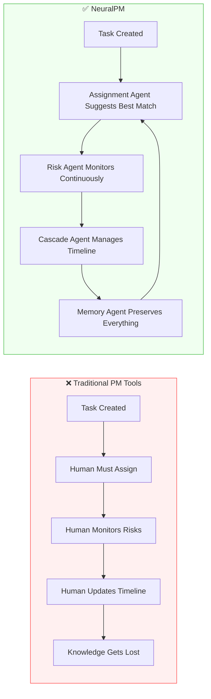

---

## System Architecture Overview

NeuralPM is built on a **four-agent architecture** coordinated by a shared Memory System. The agents operate as a unified intelligence layer — not in isolation — creating a closed-loop system where each agent's output feeds the next.

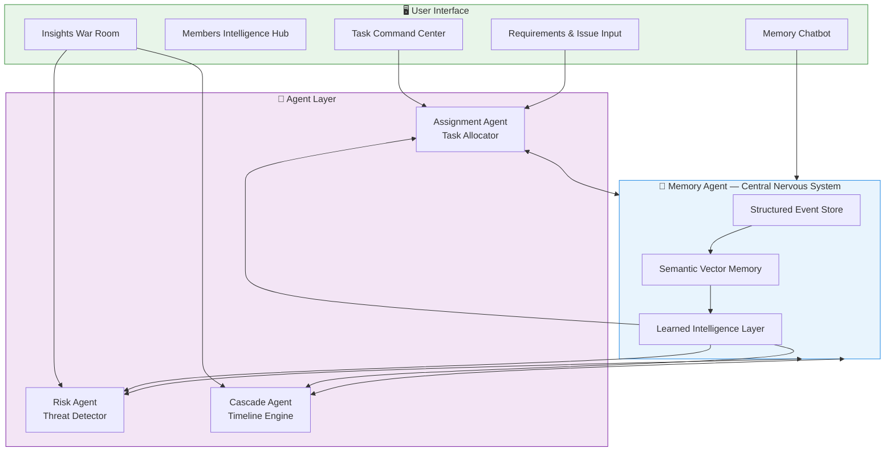

---

## The Agent Layer

### 1. Assignment Agent

**The Intelligent Task Allocator**

The Assignment Agent is responsible for matching every task with the most suitable engineer using multi-dimensional reasoning.

#### Core Functionality

- Analyzes task requirements: skills, complexity, severity, category, and urgency
- Evaluates every team member across multiple factors:
  - Skill and technology overlap
  - Current workload and availability
  - Historical performance and velocity
  - Experience level vs task complexity
  - Recent context affinity (has the engineer worked on similar modules recently?)
- Incorporates past patterns from the Learned Intelligence Layer (e.g., manager preferences and override history)

#### Execution Modes

| Mode | Behavior |
|------|----------|
| **Suggest & Approve** *(Default)* | Proposes a ranked shortlist of 3 candidates with detailed reasoning and match scores (0–100) |
| **Auto-Assign** | Instantly assigns the task and notifies the engineer with a clear explanation of why they were chosen |

#### Decision Flow

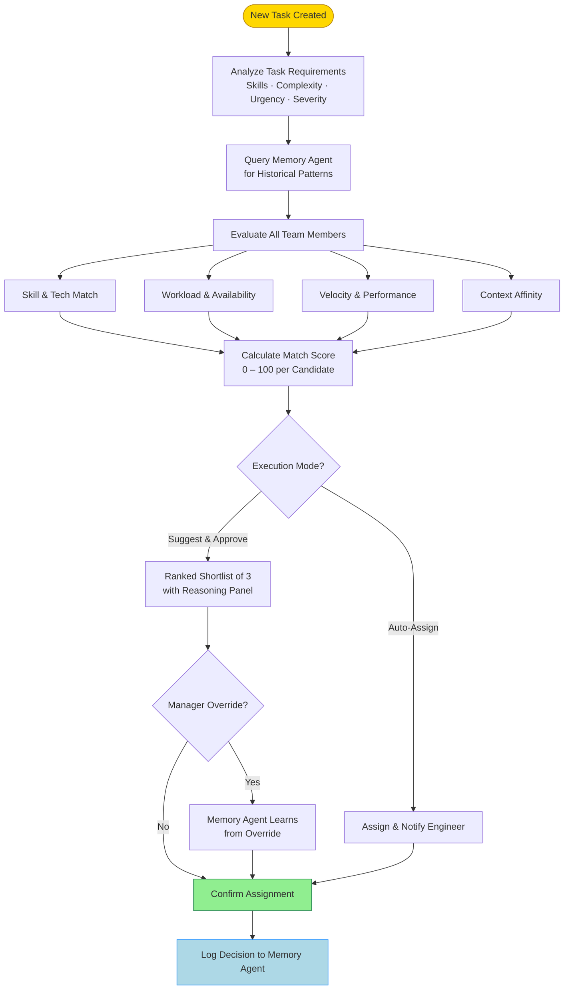

#### User Interaction

In the **Task Command Center**, users can click **"Find Best Match"** on any task. A clean side panel appears showing:
- Candidate rankings
- Per-factor breakdown scores
- One-click assign buttons

Managers can override assignments — the system learns from these overrides to improve future suggestions.

---

### 2. Risk Agent

**The Proactive Threat Detector**

The Risk Agent continuously monitors the project environment to identify potential problems before they escalate into crises.

#### Core Functionality

| Detection Type | Description |
|---|---|
| **Stale Task Detection** | Flags tasks with no updates beyond defined thresholds |
| **Overload Detection** | Identifies engineers approaching or exceeding safe capacity limits |
| **Deadline Risk Analysis** | Detects tasks with approaching deadlines but insufficient progress or unresolved blockers |
| **Blocker Chain Analysis** | Discovers when a single stalled task is blocking multiple downstream deliverables |

#### Risk Detection Flow

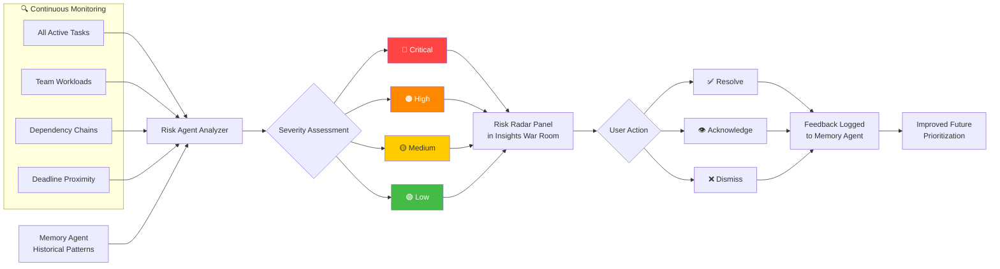

#### User Interaction

Risks appear automatically in the **Risk Radar** panel inside the **Insights War Room**. Each risk card displays:
- Severity level (Critical / High / Medium / Low)
- Clear natural language explanation of the threat
- Affected tasks and team members
- Agent reasoning behind the flag
- Suggested actions (e.g., "Reassign to Sarah" or "Add 3 days buffer")

Users can acknowledge, dismiss, or resolve risks directly. The agent learns from feedback — if a manager frequently dismisses low-severity risks, future prioritization adjusts accordingly.

---

### 3. Cascade Agent

**The Timeline Reasoning Engine**

The Cascade Agent understands task dependencies and intelligently manages timeline changes across the entire project.

#### Core Functionality

- **Impact Propagation**: When a task's deadline shifts, automatically calculates the effect on all dependent tasks using the project's dependency graph
- **Revised Timeline Generation**: Produces new projected dates with full causal reasoning
- **Conflict Detection**: Identifies hard conflicts with external milestones or client commitments
- **Mitigation Suggestions**: Recommends resource reallocation, parallelization, or scope adjustment
- **What-If Simulator**: Allows managers to test hypothetical delays without committing changes

#### Cascade Impact Flow

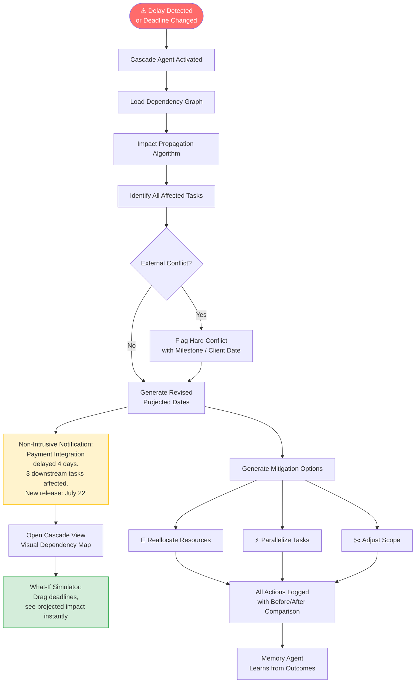

#### User Interaction

When a delay occurs, a non-intrusive notification appears summarizing the downstream impact. Users can then:
- Open the **Cascade View** to see a visual dependency map with highlighted impact paths
- Use the **What-If Simulator** to drag deadlines and instantly see projected outcomes
- Review all logged cascade actions with transparent before/after comparisons

---

## Memory Agent — The Central Nervous System

The **Memory Agent** is the heart and brain of NeuralPM. It is not a simple chatbot or logging system — it is the **persistent, adaptive, and self-improving long-term memory core** that powers all other agents and delivers intelligent answers through the chatbot interface.

While traditional tools only record data, NeuralPM's Memory Agent actively **accumulates experience** across sprints, learns from project events, and refines its understanding over time.

### Core Architecture — Three Integrated Layers

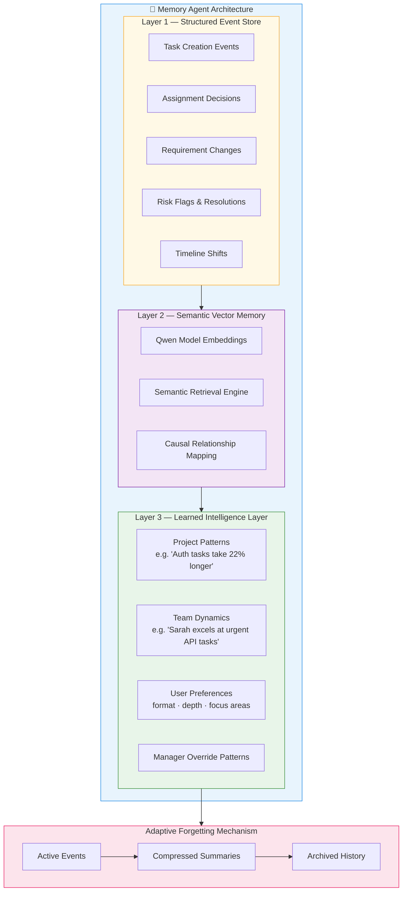

### The Memory Data Model

Every layer above is backed by concrete storage. The Structured Event Store is a single append-only table of project events, with dedicated fields that drive retrieval and forgetting:

```sql
CREATE TABLE memory_events (
    id              UUID PRIMARY KEY DEFAULT gen_random_uuid(),
    task_id         UUID,
    event_type      VARCHAR(50),          -- assignment | requirement_change | risk_flag | timeline_shift | ...
    description     TEXT,
    agent_source    VARCHAR(50),          -- which agent wrote this event
    member_id       UUID,
    sprint_id       UUID,
    metadata        JSONB,                -- structured payload (scores, deltas, reasons)
    timestamp       TIMESTAMP DEFAULT NOW(),

    -- Retrieval & forgetting fields
    relevance_score FLOAT     DEFAULT 1.0,   -- 0.01 – 1.0, decays over time
    superseded_by   UUID      REFERENCES memory_events(id),  -- set when overridden/replaced
    memory_tier     VARCHAR(20) DEFAULT 'active',  -- active | compressed | archived
    last_accessed   TIMESTAMP,
    access_count    INT       DEFAULT 0,
    embedding       VECTOR(1024)          -- Qwen embedding for semantic retrieval
);
```

The `embedding` column powers the Semantic Vector Memory layer (cosine similarity search), while `relevance_score`, `memory_tier`, and `superseded_by` power forgetting. `access_count` and `last_accessed` let frequently-used memories resist decay.

### Adaptive Forgetting — Decay & Supersession

Forgetting is a scheduled process, not a label. It runs **asynchronously via Celery Beat** — nightly in production, every five minutes under demo acceleration — re-scoring every event in the background so writes are never blocked by decay work. It also fires **synchronously on any `superseded_by` write**, so an override or requirement change fades the old memory the instant it happens rather than waiting for the next cycle. Three things can lower an event's relevance:

1. **Supersession** — when a requirement is changed or an assignment is overridden, the old event's `superseded_by` is set and its relevance collapses immediately. It is no longer retrieved by default, but remains queryable for audit.
2. **Age-based tiering** — events move `active → compressed → archived` as they age. Compressed events keep an LLM-generated summary instead of full text; archived events are excluded from default retrieval.
3. **Disuse decay** — events that are rarely accessed lose relevance gradually. Frequently-accessed events decay more slowly, so genuinely important history stays available.

```python
def rescore_event(event, now):
    age_days = (now - event.timestamp).days

    if event.superseded_by is not None:
        # Overridden/replaced: fade fast, keep for audit only
        event.relevance_score = 0.05

    elif age_days > 365:
        event.memory_tier = "archived"
        event.relevance_score *= 0.5

    elif age_days > 90:
        event.memory_tier = "compressed"
        if event.memory_tier != "compressed":
            event.description = compress_with_llm(event.description)

    else:
        # Recently-used memories decay slower (min decay 1%, max 10%)
        decay_rate = max(0.01, 0.10 - event.access_count * 0.02)
        event.relevance_score *= (1 - decay_rate)

    event.relevance_score = clamp(event.relevance_score, 0.01, 1.0)
```

The decay constants (90 / 365 days, 1–10% rates) are configurable per workspace. For a short-lived project or a hackathon demo, the thresholds run on a compressed clock — the five-minute Beat cycle stands in for "nightly," and an "advance sprint" control can fast-forward ages — so the behaviour is observable without waiting for real calendar time.

### User Preference Memory

User preferences are stored explicitly, separate from project events, so that a learned preference can directly change an agent's decision rather than just shaping prose:

```sql
CREATE TABLE user_preference_memory (
    id               UUID PRIMARY KEY DEFAULT gen_random_uuid(),
    user_id          UUID NOT NULL,
    preference_type  VARCHAR(50),    -- assignment_override | communication_style | risk_tolerance | ...
    preference_value JSONB,
    confidence       FLOAT DEFAULT 0.5,   -- grows with consistent evidence
    evidence_count   INT   DEFAULT 0,
    last_observed    TIMESTAMP,
    created_at       TIMESTAMP DEFAULT NOW()
);
```

`confidence` is derived, not guessed. It combines how consistent the behaviour is with how much evidence supports it:

```
confidence = consistency_rate × (1 − 1 / (1 + evidence_count))
```

So a preference seen 12 times with an 80% consistency rate lands around `0.8 × (1 − 1/13) ≈ 0.74`, and climbs toward the consistency ceiling as evidence accumulates. Preferences below a confidence threshold (default `0.6`) are treated as hints; above it they actively re-rank agent output.

A populated table for one manager (Alice):

| user_id | preference_type | preference_value | confidence | evidence_count |
|---|---|---|---|---|
| Alice | `assignment_override` | `{"skill":"backend","preferred_assignee":"Sarah","override_rate":0.8}` | 0.74 | 12 |
| Alice | `communication_style` | `{"format":"bullet_points","verbosity":"low"}` | 0.78 | 8 |
| Alice | `risk_tolerance` | `{"dismisses":["overload"],"escalates":["blocker_chain"]}` | 0.67 | 6 |

### How a Preference Changes a Decision

Preferences are not decoration — they alter agent output. The Assignment Agent computes a raw skills-and-workload score, then applies any high-confidence preference as a re-ranking factor:

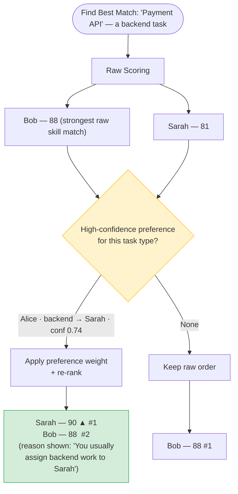

The reasoning panel always discloses *why* the order changed, and the manager can still override — which itself becomes another evidence point, nudging `confidence` and `override_rate` further.

#### Learning Mode

Confidence normally accrues slowly — a preference needs repeated, consistent evidence before it crosses `0.6`. **Learning Mode** is an opt-in toggle that lets a manager teach the system in a single step instead of waiting for the count to build. When it is on, an override prompts one clarifying question — *"One-time exception, or a new pattern?"* — and the answer is written straight into `user_preference_memory`:

- **One-time exception** → logged as ordinary evidence, no confidence boost. The override is honoured once and forgotten.
- **New pattern** → the preference is seeded at `confidence = 0.7` with `evidence_count = 1`, immediately clearing the threshold so the *next* suggestion already reflects it.

This makes cross-session learning observable inside one working session: override → confirm "new pattern" → the very next matching task is re-ranked. With Learning Mode off, the same outcome still emerges, just over the dozen-or-so overrides it takes confidence to climb on its own.

#### Resolving Conflicting Preferences

When more than one preference applies to the same decision — say Alice prefers Sarah for backend work (`0.74`) but also prefers Bob for anything urgent (`0.85`) — the Assignment Agent uses **confidence-weighted arbitration**: the higher-confidence preference wins, so an urgent backend task goes to Bob. Ties (confidences within a small epsilon) are broken by the more recent `last_observed`. If no applicable preference clears the `0.6` threshold, the learned layer steps aside entirely and raw skill-and-workload scores decide.

#### Preferences Across the Risk and Cascade Agents

Preference re-ranking is not unique to assignment — the Risk and Cascade Agents read the same `user_preference_memory` before they produce output, so the whole system bends toward how a given manager works.

The Risk Agent consults `risk_tolerance` before rendering the Risk Radar, suppressing categories a manager reliably dismisses and escalating the ones they always act on:

```python
def generate_risk_radar(manager_id):
    risks = detect_all_risks()
    prefs = get_preferences(manager_id, "risk_tolerance")  # None if below threshold

    if prefs and prefs.confidence > 0.6:
        for risk in risks:
            if risk.type in prefs.value.get("dismisses", []):
                risk.severity = "suppressed"   # learned: Alice routinely dismisses these
            elif risk.type in prefs.value.get("escalates", []):
                risk.severity = "escalated"    # learned: Alice always acts on these
    return risks
```

Suppressed risks are hidden from the default board but never deleted — they stay one filter-click away, and the suppression reason is shown on hover, so the learned behaviour is transparent and reversible.

The Cascade Agent reads a `timeline_philosophy` preference before building mitigation scenarios, so a manager who has repeatedly chosen scope cuts over slipped release dates is offered that path first:

```python
def generate_cascade_scenarios(delay, manager_id):
    scenarios = [standard_propagation(delay)]            # always offered
    prefs = get_preferences(manager_id, "timeline_philosophy")

    if prefs and prefs.confidence > 0.6:
        if prefs.value.get("protects") == "release_date":
            scenarios.append(scope_cut_scenario(delay))  # learned: prefers cutting scope
        if prefs.value.get("buffers") == "testing":
            scenarios.append(buffer_scenario(delay, stage="testing"))
    return scenarios
```

In both cases the agent still produces the neutral, unlearned scenario, so a preference shapes the *order and emphasis* of options rather than removing the manager's choices.

### How Accuracy Improves Over Time

The Memory Agent becomes significantly smarter across multi-turn conversations and cross-session usage in two dimensions:

#### A. Deeper Project Intelligence (Long-term Project Memory)

As the project progresses through multiple sprints, the Memory Agent actively **understands and refines** the project's history:

- Builds rich **causal chains** connecting requirement changes → assignment decisions → delays → risks
- Automatically compresses old events into meaningful summaries and insights
- Learns recurring project patterns (e.g., "Authentication tasks consistently take 22% longer than estimated")
- Uses the **Adaptive Forgetting Mechanism** to reduce relevance of outdated information while preserving important historical context

#### B. Adaptive User Interaction (Personalized Delivery)

The Memory Agent maintains a lightweight **User Interaction Memory** to improve how information is delivered:

- Learns the user's preferred communication style (bullet points, depth level, focus areas)
- Understands which topics the user cares about most (deadlines, risks, team workload, etc.)
- Remembers useful patterns from previous conversations
- Adjusts tone and structure based on past feedback (thumbs up/down)

### Memory Improvement Across Sessions

"Better over time" is tracked with a concrete signal rather than asserted. The primary metric is **override rate** — the fraction of agent suggestions a manager changes — supported by **suggestion-acceptance rate** and Risk Agent **dismissal rate**. As preferences accumulate evidence, override rate should fall; that single number is what the system optimises and what the demo measures.

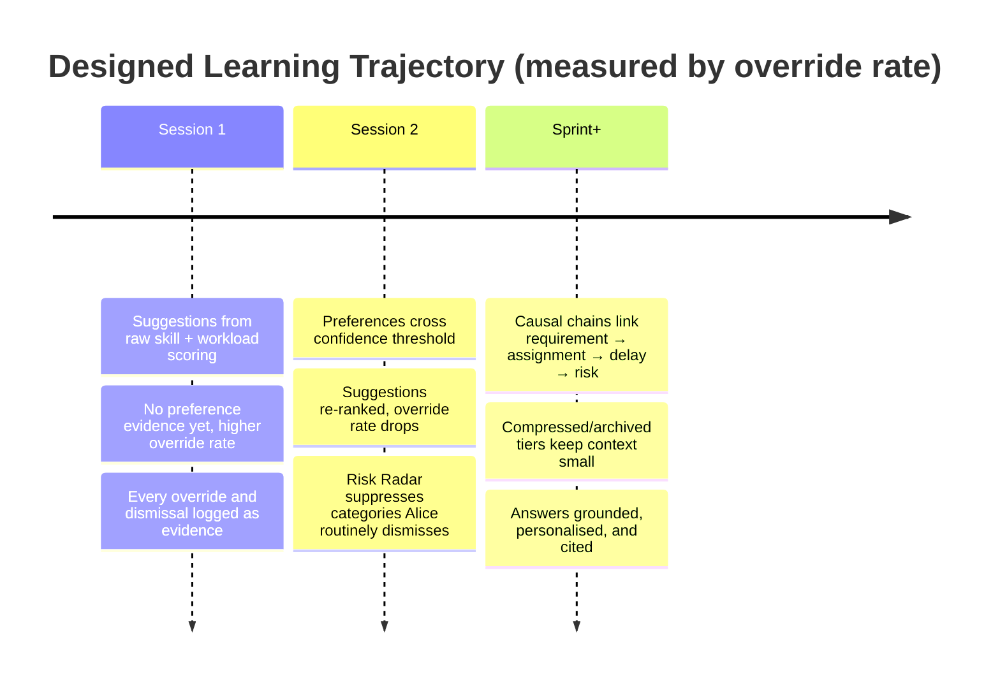

### Tiered Context Budgeting

The context window is a hard, limited resource, so every chatbot response (and every agent query) runs through a budget allocator before any model call. The default split below is a starting allocation, not a fixed cut: each slice is a token ceiling, and the retriever only fills it with memories that pass the relevance and tier filters. Unused budget in one slice is reclaimed by the reasoning buffer.

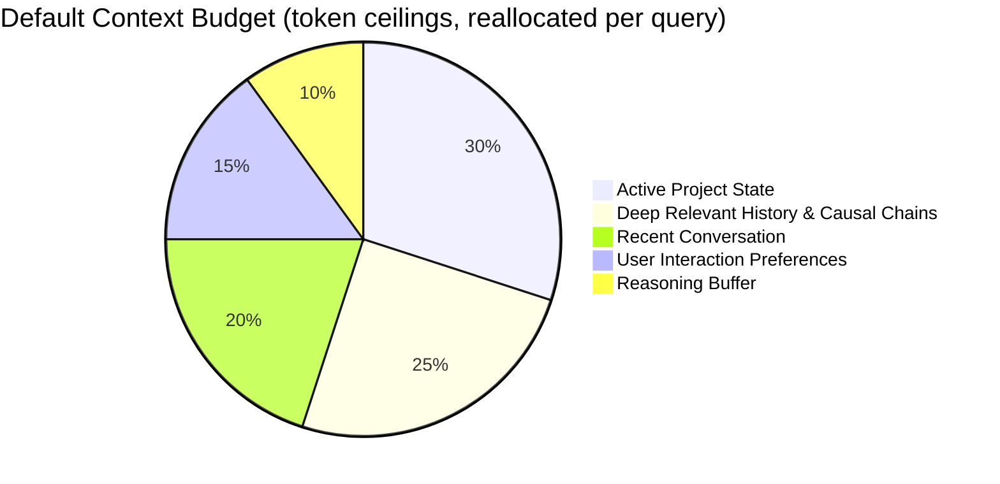

```python
def allocate_context(query, user_id, max_tokens=8000):
    ceilings = {
        "recent_conversation": int(max_tokens * 0.20),
        "active_project":       int(max_tokens * 0.30),
        "user_preferences":     int(max_tokens * 0.15),
        "causal_history":       int(max_tokens * 0.25),
        "reserve":              int(max_tokens * 0.10),
    }

    # Only retrieve memories that are still relevant and not archived
    candidates = retrieve_hybrid(
        query,
        filters={"relevance_score__gte": 0.2, "tier__in": ["active", "compressed"]},
    )

    ranked = rank_by(candidates, query=query, user_id=user_id)  # semantic + recency + relevance
    return fill_budget(ranked, ceilings)  # stop each slice at its ceiling, reclaim leftovers
```

Because archived and superseded memories are filtered out *before* ranking, the prompt stays small even on a long-running project — which is exactly what forgetting is for.

### Memory Chatbot Experience

The chatbot serves as the natural language interface to the intelligent memory core. Example queries:

> *"Why was the API deadline pushed last sprint?"*
> *"Who has been performing well on urgent frontend tasks?"*
> *"Summarize what changed in the payment module over the last month."*
> *"What are the biggest risks for this release?"*

All responses are fully grounded in actual project events with clear citations and causal explanations. Answers become more precise, insightful, and personalized with every session.

### Memory Autopsy

Every chatbot answer can be expanded into a **Memory Autopsy** — a transparency panel showing exactly which memories were loaded, which were deliberately left out, and how much of the context window was used. This is the system's audit trail and its proof of forgetting.

```
Query: "Why did the API deadline push?"

Context used: 3,247 / 8,192 tokens   (8 memories loaded, 5 filtered out)

LOADED
  #4421  timeline_shift   relevance 0.95  active       "Payment API +3d"
  #4418  risk_flag        relevance 0.81  active       "Sarah overload"
  #4402  assignment       relevance 0.66  compressed   "Payment API → Sarah"
  ...

FILTERED OUT
  #4401  assignment       relevance 0.05  superseded by #4420   (Bob → Sarah override)
  #3990  requirement      relevance 0.04  archived (>365d)

PREFERENCES APPLIED
  #12  communication_style  → response formatted as bullet points (conf 0.78)
```

The line that sells the memory track is the *filtered-out* block: it shows a memory that was intentionally forgotten (superseded) and one aged into the archive tier — evidence that forgetting is a running mechanism, not a diagram.

### Cross-Session Learning Walkthrough

The clearest demonstration of persistent memory is the same action producing a better result in a later session, with nothing changed but accumulated experience.

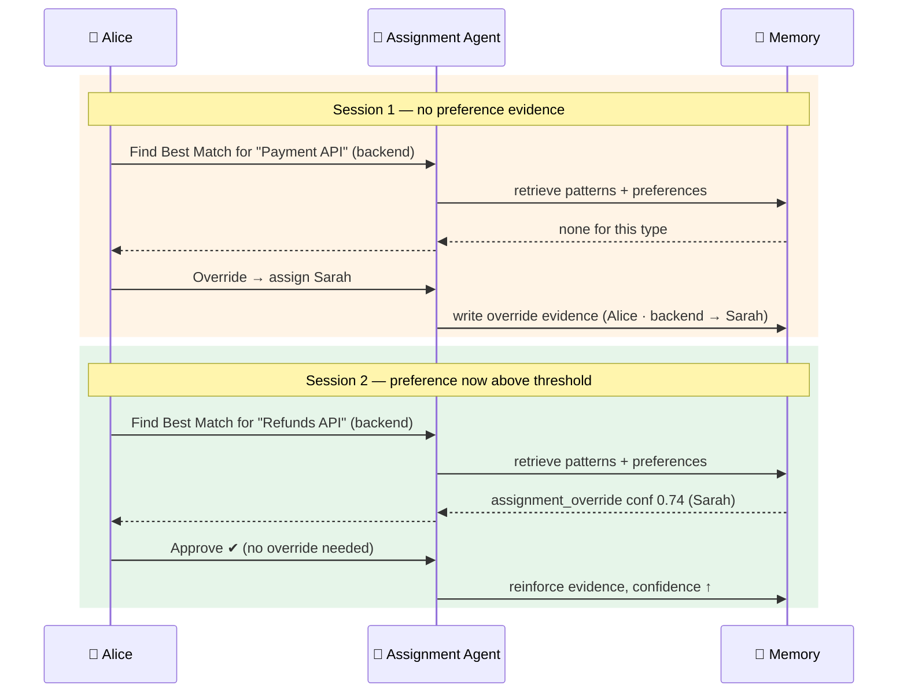

The same is true across the other agents: the Risk Radar stops surfacing the categories a manager consistently dismisses (while keeping the ones they always act on), and the Cascade Agent offers a manager-tuned mitigation alongside the standard one once it has seen enough of their choices.

---

## Agent Collaboration & The Agentic Harness

NeuralPM is built as a tightly integrated **multi-agent system** where four specialized agents work together as a unified intelligence layer. The Memory Agent acts as the **shared nervous system**, creating a closed-loop where every agent's output becomes another agent's input.

### End-to-End Collaboration Flow

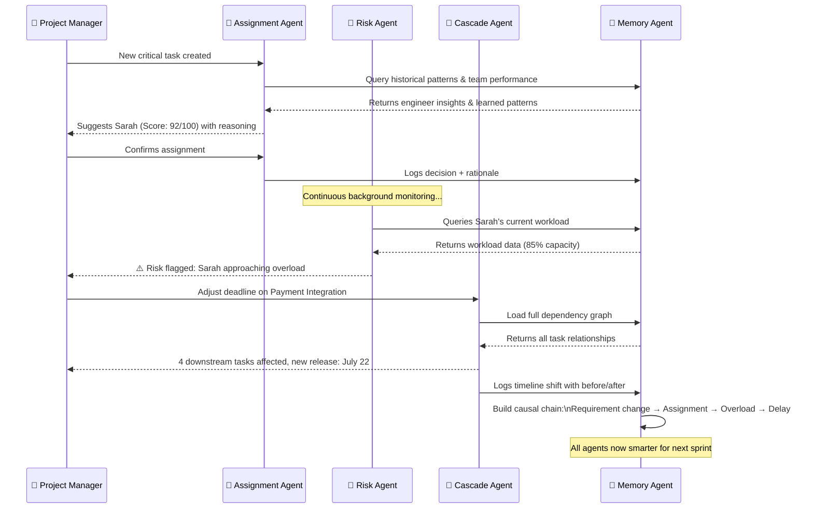

### How the Memory Agent Powers the Other Agents

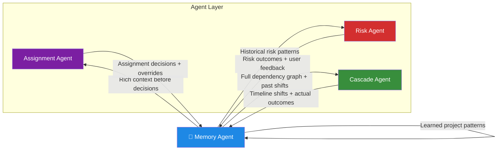

The Memory Agent provides:

- **Rich Context**: Every agent queries the Memory Agent before making any decision, grounding actions in real project history
- **Continuous Learning**: Past events and outcomes are transformed into patterns that make all agents more accurate
- **Consistency**: All agents operate with the same up-to-date project truth, preventing contradictions
- **Explainability**: Every suggestion can be traced back through the memory chain for full transparency

---

## UI Features & User Experience

NeuralPM features a clean, modern, and intuitive interface designed for engineering teams and managers. It feels familiar like Jira but is significantly more intelligent and proactive. Built with **React 18** and **Tailwind CSS** for a responsive, fast experience.

### Navigation Structure

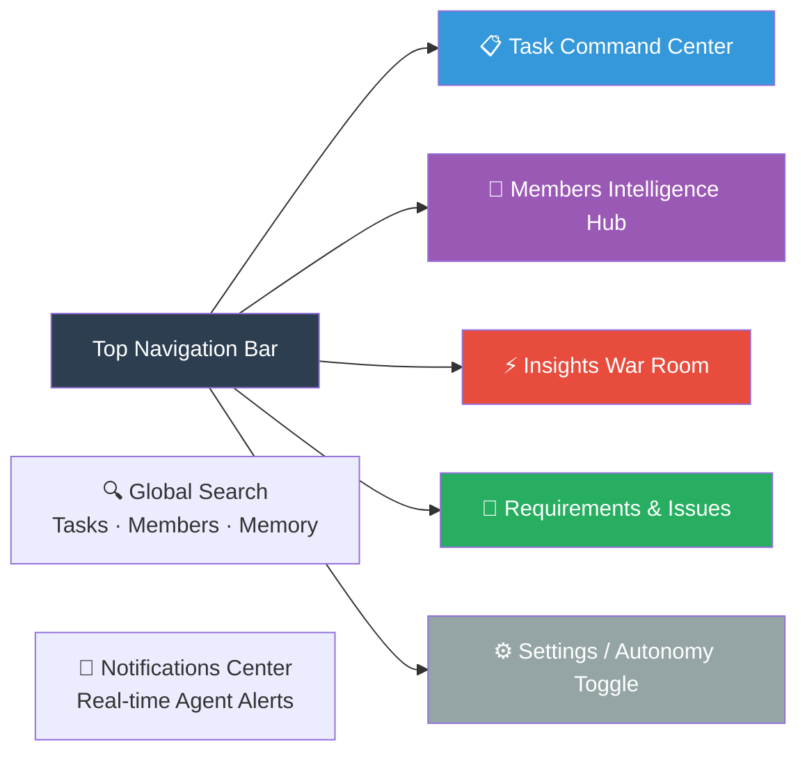

---

### 1. Task Command Center

The central hub — a powerful Jira-like task management table.

**Task List Columns:**

| Column | Details |
|---|---|
| Task ID | Unique identifier |
| Task Title | With inline "Find Best Match" button |
| Category | Frontend, Backend, API, Testing, etc. |
| Severity | 🔴 Critical · 🟠 High · 🟡 Medium · 🟢 Low |
| Assignee | With avatar and load tooltip |
| Status | Backlog · Ongoing · Review · Completed |
| Progress | Percentage bar |
| Due Date | With risk highlighting |
| Actions | Find Match · Edit · etc. |

**Smart Features:**
- Inline **"Find Best Match"** button on every unassigned task triggers the Assignment Agent instantly
- Color-coded severity and status indicators
- Advanced filtering and search (assignee, severity, status, keywords)
- Drag-and-drop status changes that automatically trigger Memory logging and Risk/Cascade checks
- Sortable columns and customizable views
- Hovering on an assignee shows a mini tooltip with their current load percentage

---

### 2. Members Intelligence Hub

A dedicated tab for deep team visibility.

**Main Members Table** displays all engineers with: Name, Role, Current Load (%), Active Tasks, Velocity (story points/week), Availability Status.

**Individual Member Profile** (click to open a detailed side drawer or full-page profile):

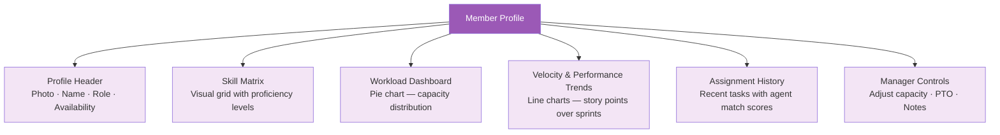

---

### 3. Insights War Room

The command center for managers — a dedicated analytics dashboard aggregating intelligence from all agents.

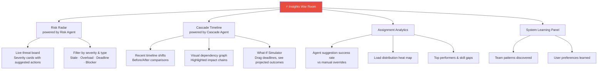

The **System Learning Panel** is where the memory layer becomes visible to managers. It shows a live **Override Rate** graph — the headline metric — trending down as the system learns (e.g. from a high rate early on toward single digits as preferences mature); a **Confidence Growth** chart tracking which preferences are approaching or have crossed the `0.6` threshold; and a **Preference Registry** where every learned preference can be inspected, edited, or deleted outright. The registry matters as much as the charts: it keeps the learning auditable and reversible, so a preference the system picked up incorrectly can be removed in one click rather than waiting for it to decay.

---

### 4. Requirements & Issue Input Section

A dedicated area for Product Managers and stakeholders to feed new information into the system.

**Accessible via a prominent "+ New" button or a separate "Requirements" tab.**

**Smart Submission Pipeline:**

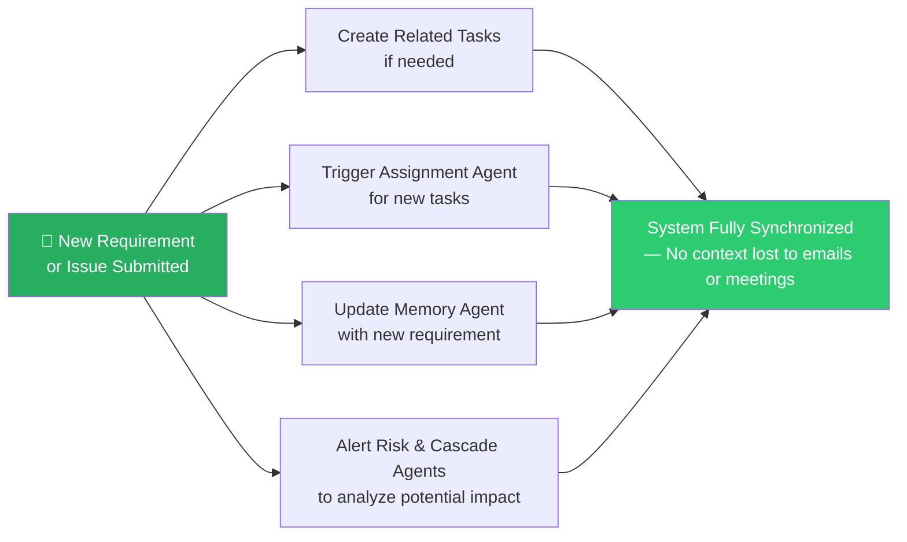

---

### 5. Memory Chatbot

A persistent, intelligent chatbot available on every screen as a right-side panel or floating button.

**Features:**
- Natural language interface to the entire project memory
- Multi-turn conversation support — remembers context within a session
- Answers formatted with bullet points, bold highlights, and event citations
- Thumbs up/down feedback buttons help the system learn user preferences
- Supports file attachments and document analysis (via Qwen-VL)

**Example Queries:**
> *"Why was the login feature delayed?"*
> *"Who is the best person for the payment gateway task?"*
> *"Summarize all risks in the current sprint."*
> *"What changed in the requirements last week?"*

The chatbot becomes more accurate and personalized over time as the Memory Agent learns the user's style and focus areas.

---

## Autonomy Control

All three agents respect a global **Governance Toggle** that lets teams choose their preferred level of autonomy:

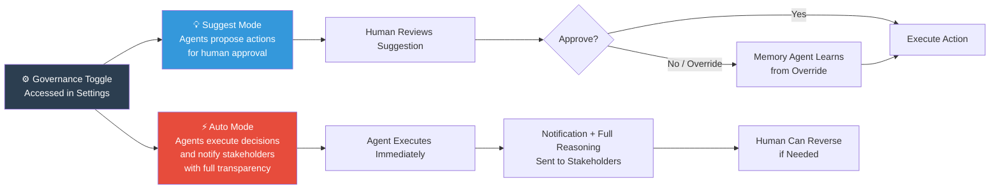

---

## Key Benefits

| Benefit | Description |
|---|---|
| 🎯 **Smarter Task Distribution** | Tasks matched to the right people based on skills, workload, and past performance — reducing burnout and improving delivery speed |
| 🚨 **Early Risk Prevention** | Potential problems surfaced proactively before they become crises |
| 📅 **Automatic Timeline Management** | Delays intelligently propagated across dependent tasks with clear impact visibility |
| 🧠 **Perfect Project Memory** | Never lose important context — the system remembers why decisions were made, what changed, and how the project evolved |
| ⚙️ **Less Manual Work** | Managers spend less time updating boards and chasing updates, and more time on strategy and team leadership |
| 📈 **Continuous Improvement** | The system becomes measurably more accurate and helpful with every sprint — no configuration required |

---

> **NeuralPM** transforms project management from a tiring administrative task into a smooth, intelligent experience. It is a **living Project Operating System** — one that doesn't just manage tasks, but actively understands the project, anticipates problems, and supports better decision-making over time.

---

*Built for the future of work — powered by multi-agent AI and persistent memory.*
