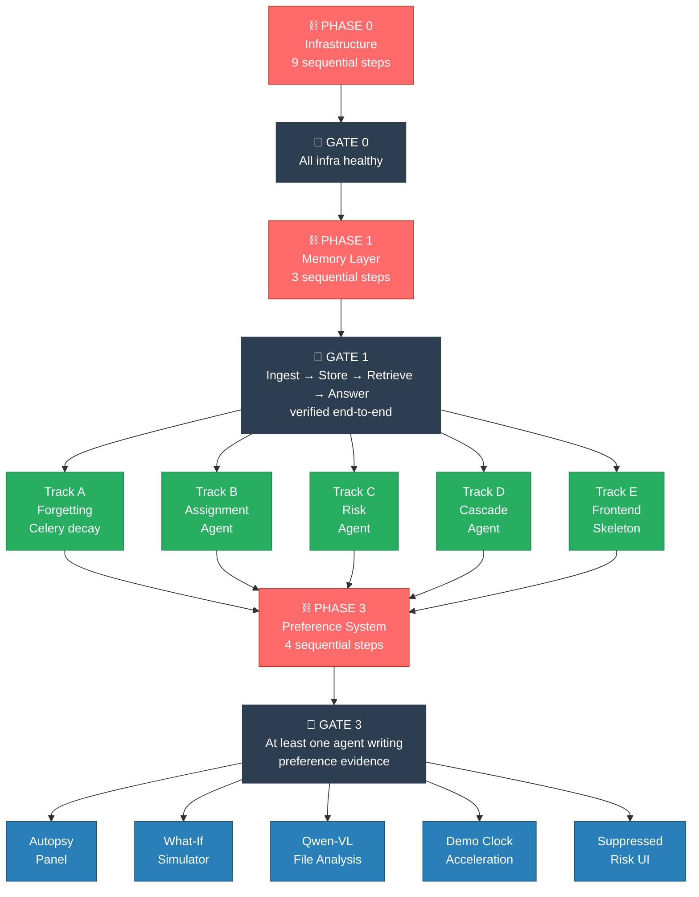
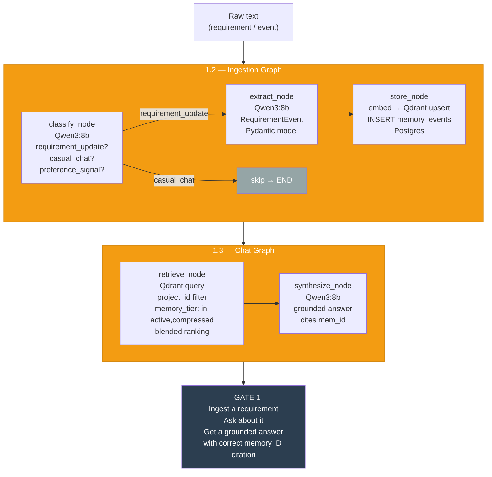
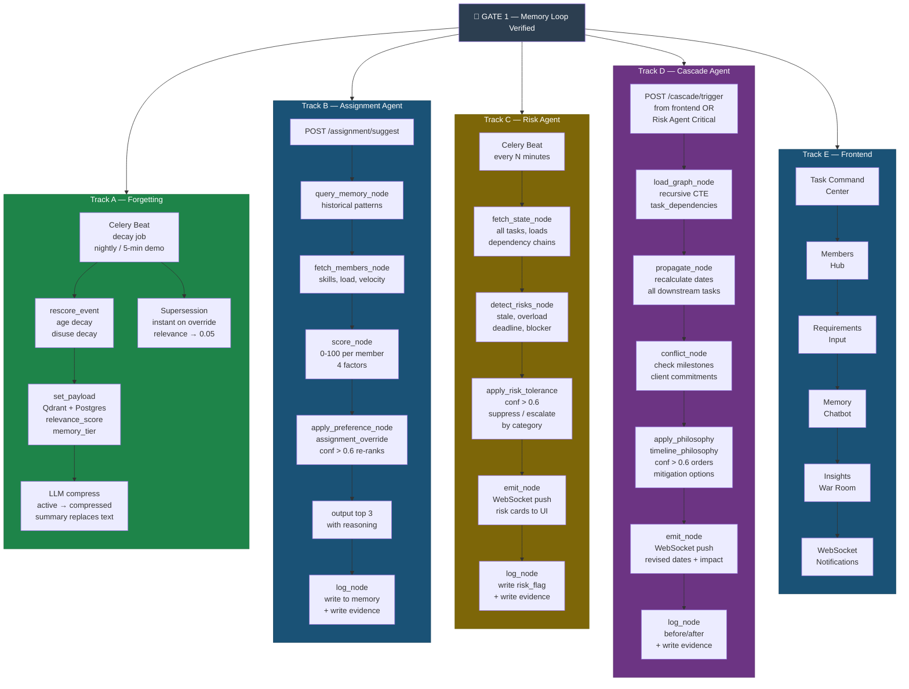
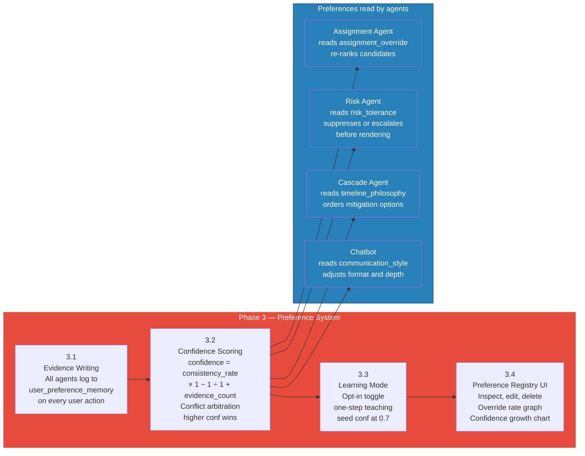
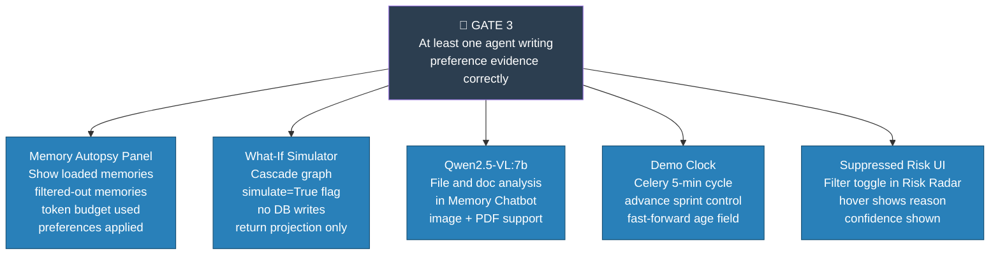
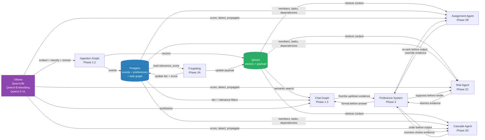

# NeuralPM — Build Parallelism & Sequencing Overview

> **The core rule:** Two sequential gates control everything. Once both pass, the build fans out into wide parallel tracks. Understanding this prevents the most common mistake — starting agents before the memory loop is verified.

---

## 1. The Big Picture



| Colour | Meaning |
|---|---|
| 🔴 Red | Sequential — must complete fully before anything downstream starts |
| 🟢 Green | Parallel — all 5 tracks run at the same time |
| 🔵 Blue | Parallel — all 5 polish features run at the same time |
| ⬛ Black | Gate — hard checkpoint, run tests before proceeding |

---

## 2. Phase 0 — Infrastructure (Fully Sequential)

Every step depends on the previous. No exceptions.

```mermaid
flowchart LR
    A["0.1\nQdrant\nDocker :6333"] -->
    B["0.2\nPostgres\nDocker :5432"] -->
    C["0.3\nQwen3:8b\nollama pull"] -->
    D["0.4\nQwen3-Embedding:4b\nollama pull"] -->
    E["0.5\nQwen2.5-VL:7b\nollama pull"] -->
    F["0.6\nPostgres\nSchemas"] -->
    G["0.7\nQdrant\nCollection + Indexes"] -->
    H["0.8\nFastAPI\nSkeleton"] -->
    I["0.9\nCelery\n+ Redis"]

    style A fill:#e74c3c,color:#fff
    style B fill:#e74c3c,color:#fff
    style C fill:#e74c3c,color:#fff
    style D fill:#e74c3c,color:#fff
    style E fill:#e74c3c,color:#fff
    style F fill:#e74c3c,color:#fff
    style G fill:#e74c3c,color:#fff
    style H fill:#e74c3c,color:#fff
    style I fill:#e74c3c,color:#fff
```



**Why sequential?** Each step is a hard dependency. You cannot create a Qdrant collection (0.7) before Qdrant is running (0.1). You cannot test the ingest API (0.8) before schemas exist (0.6).

**Gate 0 test:** All five pass simultaneously before moving on.
```bash
curl localhost:6333/collections          # Qdrant ✓
psql $DATABASE_URL -c "\dt"             # Postgres schemas ✓
ollama list | grep qwen3                # Models ✓
curl localhost:8000/docs                # FastAPI ✓
celery -A app inspect ping              # Celery ✓
```

---

## 3. Phase 1 — Memory Layer (Fully Sequential)

The memory loop is the foundation of every agent. Agents are just wrappers around this loop. If the loop is broken, every agent breaks.



**Why sequential within Phase 1?**
- 1.1 (embedding pipeline) must exist before 1.2 (store_node calls it)
- 1.2 (ingestion) must exist before 1.3 (retrieve has nothing to retrieve without stored memories)
- 1.3 must be verified before any agent — agents call retrieve and synthesize internally

---

## 4. Phase 2 — Five Parallel Tracks

Once Gate 1 passes, all five tracks start simultaneously. They share the same Qdrant collection and Postgres DB but have zero code dependencies on each other.



**Why parallel?**
- Track A (Forgetting) only touches Celery + Qdrant payload updates — no agent code
- Track B, C, D each call the same `retrieve_node` + `synthesize_node` from Phase 1 but build different graph topologies on top — no shared code between them
- Track E (Frontend) only needs the FastAPI skeleton (Phase 0.8) to call endpoints — it doesn't need agents to be complete

---

## 5. Phase 3 — Preference System (Sequential Within Phase)

Preferences need agents writing evidence first. The four steps inside Phase 3 are sequential — each builds on the previous.



**Why sequential?** You cannot compute confidence (3.2) without evidence (3.1). Learning Mode (3.3) is a shortcut into 3.2 — it needs the same scoring infrastructure. The UI (3.4) displays what 3.2 produces.

---

## 6. Phase 4 — Polish (Fully Parallel)

No dependencies between any of these. All start the moment Gate 3 passes.



---

## 7. Data Flow — Why the Sequence Is What It Is

This diagram shows what data each component produces and consumes. Sequential dependencies come from data, not arbitrary ordering.



---

## 8. Summary Table

| Phase | Sequential or Parallel | Why | Steps |
|---|---|---|---|
| 0 — Infrastructure | 🔴 Sequential | Hard deps: can't query what doesn't exist | 9 steps |
| 1 — Memory Layer | 🔴 Sequential | Embed before store, store before retrieve | 3 steps + gate |
| 2 — Agents + Frontend | 🟢 Parallel (5 tracks) | No code deps between tracks, shared data layer | 5 concurrent tracks |
| 3 — Preferences | 🔴 Sequential | Evidence → scoring → learning mode → UI | 4 steps |
| 4 — Polish | 🟢 Parallel (5 features) | No deps between polish features | 5 concurrent |

**Two sequential chains. Two parallel windows. That's the whole build.**
