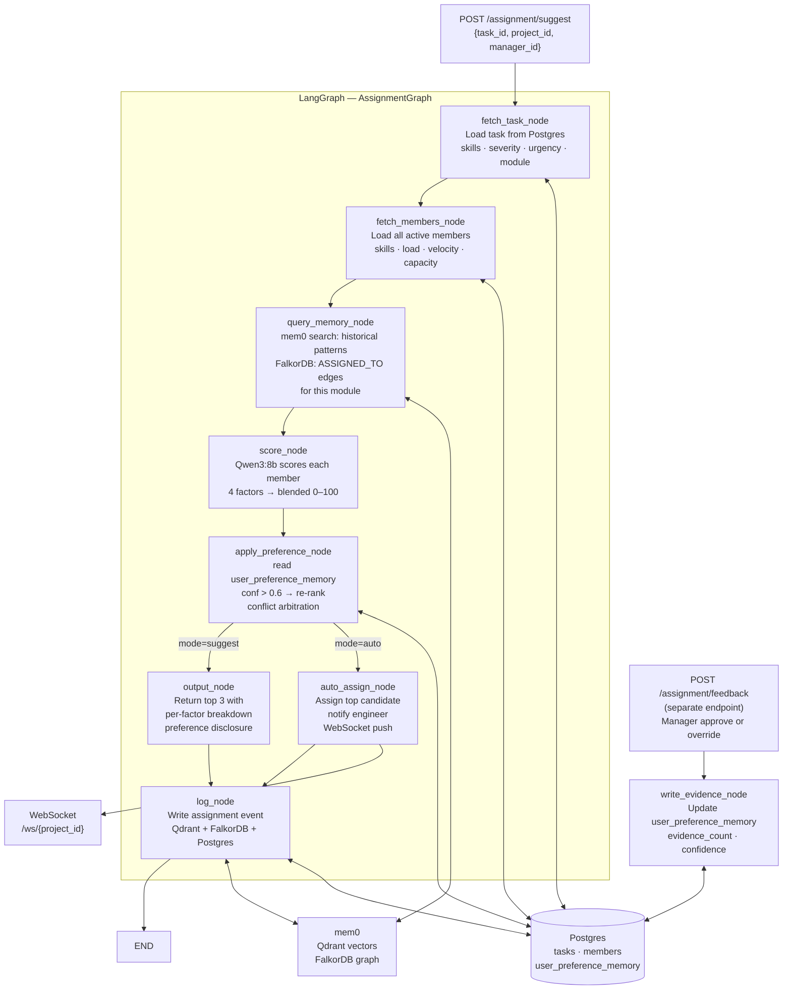

# Assignment Agent — Technical Implementation Document

> Stack: LangGraph · LangChain · Qwen3:8b (Ollama) · Qdrant · FalkorDB (mem0) · Postgres · FastAPI · Pydantic v2

---

## 1. Architecture Overview



---

## 2. Postgres Schema

### 2.1 `tasks` table

```sql
CREATE TABLE tasks (
    id              UUID PRIMARY KEY DEFAULT gen_random_uuid(),
    project_id      UUID NOT NULL,
    sprint_id       UUID,
    title           TEXT NOT NULL,
    description     TEXT,
    category        VARCHAR(50),          -- frontend | backend | api | testing | devops
    severity        VARCHAR(20),          -- critical | high | medium | low
    urgency         VARCHAR(20),          -- immediate | this_sprint | next_sprint | backlog
    status          VARCHAR(20) DEFAULT 'backlog',
    required_skills JSONB,                -- [{"skill": "stripe", "weight": 0.8}, ...]
    affected_module VARCHAR(100),         -- payment | auth | dashboard | ...
    estimated_points INT,
    due_date        TIMESTAMP,
    assignee_id     UUID REFERENCES members(id),
    created_at      TIMESTAMP DEFAULT NOW(),
    updated_at      TIMESTAMP DEFAULT NOW()
);
```

### 2.2 `members` table

```sql
CREATE TABLE members (
    id              UUID PRIMARY KEY DEFAULT gen_random_uuid(),
    project_id      UUID NOT NULL,
    name            TEXT NOT NULL,
    role            VARCHAR(100),
    skills          JSONB,    -- [{"skill": "python", "proficiency": 4}, ...]  1-5 scale
    capacity        INT DEFAULT 100,       -- story points per sprint
    active_points   INT DEFAULT 0,         -- currently assigned story points
    velocity_avg    FLOAT DEFAULT 0,       -- story points completed per sprint (rolling avg)
    availability    VARCHAR(20) DEFAULT 'available',   -- available | partial | pto
    created_at      TIMESTAMP DEFAULT NOW()
);
```

### 2.3 `assignment_history` table

```sql
CREATE TABLE assignment_history (
    id              UUID PRIMARY KEY DEFAULT gen_random_uuid(),
    task_id         UUID REFERENCES tasks(id),
    member_id       UUID REFERENCES members(id),
    manager_id      UUID,
    project_id      UUID NOT NULL,
    was_agent_suggestion  BOOLEAN DEFAULT TRUE,
    was_override          BOOLEAN DEFAULT FALSE,
    agent_top_pick_id     UUID REFERENCES members(id),
    raw_score             FLOAT,
    final_score           FLOAT,
    preference_applied    BOOLEAN DEFAULT FALSE,
    rationale             TEXT,
    assigned_at           TIMESTAMP DEFAULT NOW()
);
```

### 2.4 `user_preference_memory` table

```sql
CREATE TABLE user_preference_memory (
    id               UUID PRIMARY KEY DEFAULT gen_random_uuid(),
    user_id          UUID NOT NULL,
    preference_type  VARCHAR(50),
    -- for assignment_override:
    -- {"task_category": "backend", "task_module": "payment",
    --  "preferred_member_id": "uuid", "preferred_member_name": "Sarah",
    --  "override_count": 8, "approve_count": 4,
    --  "consistency_rate": 0.8}
    preference_value JSONB,
    confidence       FLOAT DEFAULT 0.0,
    evidence_count   INT   DEFAULT 0,
    last_observed    TIMESTAMP,
    created_at       TIMESTAMP DEFAULT NOW()
);
```

**Confidence formula:**
```
confidence = consistency_rate × (1 − 1 / (1 + evidence_count))
```

Example: consistency_rate=0.80, evidence_count=12
→ `0.80 × (1 − 1/13) ≈ 0.738`

---

## 3. Pydantic Schemas

```python
# memory_agent/schemas/assignment.py
from pydantic import BaseModel, Field
from typing import Literal, Optional
from uuid import UUID

class RequiredSkill(BaseModel):
    skill:  str
    weight: float = Field(ge=0.0, le=1.0)

class MemberSkill(BaseModel):
    skill:       str
    proficiency: int = Field(ge=1, le=5)

class TaskContext(BaseModel):
    id:              UUID
    project_id:      UUID
    title:           str
    category:        str
    severity:        Literal["critical", "high", "medium", "low"]
    urgency:         Literal["immediate", "this_sprint", "next_sprint", "backlog"]
    required_skills: list[RequiredSkill]
    affected_module: Optional[str]
    estimated_points: int
    description:     Optional[str]

class MemberContext(BaseModel):
    id:            UUID
    name:          str
    role:          str
    skills:        list[MemberSkill]
    capacity:      int
    active_points: int
    velocity_avg:  float
    availability:  str

    @property
    def load_pct(self) -> float:
        """Current load as a percentage of capacity."""
        if self.capacity == 0:
            return 100.0
        return min(100.0, (self.active_points / self.capacity) * 100)

class FactorScores(BaseModel):
    skill_match:     float = Field(ge=0, le=100)
    workload:        float = Field(ge=0, le=100)
    velocity:        float = Field(ge=0, le=100)
    context_affinity: float = Field(ge=0, le=100)
    blended:         float = Field(ge=0, le=100)

class Candidate(BaseModel):
    member:              MemberContext
    scores:              FactorScores
    rationale:           str
    preference_applied:  bool = False
    preference_reason:   Optional[str] = None

class AssignmentOutput(BaseModel):
    shortlist:           list[Candidate]   # top 3, ranked by scores.blended
    mode:                Literal["suggest", "auto"]
    preference_applied:  bool
    preference_disclosure: Optional[str]   # shown to manager in UI

class AssignmentState(BaseModel):
    """LangGraph state dict shape for the Assignment Agent."""
    # inputs
    task_id:    str
    project_id: str
    manager_id: str
    mode:       Literal["suggest", "auto"] = "suggest"

    # populated by nodes
    task:              Optional[TaskContext]      = None
    members:           list[MemberContext]        = []
    memory_context:    list[dict]                 = []  # retrieved memories
    graph_relations:   list[dict]                 = []  # FalkorDB relations
    candidates:        list[Candidate]            = []
    output:            Optional[AssignmentOutput] = None
    assignment_event_id: Optional[str]            = None
```

---

## 4. Scoring Engine

### 4.1 Factor Weights

```python
WEIGHTS = {
    "skill_match":     0.40,
    "workload":        0.25,
    "velocity":        0.20,
    "context_affinity": 0.15,
}
```

### 4.2 Factor 1 — Skill Match (0–100)

```python
def score_skill_match(member: MemberContext, task: TaskContext) -> float:
    """
    For each required skill, find the member's proficiency (1-5, 0 if absent).
    Weight each skill by its task-level importance.
    Normalize to 0-100.
    """
    if not task.required_skills:
        return 50.0   # neutral — no specific requirements

    member_skill_map = {s.skill.lower(): s.proficiency for s in member.skills}
    total_weight = sum(rs.weight for rs in task.required_skills)

    if total_weight == 0:
        return 50.0

    weighted_score = 0.0
    for rs in task.required_skills:
        proficiency = member_skill_map.get(rs.skill.lower(), 0)
        # proficiency 0-5 → normalize to 0-1 → weight
        weighted_score += (proficiency / 5.0) * rs.weight

    raw = weighted_score / total_weight   # 0.0–1.0
    return round(raw * 100, 2)
```

### 4.3 Factor 2 — Workload (0–100)

```python
def score_workload(member: MemberContext) -> float:
    """
    Lower load → higher score.
    100% load = 0 pts. 0% load = 100 pts.
    Non-linear penalty: steep drop above 80%.
    PTO / unavailable → 0.
    """
    if member.availability == "pto":
        return 0.0

    load = member.load_pct   # 0–100

    if load >= 100:
        return 0.0
    elif load >= 80:
        # Steep penalty zone: 80% load → 20 pts, 100% → 0 pts
        return round((100 - load) * 1.0, 2)
    else:
        # Linear: 0% → 100 pts, 80% → 20 pts
        return round(100 - (load * 1.0), 2)
```

### 4.4 Factor 3 — Velocity (0–100)

```python
def score_velocity(member: MemberContext, team_members: list[MemberContext]) -> float:
    """
    Normalize member velocity against team average.
    At team average = 75 pts (not 50 — we don't want average performers penalized).
    Twice team average → 100 pts cap.
    Zero velocity → 25 pts base (might be new hire, not bad performer).
    """
    velocities = [m.velocity_avg for m in team_members if m.velocity_avg > 0]
    if not velocities:
        return 50.0

    team_avg = sum(velocities) / len(velocities)
    if team_avg == 0:
        return 50.0

    ratio = member.velocity_avg / team_avg
    # ratio 0 → 25, ratio 1 → 75, ratio 2+ → 100
    score = 25 + (ratio * 50)
    return round(min(100.0, score), 2)
```

### 4.5 Factor 4 — Context Affinity (0–100)

```python
def score_context_affinity(
    member: MemberContext,
    task: TaskContext,
    graph_relations: list[dict],
    memory_context: list[dict],
) -> float:
    """
    Has this engineer worked on this module recently?

    Two sources:
    1. FalkorDB graph: (Engineer)-[:ASSIGNED_TO]->(Task in same module)
    2. mem0 vector: memories mentioning member name + module in last 30 days

    Scores:
      - Strong graph evidence (recent assignment to same module) → 85–100
      - Weak graph evidence (assigned to adjacent module)        → 60–80
      - Only memory evidence                                     → 50–70
      - No evidence                                              → 30 (neutral base)
    """
    module = (task.affected_module or "").lower()
    member_name = member.name.lower()

    # Check FalkorDB graph relations for direct module assignment
    graph_score = 30.0
    for rel in graph_relations:
        src  = (rel.get("source") or "").lower()
        rtype = rel.get("relationship", "")
        tgt  = (rel.get("target") or "").lower()

        if src == member_name and rtype == "ASSIGNED_TO" and module in tgt:
            graph_score = 90.0
            break
        elif src == member_name and rtype in ("WORKED_ON", "CONTRIBUTED_TO") and module in tgt:
            graph_score = max(graph_score, 70.0)

    # Check memory context for text mentions
    mem_score = 30.0
    for mem in memory_context:
        text = (mem.get("memory", "") or "").lower()
        if member_name in text and module in text:
            mem_score = max(mem_score, 60.0)

    return round(max(graph_score, mem_score), 2)
```

### 4.6 Blended Score

```python
def compute_blended_score(scores: dict) -> float:
    return round(
        scores["skill_match"]     * WEIGHTS["skill_match"]
        + scores["workload"]      * WEIGHTS["workload"]
        + scores["velocity"]      * WEIGHTS["velocity"]
        + scores["context_affinity"] * WEIGHTS["context_affinity"],
        2,
    )
```

---

## 5. LangGraph Nodes

### 5.1 `fetch_task_node`

```python
# nodes/assignment/fetch_task.py
from db import get_pg_conn
from schemas.assignment import TaskContext, RequiredSkill

def fetch_task_node(state: dict) -> dict:
    conn = get_pg_conn()
    row = conn.execute(
        "SELECT * FROM tasks WHERE id = %s AND project_id = %s",
        (state["task_id"], state["project_id"])
    ).fetchone()

    if not row:
        raise ValueError(f"Task {state['task_id']} not found in project {state['project_id']}")

    required_skills = [
        RequiredSkill(**s) for s in (row["required_skills"] or [])
    ]

    return {
        "task": TaskContext(
            id=row["id"],
            project_id=row["project_id"],
            title=row["title"],
            category=row["category"],
            severity=row["severity"],
            urgency=row["urgency"],
            required_skills=required_skills,
            affected_module=row["affected_module"],
            estimated_points=row["estimated_points"] or 0,
            description=row["description"],
        )
    }
```

### 5.2 `fetch_members_node`

```python
# nodes/assignment/fetch_members.py
from db import get_pg_conn
from schemas.assignment import MemberContext, MemberSkill

def fetch_members_node(state: dict) -> dict:
    conn = get_pg_conn()
    rows = conn.execute(
        """SELECT * FROM members
           WHERE project_id = %s
           AND availability != 'deactivated'
           ORDER BY name""",
        (state["project_id"],)
    ).fetchall()

    members = [
        MemberContext(
            id=row["id"],
            name=row["name"],
            role=row["role"],
            skills=[MemberSkill(**s) for s in (row["skills"] or [])],
            capacity=row["capacity"],
            active_points=row["active_points"],
            velocity_avg=row["velocity_avg"],
            availability=row["availability"],
        )
        for row in rows
    ]

    return {"members": members}
```

### 5.3 `query_memory_node`

```python
# nodes/assignment/query_memory.py
from memory_agent.config import get_mem0_client

def query_memory_node(state: dict) -> dict:
    """
    Retrieve two things from the memory layer:
    1. Historical assignment patterns for this task type / module (vector search)
    2. FalkorDB graph relations: who has been ASSIGNED_TO tasks in this module
    """
    task = state["task"]
    client = get_mem0_client()

    # Build a query that captures both the task domain and team dynamics
    query = (
        f"assignment history for {task.category} tasks "
        f"in {task.affected_module or 'this project'} module. "
        f"Who performs well on {task.severity} priority work?"
    )

    response = client.search(
        query,
        filters={
            "user_id":    state["manager_id"],
            "project_id": state["project_id"],
            "event_type": "assignment",
        },
        limit=10,
    )

    if isinstance(response, dict):
        memories  = response.get("results",   [])
        relations = response.get("relations", [])
    else:
        memories  = response or []
        relations = []

    return {
        "memory_context":  memories,
        "graph_relations": relations,
    }
```

### 5.4 `score_node`

```python
# nodes/assignment/score.py
from schemas.assignment import Candidate, FactorScores
from scoring import (
    score_skill_match, score_workload,
    score_velocity, score_context_affinity,
    compute_blended_score,
)
from memory_agent.config import get_llm
import json, re

RATIONALE_PROMPT = """/no_think
Generate a one-sentence rationale for assigning this task to this engineer.

Task: {task_title} ({category}, {severity})
Engineer: {member_name} ({role})
Scores: skill={skill}, workload={workload}, velocity={velocity}, context={context}

Return JSON: {{"rationale": "<one sentence>"}}"""

def score_node(state: dict) -> dict:
    task    = state["task"]
    members = state["members"]
    graph   = state.get("graph_relations", [])
    mems    = state.get("memory_context", [])
    llm     = get_llm(json_mode=True)

    candidates = []

    for member in members:
        skill   = score_skill_match(member, task)
        wl      = score_workload(member)
        vel     = score_velocity(member, members)
        ctx     = score_context_affinity(member, task, graph, mems)
        blended = compute_blended_score({
            "skill_match": skill, "workload": wl,
            "velocity": vel, "context_affinity": ctx
        })

        # Ask Qwen3 for a one-sentence rationale
        prompt = RATIONALE_PROMPT.format(
            task_title=task.title, category=task.category, severity=task.severity,
            member_name=member.name, role=member.role,
            skill=skill, workload=wl, velocity=vel, context=ctx,
        )
        try:
            raw = llm.invoke(prompt).content
            raw = re.sub(r"<think>.*?</think>", "", raw, flags=re.DOTALL).strip()
            rationale = json.loads(raw).get("rationale", "Best available match.")
        except Exception:
            rationale = f"Scored {blended:.0f}/100 across skill, workload, velocity, and context."

        candidates.append(Candidate(
            member=member,
            scores=FactorScores(
                skill_match=skill, workload=wl,
                velocity=vel, context_affinity=ctx, blended=blended
            ),
            rationale=rationale,
        ))

    # Sort descending by blended score
    candidates.sort(key=lambda c: c.scores.blended, reverse=True)
    return {"candidates": candidates}
```

### 5.5 `apply_preference_node` — The Core Preference + Arbitration Logic

```python
# nodes/assignment/apply_preference.py
from db import get_pg_conn
from schemas.assignment import Candidate
import json

CONFIDENCE_THRESHOLD = 0.6


def _get_applicable_preferences(manager_id: str, task) -> list[dict]:
    """
    Fetch all assignment_override preferences for this manager that could
    apply to this task. Multiple preferences may apply simultaneously
    (e.g. "prefer Sarah for backend" AND "prefer Bob for urgent tasks").
    """
    conn = get_pg_conn()
    rows = conn.execute(
        """SELECT * FROM user_preference_memory
           WHERE user_id = %s
           AND preference_type = 'assignment_override'
           AND confidence > %s
           ORDER BY confidence DESC, last_observed DESC""",
        (manager_id, CONFIDENCE_THRESHOLD)
    ).fetchall()

    applicable = []
    for row in rows:
        val = row["preference_value"]
        if isinstance(val, str):
            val = json.loads(val)

        matches_category = val.get("task_category") == task.category
        matches_module   = val.get("task_module")   == task.affected_module
        matches_urgency  = val.get("task_urgency")  == task.urgency

        # A preference applies if it matches at least one task dimension
        if matches_category or matches_module or matches_urgency:
            applicable.append({
                "preference_value": val,
                "confidence":       row["confidence"],
                "last_observed":    row["last_observed"],
                "match_type":       (
                    "category_and_module" if matches_category and matches_module
                    else "category" if matches_category
                    else "module"   if matches_module
                    else "urgency"
                ),
            })

    return applicable


def _arbitrate(preferences: list[dict]) -> dict | None:
    """
    Confidence-weighted arbitration:
    1. Highest confidence wins.
    2. Tie (within epsilon 0.02): most recently observed wins.
    3. If no preference clears threshold: return None (raw scores decide).
    """
    if not preferences:
        return None

    EPSILON = 0.02
    top = preferences[0]   # already sorted by confidence DESC, last_observed DESC

    # Check if second preference is within epsilon (tie)
    if len(preferences) > 1:
        second = preferences[1]
        if abs(top["confidence"] - second["confidence"]) < EPSILON:
            # Tie — use most recent
            top = max(preferences[:2], key=lambda p: p["last_observed"])

    return top


def apply_preference_node(state: dict) -> dict:
    """
    1. Fetch applicable preferences from user_preference_memory.
    2. Arbitrate if multiple apply.
    3. Apply the winning preference as a re-ranking boost to the preferred member.
    4. Resort candidates.
    """
    task        = state["task"]
    manager_id  = state["manager_id"]
    candidates  = state["candidates"]

    prefs = _get_applicable_preferences(manager_id, task)
    winning_pref = _arbitrate(prefs)

    if winning_pref is None:
        # No preference clears the threshold — return raw order
        return {
            "candidates":          candidates,
            "preference_applied":  False,
            "preference_disclosure": None,
        }

    pref_val             = winning_pref["preference_value"]
    preferred_member_id  = pref_val.get("preferred_member_id")
    preferred_name       = pref_val.get("preferred_member_name", "preferred member")
    pref_confidence      = winning_pref["confidence"]
    match_type           = winning_pref["match_type"]

    # Apply a confidence-scaled re-ranking boost to the preferred member
    # boost = 15% at confidence=0.6, scales up to 25% at confidence=1.0
    boost_multiplier = 1.0 + (pref_confidence - 0.6) * 0.625  # 1.0–1.25 range

    preference_applied = False
    for candidate in candidates:
        if str(candidate.member.id) == preferred_member_id:
            old_score = candidate.scores.blended
            candidate.scores.blended = min(100.0, old_score * boost_multiplier)
            candidate.preference_applied = True
            candidate.preference_reason = (
                f"You usually assign {match_type.replace('_',' ')} work to "
                f"{preferred_name} (confidence {pref_confidence:.0%})"
            )
            preference_applied = True
            break

    # Re-sort after boost
    candidates.sort(key=lambda c: c.scores.blended, reverse=True)

    disclosure = None
    if preference_applied:
        disclosure = (
            f"Ranking adjusted: you typically assign "
            f"{task.category} / {task.affected_module} tasks to {preferred_name}. "
            f"Preference confidence: {pref_confidence:.0%}. "
            f"You can still override."
        )

    return {
        "candidates":            candidates,
        "preference_applied":    preference_applied,
        "preference_disclosure": disclosure,
    }
```

### 5.6 `output_node` (Suggest Mode)

```python
# nodes/assignment/output.py
from schemas.assignment import AssignmentOutput

def output_node(state: dict) -> dict:
    """
    Return top 3 candidates with full per-factor breakdown.
    The UI renders this as the ranked shortlist panel.
    """
    top3 = state["candidates"][:3]

    output = AssignmentOutput(
        shortlist=top3,
        mode="suggest",
        preference_applied=state.get("preference_applied", False),
        preference_disclosure=state.get("preference_disclosure"),
    )
    return {"output": output}
```

### 5.7 `auto_assign_node` (Auto Mode)

```python
# nodes/assignment/auto_assign.py
from db import get_pg_conn
from websocket_manager import broadcast

def auto_assign_node(state: dict) -> dict:
    """
    Auto mode: assign top candidate immediately.
    1. Write assignee_id to tasks table.
    2. Increment member's active_points.
    3. Push WebSocket notification to manager + engineer.
    """
    top        = state["candidates"][0]
    task       = state["task"]
    member     = top.member
    conn       = get_pg_conn()

    # Assign in DB
    conn.execute(
        "UPDATE tasks SET assignee_id = %s, status = 'assigned', updated_at = NOW() WHERE id = %s",
        (str(member.id), str(task.id))
    )
    conn.execute(
        "UPDATE members SET active_points = active_points + %s WHERE id = %s",
        (task.estimated_points, str(member.id))
    )
    conn.commit()

    # WebSocket notification
    notification = {
        "type":    "auto_assignment",
        "task_id": str(task.id),
        "task":    task.title,
        "assignee": member.name,
        "score":   top.scores.blended,
        "rationale": top.rationale,
        "message": (
            f"Auto-assigned '{task.title}' to {member.name} "
            f"(match score: {top.scores.blended:.0f}/100). "
            f"{top.rationale}"
        ),
    }
    broadcast(state["project_id"], notification)

    from schemas.assignment import AssignmentOutput
    return {
        "output": AssignmentOutput(
            shortlist=state["candidates"][:3],
            mode="auto",
            preference_applied=state.get("preference_applied", False),
            preference_disclosure=state.get("preference_disclosure"),
        )
    }
```

### 5.8 `log_node`

```python
# nodes/assignment/log_node.py
from memory_agent.config import get_mem0_client
from db import get_pg_conn
import uuid

def log_node(state: dict) -> dict:
    """
    Write the assignment decision to three places:
    1. Postgres assignment_history (audit trail, override tracking)
    2. Qdrant via mem0 (semantic retrieval for future scoring)
    3. FalkorDB via mem0 (graph: Engineer -[:SUGGESTED]-> Task)
    """
    task       = state["task"]
    candidates = state["candidates"]
    top        = candidates[0]
    manager_id = state["manager_id"]

    # ── 1. Postgres audit log ────────────────────────────────────────────── #
    conn = get_pg_conn()
    event_id = str(uuid.uuid4())
    conn.execute(
        """INSERT INTO assignment_history
           (id, task_id, member_id, manager_id, project_id,
            was_agent_suggestion, agent_top_pick_id,
            raw_score, final_score, preference_applied, rationale)
           VALUES (%s,%s,%s,%s,%s, TRUE,%s, %s,%s,%s,%s)""",
        (event_id, str(task.id), str(top.member.id), manager_id,
         state["project_id"], str(top.member.id),
         top.scores.blended, top.scores.blended,
         state.get("preference_applied", False), top.rationale)
    )
    conn.commit()

    # ── 2 + 3. mem0 add → Qdrant (vector) + FalkorDB (graph) ────────────── #
    embed_text = (
        f"Assignment decision: '{task.title}' ({task.category}, {task.severity}) "
        f"suggested to {top.member.name}. Score: {top.scores.blended:.0f}/100. "
        f"Skill match: {top.scores.skill_match:.0f}, "
        f"Workload: {top.scores.workload:.0f} (load: {top.member.load_pct:.0f}%), "
        f"Velocity: {top.scores.velocity:.0f}, "
        f"Context affinity: {top.scores.context_affinity:.0f}. "
        f"Module: {task.affected_module}. "
        f"Rationale: {top.rationale}"
    )

    metadata = {
        "event_type":    "assignment",
        "project_id":    state["project_id"],
        "task_id":       str(task.id),
        "task_category": task.category,
        "affected_module": task.affected_module or "unspecified",
        "assignee_id":   str(top.member.id),
        "assignee_name": top.member.name,
        "severity":      task.severity,
        "memory_tier":   "active",
        "relevance_score": 1.0,
    }

    client = get_mem0_client()
    result = client.add(embed_text, user_id=manager_id, metadata=metadata, infer=False)

    relations = []
    if isinstance(result, dict):
        relations = result.get("relations", [])

    return {"assignment_event_id": event_id, "logged_relations": relations}
```

### 5.9 `write_evidence_node` — Learning from Outcomes

This node runs AFTER the manager takes action (approve / override). It is called via a separate endpoint `POST /assignment/feedback`, not inline in the suggest flow.

```python
# nodes/assignment/write_evidence.py
from db import get_pg_conn
import json
from datetime import datetime

CONFIDENCE_THRESHOLD = 0.6


def _calculate_confidence(consistency_rate: float, evidence_count: int) -> float:
    """confidence = consistency_rate × (1 − 1 / (1 + evidence_count))"""
    return consistency_rate * (1 - 1 / (1 + evidence_count))


def write_evidence_node(state: dict) -> dict:
    """
    Called when manager approves or overrides an agent suggestion.

    state must include:
      manager_id          — whose preference to update
      task_id             — which task was assigned
      chosen_member_id    — who the manager ultimately chose
      agent_suggestion_id — who the agent top-ranked
      was_override        — True if manager chose someone different
      learning_mode       — if True, prompt "new pattern" shortcut is available
      new_pattern_confirmed — if learning_mode=True and manager confirmed "new pattern"
    """
    conn           = get_pg_conn()
    manager_id     = state["manager_id"]
    task           = state["task"]
    chosen_id      = state["chosen_member_id"]
    chosen_name    = state["chosen_member_name"]
    was_override   = state["was_override"]
    learning_mode  = state.get("learning_mode", False)
    new_pattern    = state.get("new_pattern_confirmed", False)

    # Key for this preference: task category + module combination
    pref_key = {
        "task_category": task.category,
        "task_module":   task.affected_module,
    }

    # Fetch existing preference (if any)
    existing = conn.execute(
        """SELECT * FROM user_preference_memory
           WHERE user_id = %s AND preference_type = 'assignment_override'
           AND preference_value->>'task_category' = %s
           AND preference_value->>'task_module'   = %s""",
        (manager_id, task.category, task.affected_module)
    ).fetchone()

    now = datetime.utcnow()

    if existing is None:
        # ── First evidence for this preference ──────────────────────────── #
        evidence_count    = 1
        override_count    = 1 if was_override else 0
        approve_count     = 0 if was_override else 1
        consistency_rate  = 1.0   # first data point — can only be consistent
        confidence = _calculate_confidence(consistency_rate, evidence_count)

        # Learning Mode "new pattern": seed immediately above threshold
        if learning_mode and new_pattern:
            confidence = 0.7
            evidence_count = 1   # still 1 but confidence is seeded

        pref_value = {
            **pref_key,
            "preferred_member_id":   chosen_id,
            "preferred_member_name": chosen_name,
            "override_count":        override_count,
            "approve_count":         approve_count,
            "consistency_rate":      consistency_rate,
        }

        conn.execute(
            """INSERT INTO user_preference_memory
               (user_id, preference_type, preference_value, confidence,
                evidence_count, last_observed, created_at)
               VALUES (%s,'assignment_override',%s,%s,%s,%s,%s)""",
            (manager_id, json.dumps(pref_value), confidence, evidence_count, now, now)
        )

    else:
        # ── Update existing preference ───────────────────────────────────── #
        val = existing["preference_value"]
        if isinstance(val, str):
            val = json.loads(val)

        evidence_count   = existing["evidence_count"] + 1
        override_count   = val.get("override_count",  0)
        approve_count    = val.get("approve_count",   0)
        prev_consistency = val.get("consistency_rate", 1.0)

        # Is the manager's choice consistent with the learned preference?
        is_consistent = (chosen_id == val.get("preferred_member_id"))

        if was_override and is_consistent:
            override_count  += 1
            approve_count   += 0
        elif not was_override and is_consistent:
            approve_count   += 1
        else:
            # Manager chose someone different — update preferred member
            override_count  += 1

        # Recalculate consistency rate (rolling average)
        consistency_rate = (
            (prev_consistency * (evidence_count - 1) + (1.0 if is_consistent else 0.0))
            / evidence_count
        )

        confidence = _calculate_confidence(consistency_rate, evidence_count)

        # Learning Mode shortcut: jump to 0.7 if manager confirms "new pattern"
        if learning_mode and new_pattern and not is_consistent:
            confidence     = 0.7
            # Reset preferred member to the new choice
            chosen_in_pref = chosen_id
        else:
            chosen_in_pref = chosen_id if not is_consistent else val["preferred_member_id"]

        updated_val = {
            **pref_key,
            "preferred_member_id":   chosen_in_pref,
            "preferred_member_name": chosen_name if not is_consistent else val["preferred_member_name"],
            "override_count":        override_count,
            "approve_count":         approve_count,
            "consistency_rate":      round(consistency_rate, 4),
        }

        conn.execute(
            """UPDATE user_preference_memory
               SET preference_value=%s, confidence=%s, evidence_count=%s, last_observed=%s
               WHERE id=%s""",
            (json.dumps(updated_val), confidence, evidence_count, now, existing["id"])
        )

    conn.commit()

    return {
        "evidence_written": True,
        "new_confidence":   confidence,
        "evidence_count":   evidence_count,
        "crossed_threshold": confidence >= CONFIDENCE_THRESHOLD,
    }
```

---

## 6. LangGraph Graph Definition

```python
# graphs/assignment.py
from langgraph.graph import StateGraph, START, END
from nodes.assignment.fetch_task    import fetch_task_node
from nodes.assignment.fetch_members import fetch_members_node
from nodes.assignment.query_memory  import query_memory_node
from nodes.assignment.score         import score_node
from nodes.assignment.apply_preference import apply_preference_node
from nodes.assignment.output_node   import output_node
from nodes.assignment.auto_assign   import auto_assign_node
from nodes.assignment.log_node      import log_node

def route_mode(state: dict) -> str:
    return "auto_assign" if state.get("mode") == "auto" else "output"

def build_assignment_graph():
    graph = StateGraph(dict)

    graph.add_node("fetch_task",         fetch_task_node)
    graph.add_node("fetch_members",      fetch_members_node)
    graph.add_node("query_memory",       query_memory_node)
    graph.add_node("score",              score_node)
    graph.add_node("apply_preference",   apply_preference_node)
    graph.add_node("output",             output_node)
    graph.add_node("auto_assign",        auto_assign_node)
    graph.add_node("log",                log_node)

    graph.add_edge(START,              "fetch_task")
    graph.add_edge("fetch_task",       "fetch_members")
    graph.add_edge("fetch_members",    "query_memory")
    graph.add_edge("query_memory",     "score")
    graph.add_edge("score",            "apply_preference")

    # Route: suggest mode → output, auto mode → auto_assign
    graph.add_conditional_edges(
        "apply_preference",
        route_mode,
        {"output": "output", "auto_assign": "auto_assign"},
    )

    graph.add_edge("output",      "log")
    graph.add_edge("auto_assign", "log")
    graph.add_edge("log",         END)

    return graph.compile()

assignment_graph = build_assignment_graph()
```

---

## 7. FastAPI Endpoints

```python
# api/assignment.py
from fastapi import APIRouter, HTTPException, BackgroundTasks
from pydantic import BaseModel
from typing import Literal, Optional
from graphs.assignment import assignment_graph
from nodes.assignment.write_evidence import write_evidence_node
from db import get_pg_conn

router = APIRouter(prefix="/assignment", tags=["Assignment Agent"])


# ── POST /assignment/suggest ─────────────────────────────────────────────── #

class SuggestRequest(BaseModel):
    task_id:    str
    project_id: str
    manager_id: str
    mode:       Literal["suggest", "auto"] = "suggest"

class FactorScoresOut(BaseModel):
    skill_match:      float
    workload:         float
    velocity:         float
    context_affinity: float
    blended:          float

class CandidateOut(BaseModel):
    member_id:           str
    member_name:         str
    role:                str
    load_pct:            float
    scores:              FactorScoresOut
    rationale:           str
    preference_applied:  bool
    preference_reason:   Optional[str]

class SuggestResponse(BaseModel):
    shortlist:             list[CandidateOut]
    mode:                  str
    preference_applied:    bool
    preference_disclosure: Optional[str]
    assignment_event_id:   Optional[str]

@router.post("/suggest", response_model=SuggestResponse)
def suggest(req: SuggestRequest):
    state = req.model_dump()

    try:
        result = assignment_graph.invoke(state)
    except ValueError as e:
        raise HTTPException(status_code=404, detail=str(e))

    output = result.get("output")
    if not output:
        raise HTTPException(status_code=500, detail="Assignment graph produced no output")

    shortlist = [
        CandidateOut(
            member_id=str(c.member.id),
            member_name=c.member.name,
            role=c.member.role,
            load_pct=c.member.load_pct,
            scores=FactorScoresOut(**c.scores.model_dump()),
            rationale=c.rationale,
            preference_applied=c.preference_applied,
            preference_reason=c.preference_reason,
        )
        for c in output.shortlist
    ]

    return SuggestResponse(
        shortlist=shortlist,
        mode=output.mode,
        preference_applied=output.preference_applied,
        preference_disclosure=output.preference_disclosure,
        assignment_event_id=result.get("assignment_event_id"),
    )


# ── POST /assignment/feedback ─────────────────────────────────────────────── #
# Called when manager approves or overrides. Triggers evidence writing.

class FeedbackRequest(BaseModel):
    task_id:               str
    project_id:            str
    manager_id:            str
    chosen_member_id:      str
    chosen_member_name:    str
    agent_suggestion_id:   str    # who agent top-ranked
    was_override:          bool
    assignment_event_id:   str
    learning_mode:         bool = False
    new_pattern_confirmed: bool = False

class FeedbackResponse(BaseModel):
    evidence_written:  bool
    new_confidence:    float
    evidence_count:    int
    crossed_threshold: bool
    message:           str

@router.post("/feedback", response_model=FeedbackResponse)
def feedback(req: FeedbackRequest, bg: BackgroundTasks):
    # Fetch task for context in write_evidence_node
    conn = get_pg_conn()
    task_row = conn.execute(
        "SELECT * FROM tasks WHERE id = %s", (req.task_id,)
    ).fetchone()
    if not task_row:
        raise HTTPException(status_code=404, detail="Task not found")

    # Build minimal task object for evidence node
    from schemas.assignment import TaskContext
    task = TaskContext(
        id=task_row["id"], project_id=task_row["project_id"],
        title=task_row["title"], category=task_row["category"],
        severity=task_row["severity"], urgency=task_row["urgency"],
        required_skills=[], affected_module=task_row["affected_module"],
        estimated_points=task_row["estimated_points"] or 0,
    )

    state = {
        **req.model_dump(),
        "task": task,
    }

    result = write_evidence_node(state)

    threshold_msg = ""
    if result["crossed_threshold"] and req.was_override:
        threshold_msg = (
            f" Confidence crossed 60% threshold — "
            f"future suggestions for {task.category}/{task.affected_module} "
            f"tasks will be re-ranked toward {req.chosen_member_name}."
        )

    return FeedbackResponse(
        **result,
        message=f"Evidence recorded (count={result['evidence_count']}, "
                f"confidence={result['new_confidence']:.0%}).{threshold_msg}",
    )
```

---

## 8. Complete Data Flow Walkthrough

### Scenario: Manager clicks "Find Best Match" on the Payment API task

```
POST /assignment/suggest
{
  "task_id": "uuid-payment-api",
  "project_id": "alpha",
  "manager_id": "alice",
  "mode": "suggest"
}
```

**Node 1 — fetch_task:**
```
task = {title: "Payment API", category: "backend", severity: "critical",
        required_skills: [{skill: "stripe", weight: 0.9}, {skill: "python", weight: 0.7}],
        affected_module: "payment", estimated_points: 8}
```

**Node 2 — fetch_members:**
```
members = [
  Bob   {skills: [python:4, react:3], load: 40%, velocity: 18sp/sprint},
  Sarah {skills: [stripe:5, python:5, fastapi:4], load: 55%, velocity: 22sp/sprint},
  Carol {skills: [python:3, testing:4], load: 20%, velocity: 14sp/sprint},
]
```

**Node 3 — query_memory:**
```
mem0 search: "assignment history for backend payment tasks critical"
→ vector hits: ["Sarah assigned to Stripe refunds Sprint 3 — score 94",
                "Payment gateway assigned to Sarah — high velocity"]
→ FalkorDB relations:
    (Sarah)-[:ASSIGNED_TO]->(Stripe Checkout task)
    (Sarah)-[:ASSIGNED_TO]->(Payment Gateway task)
    (Payment API)-[:BLOCKS]->(Checkout Flow)
```

**Node 4 — score:**
```
Bob:   skill=56, workload=68, velocity=72, context=30  → blended=57.4
Sarah: skill=98, workload=51, velocity=86, context=90  → blended=82.4
Carol: skill=42, workload=88, velocity=51, context=30  → blended=55.0
```

**Node 5 — apply_preference:**
```
Fetch preferences for alice, assignment_override, category=backend, module=payment
→ Found: {preferred_member_id: sarah_uuid, confidence: 0.74, match_type: category_and_module}
→ boost_multiplier = 1 + (0.74 - 0.6) * 0.625 = 1.0875
→ Sarah: 82.4 × 1.0875 = 89.6 ← re-ranked to 90
→ disclosure: "Ranking adjusted: you typically assign backend/payment tasks
               to Sarah (confidence 74%). You can still override."
```

**Node 6 — output:**
```json
{
  "shortlist": [
    {"member_name": "Sarah", "scores": {"blended": 89.6, "skill_match": 98, ...},
     "rationale": "Sarah's Stripe expertise and recent payment module context make her the strongest match.",
     "preference_applied": true, "preference_reason": "You usually assign backend/payment work to Sarah (conf 74%)"},
    {"member_name": "Bob",   "scores": {"blended": 57.4, ...}},
    {"member_name": "Carol", "scores": {"blended": 55.0, ...}}
  ],
  "preference_disclosure": "Ranking adjusted: you typically assign backend/payment tasks to Sarah..."
}
```

**Node 7 — log:**
```
Postgres: assignment_history row inserted
Qdrant: memory vector stored → "Assignment decision: Payment API (backend, critical) suggested to Sarah. Score: 90/100..."
FalkorDB: (Alice)-[:SUGGESTED]->(Sarah) for (Payment API)
```

**Manager approves Sarah → POST /assignment/feedback:**
```json
{"chosen_member_id": "sarah_uuid", "was_override": false, ...}
```

**write_evidence_node:**
```
existing preference for alice/backend/payment: confidence=0.74, evidence_count=12
→ is_consistent = true (Sarah was both preferred and chosen)
→ consistency_rate = (0.80 × 11 + 1.0) / 12 = 0.817
→ confidence = 0.817 × (1 - 1/13) = 0.754
→ UPDATE user_preference_memory SET confidence=0.754, evidence_count=13
```

---

## 9. Learning Mode Walkthrough

Manager enables Learning Mode toggle → assigns Bob to a frontend task (agent suggested Carol):

```
POST /assignment/feedback
{
  "was_override": true,
  "chosen_member_id": "bob_uuid",
  "learning_mode": true,
  ...
}
```

System prompts manager: **"One-time exception, or a new pattern?"**

Manager clicks **"New pattern"** → `new_pattern_confirmed: true`

```python
# write_evidence_node with new_pattern=True
confidence     = 0.7    # seeded immediately above 0.6 threshold
evidence_count = 1

→ INSERT user_preference_memory
  {task_category: "frontend", preferred_member_id: "bob_uuid",
   confidence: 0.7, evidence_count: 1}
```

**Next suggestion for a frontend task:** Bob is immediately re-ranked to top, with disclosure:
> "You set 'prefer Bob for frontend' as a new pattern (confidence 70%). You can still override."

---

## 10. Conflict Arbitration — Full Example

Manager Alice has two applicable preferences:
- Pref A: "prefer Sarah for backend tasks" — confidence 0.74, observed 3 days ago
- Pref B: "prefer Bob for urgent tasks"   — confidence 0.85, observed 1 day ago

**Task:** Payment API (category=backend, urgency=immediate)

Both preferences apply. Arbitration:
```python
prefs = [
  {preference_value: {preferred_member_id: "bob"}, confidence: 0.85, last_observed: "1 day ago"},   # Pref B
  {preference_value: {preferred_member_id: "sarah"}, confidence: 0.74, last_observed: "3 days ago"}, # Pref A
]
# Sorted by confidence DESC → Pref B (0.85) wins
# |0.85 - 0.74| = 0.11 > EPSILON (0.02) → no tie → Pref B wins definitively

winning_pref = Pref B → boost Bob
```

Output disclosure:
> "Ranking adjusted: you typically assign urgent tasks to Bob (confidence 85%).
> Note: you also prefer Sarah for backend tasks (confidence 74%). Urgency preference took precedence."

---

## 11. "Find Best Match" UI Button Wiring

```
User clicks "Find Best Match" on task row
  → Frontend: POST /assignment/suggest {task_id, project_id, manager_id, mode: "suggest"}
  → Show loading spinner on that row
  → Response: render shortlist side panel with 3 candidates
      Each card shows:
        - Member avatar + name + role
        - Load bar (load_pct)
        - Blended score badge (0–100)
        - Factor breakdown: skill | workload | velocity | context (4 bars)
        - Rationale text
        - [If preference_applied]: yellow banner "Ranked by your learned preference"
        - "Assign" button → POST /assignment/feedback {was_override: false}
        - Other cards have "Choose instead" → POST /assignment/feedback {was_override: true}
```

---

## 12. Environment Variables Required

```bash
# .env additions for Assignment Agent
ASSIGNMENT_MODE=suggest              # suggest | auto (global default, overridable per-request)
PREFERENCE_CONFIDENCE_THRESHOLD=0.6  # minimum confidence to activate re-ranking
PREFERENCE_BOOST_MAX=0.25            # max 25% boost at confidence=1.0
LEARNING_MODE_ENABLED=false          # opt-in per manager from Settings UI
```
