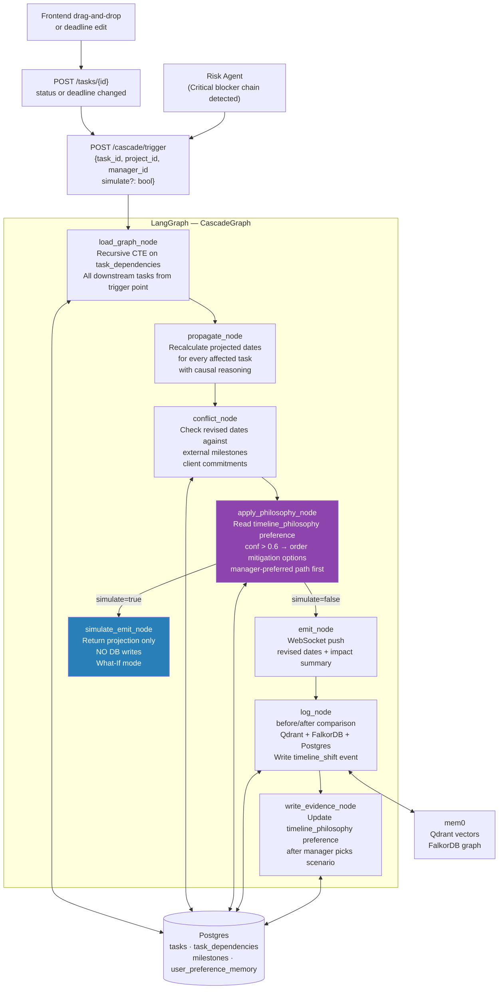

# Cascade Agent — Technical Implementation Document

> Stack: LangGraph · LangChain · Qwen3:8b (Ollama) · Qdrant · FalkorDB (mem0) · Postgres · FastAPI · Pydantic v2

---

## 1. Architecture Overview



---

## 2. Postgres Schema

### 2.1 `task_dependencies` table

```sql
-- Replaces Neo4j for Phase 1. Recursive CTE handles graph traversal.
CREATE TABLE task_dependencies (
    task_id       UUID REFERENCES tasks(id) ON DELETE CASCADE,
    depends_on_id UUID REFERENCES tasks(id) ON DELETE CASCADE,
    PRIMARY KEY (task_id, depends_on_id)
);

-- Index for fast downstream lookups
CREATE INDEX idx_task_deps_depends_on ON task_dependencies(depends_on_id);
```

### 2.2 `milestones` table

```sql
CREATE TABLE milestones (
    id          UUID PRIMARY KEY DEFAULT gen_random_uuid(),
    project_id  UUID NOT NULL,
    title       TEXT NOT NULL,
    due_date    TIMESTAMP NOT NULL,
    is_external BOOLEAN DEFAULT FALSE,   -- client commitment = hard constraint
    description TEXT
);
```

### 2.3 `cascade_log` table

```sql
CREATE TABLE cascade_log (
    id              UUID PRIMARY KEY DEFAULT gen_random_uuid(),
    project_id      UUID NOT NULL,
    trigger_task_id UUID REFERENCES tasks(id),
    manager_id      UUID,
    original_dates  JSONB,   -- {task_id: original_due_date, ...}
    revised_dates   JSONB,   -- {task_id: new_projected_date, ...}
    conflict_flags  JSONB,   -- [{milestone_id, milestone_title, conflict_type}, ...]
    mitigation_chosen VARCHAR(50),  -- "scope_cut" | "buffer" | "parallelize" | "standard"
    simulate_only   BOOLEAN DEFAULT FALSE,
    created_at      TIMESTAMP DEFAULT NOW()
);
```

### 2.4 `timeline_philosophy` in `user_preference_memory`

```sql
-- preference_type = 'timeline_philosophy'
-- preference_value shape:
{
  "protects":  "release_date",     -- manager prefers cutting scope over slipping dates
  -- OR
  "protects":  "scope",            -- manager prefers slipping dates over cutting scope
  "buffers":   "testing",          -- manager adds buffer at testing stage when possible
  "chosen_scenarios": {
    "scope_cut":   5,
    "buffer":      2,
    "parallelize": 1,
    "standard":    3
  },
  "total_scenarios_offered": 11
}
```

---

## 3. Pydantic Schemas

```python
# schemas/cascade.py
from pydantic import BaseModel, Field
from typing import Literal, Optional
from uuid import UUID
from datetime import datetime, timedelta

class TaskNode(BaseModel):
    id:              UUID
    title:           str
    status:          str
    assignee_id:     Optional[UUID]
    assignee_name:   Optional[str]
    current_due:     Optional[datetime]
    estimated_days:  int   # working days to complete
    affected_module: Optional[str]
    depth:           int   # hops from trigger task in the dependency tree

class MilestoneConflict(BaseModel):
    milestone_id:    UUID
    milestone_title: str
    due_date:        datetime
    conflicting_task_id:   UUID
    conflicting_task_title: str
    new_projected_date:    datetime
    days_overrun:    int
    is_external:     bool   # True = hard client commitment

class MitigationScenario(BaseModel):
    name:        Literal["standard", "scope_cut", "buffer", "parallelize"]
    label:       str      # human-readable name for UI
    description: str
    revised_dates: dict[str, datetime]   # task_id → new date
    resolves_conflicts: bool
    tradeoffs:   str      # e.g. "Removes non-critical acceptance criteria from Sprint 4"
    is_preferred: bool = False   # True if timeline_philosophy preference applies

class CascadeResult(BaseModel):
    trigger_task_id:   UUID
    affected_tasks:    list[TaskNode]
    original_dates:    dict[str, datetime]
    revised_dates:     dict[str, datetime]    # standard propagation
    delay_days:        int
    conflict_flags:    list[MilestoneConflict]
    scenarios:         list[MitigationScenario]
    preference_applied: bool
    simulate_only:     bool

class CascadeState(BaseModel):
    task_id:     str
    project_id:  str
    manager_id:  str
    simulate:    bool = False
    delay_days:  int = 0   # set by propagate_node

    # populated by nodes
    trigger_task:   Optional[TaskNode]   = None
    downstream:     list[TaskNode]       = []
    original_dates: dict[str, datetime]  = {}
    revised_dates:  dict[str, datetime]  = {}
    conflicts:      list[MilestoneConflict] = []
    scenarios:      list[MitigationScenario] = []
    result:         Optional[CascadeResult] = None
```

---

## 4. Dependency Graph Traversal

```python
# cascade_utils.py

def get_downstream_tasks(trigger_task_id: str, project_id: str) -> list[dict]:
    """
    Recursive CTE: find all tasks downstream of trigger_task_id.
    Returns tasks ordered by dependency depth (breadth-first).
    """
    from db import get_pg_conn
    conn = get_pg_conn()

    rows = conn.execute("""
        WITH RECURSIVE downstream AS (
            -- Base: tasks directly depending on the trigger
            SELECT td.task_id, 1 AS depth
            FROM task_dependencies td
            WHERE td.depends_on_id = %s

            UNION ALL

            -- Recursive: tasks depending on already-found tasks
            SELECT td.task_id, ds.depth + 1
            FROM task_dependencies td
            JOIN downstream ds ON td.depends_on_id = ds.task_id
            WHERE ds.depth < 20   -- safety limit: max 20 hops
        )
        SELECT DISTINCT ON (t.id)
               t.id, t.title, t.status, t.assignee_id,
               m.name as assignee_name,
               t.due_date as current_due,
               t.estimated_points,
               t.affected_module,
               ds.depth
        FROM downstream ds
        JOIN tasks t ON t.id = ds.task_id
        LEFT JOIN members m ON t.assignee_id = m.id
        WHERE t.project_id = %s
          AND t.status NOT IN ('completed', 'cancelled')
        ORDER BY t.id, ds.depth
    """, (trigger_task_id, project_id)).fetchall()

    return rows
```

---

## 5. LangGraph Nodes

### 5.1 `load_graph_node`

```python
# nodes/cascade/load_graph.py
from schemas.cascade import TaskNode, CascadeState
from cascade_utils import get_downstream_tasks
from db import get_pg_conn

def load_graph_node(state: dict) -> dict:
    conn = get_pg_conn()

    # Load trigger task itself
    trigger_row = conn.execute(
        "SELECT t.*, m.name as assignee_name FROM tasks t "
        "LEFT JOIN members m ON t.assignee_id=m.id WHERE t.id=%s",
        (state["task_id"],)
    ).fetchone()

    if not trigger_row:
        raise ValueError(f"Trigger task {state['task_id']} not found")

    trigger_task = TaskNode(
        id=trigger_row["id"], title=trigger_row["title"],
        status=trigger_row["status"], assignee_id=trigger_row["assignee_id"],
        assignee_name=trigger_row["assignee_name"],
        current_due=trigger_row["due_date"],
        estimated_days=max(1, (trigger_row["estimated_points"] or 5) // 2),
        affected_module=trigger_row["affected_module"], depth=0,
    )

    downstream_rows = get_downstream_tasks(state["task_id"], state["project_id"])
    downstream = [
        TaskNode(
            id=row["id"], title=row["title"], status=row["status"],
            assignee_id=row["assignee_id"], assignee_name=row["assignee_name"],
            current_due=row["current_due"],
            estimated_days=max(1, (row["estimated_points"] or 5) // 2),
            affected_module=row["affected_module"], depth=row["depth"],
        )
        for row in downstream_rows
    ]

    # Snapshot original dates before propagation
    original_dates = {}
    if trigger_task.current_due:
        original_dates[str(trigger_task.id)] = trigger_task.current_due
    for t in downstream:
        if t.current_due:
            original_dates[str(t.id)] = t.current_due

    return {
        "trigger_task":   trigger_task,
        "downstream":     downstream,
        "original_dates": original_dates,
    }
```

### 5.2 `propagate_node`

```python
# nodes/cascade/propagate.py
from datetime import datetime, timedelta, timezone
from schemas.cascade import TaskNode

WORKING_DAYS_PER_WEEK = 5

def add_working_days(start: datetime, days: int) -> datetime:
    """Add N working days (skip weekends)."""
    result = start
    added  = 0
    while added < days:
        result += timedelta(days=1)
        if result.weekday() < 5:   # Monday=0, Friday=4
            added += 1
    return result

def propagate_node(state: dict) -> dict:
    """
    Standard propagation:
    1. The trigger task's due date has shifted by delay_days.
    2. Each downstream task's date is recalculated based on:
       - Its own estimated_days
       - The latest completion date of all its predecessors
    """
    trigger  = state["trigger_task"]
    downstream = state["downstream"]

    # Get delay from trigger task's new_due vs original_due
    # (In real impl, delay_days is passed in state from the task update event)
    delay_days = state.get("delay_days", 3)   # default 3 for demo

    now = datetime.now(timezone.utc)

    # New trigger due date
    trigger_new_due = (
        add_working_days(trigger.current_due, delay_days)
        if trigger.current_due
        else add_working_days(now, delay_days)
    )

    revised_dates = {str(trigger.id): trigger_new_due}

    # Process tasks layer by layer (by depth)
    # Each task's new start = max(completion of all predecessors)
    # Each task's new due = new start + estimated_days

    # Build a simple completion map: task_id → projected completion date
    completion = {str(trigger.id): trigger_new_due}

    # Sort by depth so predecessors are processed first
    sorted_downstream = sorted(downstream, key=lambda t: t.depth)

    for task in sorted_downstream:
        task_id = str(task.id)

        # Find all predecessors in the dependency chain that we've already computed
        # (simplified: use trigger task's completion as the baseline for depth=1,
        #  accumulate for deeper levels)
        if task.depth == 1:
            predecessor_completion = trigger_new_due
        else:
            # Use the latest completion among tasks at depth-1
            # (in full impl, this looks up the actual dependency edges)
            predecessor_completions = [
                completion[str(t.id)]
                for t in sorted_downstream
                if t.depth == task.depth - 1 and str(t.id) in completion
            ]
            predecessor_completion = (
                max(predecessor_completions) if predecessor_completions
                else trigger_new_due
            )

        # New due = after predecessor completes + this task's own duration
        new_due = add_working_days(predecessor_completion, task.estimated_days)
        completion[task_id] = new_due
        revised_dates[task_id] = new_due

    return {
        "revised_dates": revised_dates,
        "delay_days":    delay_days,
    }
```

### 5.3 `conflict_node`

```python
# nodes/cascade/conflict.py
from schemas.cascade import MilestoneConflict
from db import get_pg_conn

def conflict_node(state: dict) -> dict:
    """
    Compare revised_dates against milestones.
    External milestones (is_external=True) are hard constraints (client commitments).
    Internal milestones are soft constraints (release targets).
    """
    conn = get_pg_conn()
    revised = state["revised_dates"]

    milestones = conn.execute(
        "SELECT * FROM milestones WHERE project_id=%s ORDER BY due_date",
        (state["project_id"],)
    ).fetchall()

    downstream_by_id = {str(t.id): t for t in state["downstream"]}
    downstream_by_id[str(state["trigger_task"].id)] = state["trigger_task"]

    conflicts = []
    for ms in milestones:
        ms_due = ms["due_date"]
        for task_id, new_date in revised.items():
            if new_date > ms_due:
                task = downstream_by_id.get(task_id)
                if not task:
                    continue
                conflicts.append(MilestoneConflict(
                    milestone_id=ms["id"],
                    milestone_title=ms["title"],
                    due_date=ms_due,
                    conflicting_task_id=task.id,
                    conflicting_task_title=task.title,
                    new_projected_date=new_date,
                    days_overrun=(new_date - ms_due).days,
                    is_external=ms["is_external"],
                ))

    return {"conflicts": conflicts}
```

### 5.4 `apply_philosophy_node` — Preference-Ordered Scenarios

```python
# nodes/cascade/apply_philosophy.py
from schemas.cascade import MitigationScenario
from cascade_utils import add_working_days
from db import get_pg_conn
from datetime import datetime, timezone
import json

CONFIDENCE_THRESHOLD = 0.6

def _build_standard_scenario(state: dict) -> MitigationScenario:
    """Always offered — the neutral propagation."""
    return MitigationScenario(
        name="standard",
        label="Accept the delay",
        description=(
            f"Propagate the {state['delay_days']}-day delay across all "
            f"{len(state['downstream'])} downstream tasks. Release date slips."
        ),
        revised_dates=state["revised_dates"],
        resolves_conflicts=False,
        tradeoffs="Full scope maintained. All deadlines shift by delay amount.",
        is_preferred=False,
    )

def _build_scope_cut_scenario(state: dict) -> MitigationScenario:
    """Remove lowest-priority tasks to protect release date."""
    # Find tasks with low estimated_days (smallest scope impact to cut)
    downstream = sorted(state["downstream"], key=lambda t: t.estimated_days)
    cuttable   = [t for t in downstream if t.depth >= 2][:2]   # cut deepest, smallest tasks

    # Revised dates: original dates for remaining tasks (scope cut protects them)
    revised = {k: v for k, v in state["original_dates"].items()
               if k not in {str(t.id) for t in cuttable}}

    cut_titles = [t.title for t in cuttable]
    return MitigationScenario(
        name="scope_cut",
        label="Cut scope to protect release",
        description=(
            f"Remove {len(cuttable)} lower-priority task(s) from this sprint: "
            f"{', '.join(cut_titles)}. Original release date preserved."
        ),
        revised_dates=revised,
        resolves_conflicts=True,
        tradeoffs=f"Defers: {', '.join(cut_titles)} to next sprint.",
        is_preferred=False,
    )

def _build_buffer_scenario(state: dict, stage: str = "testing") -> MitigationScenario:
    """Add buffer at a specific stage (e.g. testing) to absorb the delay."""
    # Find testing/QA tasks in downstream and compress their buffer
    testing_tasks = [
        t for t in state["downstream"]
        if "test" in (t.affected_module or "").lower()
        or "qa" in (t.title or "").lower()
    ]

    revised = dict(state["revised_dates"])
    for t in testing_tasks:
        tid = str(t.id)
        if tid in revised:
            # Absorb delay by reducing testing buffer (risky but preserves release)
            from datetime import timedelta
            revised[tid] = revised[tid] - timedelta(days=state["delay_days"] // 2)

    return MitigationScenario(
        name="buffer",
        label=f"Compress {stage} buffer",
        description=(
            f"Absorb {state['delay_days']} day(s) by compressing the "
            f"{stage} phase buffer. Release date maintained."
        ),
        revised_dates=revised,
        resolves_conflicts=len(testing_tasks) > 0,
        tradeoffs="Reduced testing time increases risk of undetected bugs.",
        is_preferred=False,
    )

def _build_parallelize_scenario(state: dict) -> MitigationScenario:
    """Assign second engineer to trigger task to halve remaining duration."""
    trigger = state["trigger_task"]
    half_delay = max(1, state["delay_days"] // 2)

    revised = {}
    for task_id, new_date in state["revised_dates"].items():
        from datetime import timedelta
        revised[task_id] = new_date - timedelta(days=half_delay)

    return MitigationScenario(
        name="parallelize",
        label="Add engineer to trigger task",
        description=(
            f"Assign a second engineer to '{trigger.title}' to halve remaining work. "
            f"Downstream impact reduced from {state['delay_days']} to ~{half_delay} day(s)."
        ),
        revised_dates=revised,
        resolves_conflicts=False,
        tradeoffs="Requires available engineer with relevant skills. Coordination overhead.",
        is_preferred=False,
    )


def apply_philosophy_node(state: dict) -> dict:
    """
    1. Build all mitigation scenarios.
    2. Read timeline_philosophy preference.
    3. If confidence > 0.6, mark manager's preferred scenario as is_preferred=True
       and sort it to the top.
    4. Standard propagation is always present regardless of preference.
    """
    conn       = get_pg_conn()
    manager_id = state["manager_id"]

    # Build all scenarios
    standard    = _build_standard_scenario(state)
    scope_cut   = _build_scope_cut_scenario(state)
    buffer      = _build_buffer_scenario(state)
    parallelize = _build_parallelize_scenario(state)

    all_scenarios = [standard, scope_cut, buffer, parallelize]

    # Fetch timeline_philosophy preference
    pref_row = conn.execute(
        """SELECT preference_value, confidence FROM user_preference_memory
           WHERE user_id=%s AND preference_type='timeline_philosophy'
           AND confidence > %s""",
        (manager_id, CONFIDENCE_THRESHOLD)
    ).fetchone()

    preference_applied = False

    if pref_row:
        val = json.loads(pref_row["preference_value"]) if isinstance(
            pref_row["preference_value"], str) else pref_row["preference_value"]

        protects = val.get("protects")
        buffers  = val.get("buffers")

        # Determine preferred scenario name
        preferred_name = None
        if protects == "release_date":
            preferred_name = "scope_cut"
        elif protects == "scope":
            preferred_name = "standard"
        if buffers == "testing":
            preferred_name = preferred_name or "buffer"

        # Mark preferred and sort to top
        for s in all_scenarios:
            if s.name == preferred_name:
                s.is_preferred = True
                preference_applied = True
                break

        # Sort: preferred first, then standard, then others
        all_scenarios.sort(key=lambda s: (not s.is_preferred, s.name != "standard"))

    return {
        "scenarios":          all_scenarios,
        "preference_applied": preference_applied,
    }
```

### 5.5 `emit_node`

```python
# nodes/cascade/emit.py
from websocket_manager import broadcast

def emit_node(state: dict) -> dict:
    trigger  = state["trigger_task"]
    delay    = state["delay_days"]
    downstream_count = len(state["downstream"])
    conflicts = state["conflicts"]
    scenarios = state["scenarios"]

    # Summary notification (non-intrusive — shown in Notifications Center)
    summary = (
        f"'{trigger.title}' delayed {delay} day(s). "
        f"{downstream_count} downstream task(s) affected."
    )
    if conflicts:
        hard = [c for c in conflicts if c.is_external]
        if hard:
            summary += f" ⚠️ {len(hard)} client commitment(s) at risk."

    payload = {
        "type":             "cascade_impact",
        "trigger_task":     trigger.title,
        "delay_days":       delay,
        "downstream_count": downstream_count,
        "summary":          summary,
        "conflicts": [
            {
                "milestone":   c.milestone_title,
                "task":        c.conflicting_task_title,
                "overrun_days": c.days_overrun,
                "is_external": c.is_external,
            }
            for c in conflicts
        ],
        "scenarios": [
            {
                "name":        s.name,
                "label":       s.label,
                "description": s.description,
                "is_preferred": s.is_preferred,
                "tradeoffs":   s.tradeoffs,
            }
            for s in scenarios
        ],
        "revised_dates": {
            tid: dt.isoformat()
            for tid, dt in state["revised_dates"].items()
        },
    }

    broadcast(state["project_id"], payload)
    return {}
```

### 5.6 `log_node`

```python
# nodes/cascade/log_node.py
from memory_agent.config import get_mem0_client
from db import get_pg_conn
import uuid, json

def log_node(state: dict) -> dict:
    conn    = get_pg_conn()
    client  = get_mem0_client()
    trigger = state["trigger_task"]

    cascade_id = str(uuid.uuid4())

    # ── Postgres: before/after comparison ──────────────────────────────── #
    conn.execute("""
        INSERT INTO cascade_log
        (id, project_id, trigger_task_id, manager_id,
         original_dates, revised_dates, conflict_flags, simulate_only)
        VALUES (%s,%s,%s,%s,%s,%s,%s,%s)
    """, (
        cascade_id, state["project_id"], str(trigger.id), state["manager_id"],
        json.dumps({k: v.isoformat() for k, v in state["original_dates"].items()}),
        json.dumps({k: v.isoformat() for k, v in state["revised_dates"].items()}),
        json.dumps([c.model_dump(mode="json") for c in state["conflicts"]]),
        state.get("simulate", False),
    ))

    # ── Also update tasks table with new dates (if not simulate) ─────── #
    if not state.get("simulate"):
        for task_id, new_date in state["revised_dates"].items():
            if task_id != str(trigger.id):
                conn.execute(
                    "UPDATE tasks SET due_date=%s, updated_at=NOW() WHERE id=%s",
                    (new_date, task_id)
                )

    conn.commit()

    # ── mem0 (Qdrant + FalkorDB): timeline_shift event ─────────────────── #
    downstream_titles = [t.title for t in state["downstream"][:3]]
    embed_text = (
        f"Timeline shift: '{trigger.title}' delayed {state['delay_days']} day(s). "
        f"{len(state['downstream'])} downstream tasks affected: "
        f"{', '.join(downstream_titles)}{'...' if len(state['downstream']) > 3 else ''}. "
        f"Conflicts: {len(state['conflicts'])} milestone(s) at risk."
    )
    metadata = {
        "event_type":    "timeline_shift",
        "project_id":    state["project_id"],
        "trigger_task":  trigger.title,
        "delay_days":    state["delay_days"],
        "affected_count": len(state["downstream"]),
        "memory_tier":   "active",
        "relevance_score": 1.0,
    }
    client.add(embed_text, user_id=state["manager_id"],
               metadata=metadata, infer=False)

    return {"cascade_log_id": cascade_id}
```

### 5.7 `write_evidence_node` — Learning Timeline Philosophy

```python
# nodes/cascade/write_evidence.py
from db import get_pg_conn
import json
from datetime import datetime

CONFIDENCE_THRESHOLD = 0.6

def _calculate_confidence(consistency_rate: float, evidence_count: int) -> float:
    return consistency_rate * (1 - 1 / (1 + evidence_count))

def write_evidence_node(state: dict) -> dict:
    """
    Called via POST /cascade/scenario-chosen after manager picks a mitigation.
    state keys: manager_id, cascade_log_id, chosen_scenario (name), project_id
    """
    conn       = get_pg_conn()
    manager_id = state["manager_id"]
    chosen     = state["chosen_scenario"]   # "scope_cut" | "buffer" | "parallelize" | "standard"
    now        = datetime.utcnow()

    # Update cascade_log with chosen mitigation
    conn.execute(
        "UPDATE cascade_log SET mitigation_chosen=%s WHERE id=%s",
        (chosen, state["cascade_log_id"])
    )

    # ── Update timeline_philosophy preference ─────────────────────────── #
    existing = conn.execute(
        """SELECT * FROM user_preference_memory
           WHERE user_id=%s AND preference_type='timeline_philosophy'""",
        (manager_id,)
    ).fetchone()

    if existing is None:
        chosen_counts = {chosen: 1}
        pref_value = {
            "chosen_scenarios":          chosen_counts,
            "total_scenarios_offered":   1,
            "protects": "release_date" if chosen == "scope_cut" else "scope",
            "buffers":  "testing" if chosen == "buffer" else None,
        }
        confidence = _calculate_confidence(1.0, 1)
        conn.execute(
            """INSERT INTO user_preference_memory
               (user_id, preference_type, preference_value, confidence,
                evidence_count, last_observed, created_at)
               VALUES (%s,'timeline_philosophy',%s,%s,1,%s,%s)""",
            (manager_id, json.dumps(pref_value), confidence, now, now)
        )
    else:
        val = json.loads(existing["preference_value"]) if isinstance(
            existing["preference_value"], str) else existing["preference_value"]

        evidence_count = existing["evidence_count"] + 1
        chosen_counts  = val.get("chosen_scenarios", {})
        chosen_counts[chosen] = chosen_counts.get(chosen, 0) + 1
        total = val.get("total_scenarios_offered", evidence_count) + 1

        # Determine dominant philosophy from choice history
        top_choice = max(chosen_counts, key=chosen_counts.get)
        top_rate   = chosen_counts[top_choice] / total

        protects = val.get("protects", "scope")
        buffers  = val.get("buffers")

        if top_choice == "scope_cut" and top_rate > 0.5:
            protects = "release_date"
        elif top_choice == "standard" and top_rate > 0.5:
            protects = "scope"
        if top_choice == "buffer" and top_rate > 0.4:
            buffers = "testing"

        consistency_rate = top_rate   # how often manager picks the dominant scenario
        confidence = _calculate_confidence(consistency_rate, evidence_count)

        updated_val = {
            "chosen_scenarios":        chosen_counts,
            "total_scenarios_offered": total,
            "protects":                protects,
            "buffers":                 buffers,
        }
        conn.execute(
            """UPDATE user_preference_memory
               SET preference_value=%s, confidence=%s, evidence_count=%s, last_observed=%s
               WHERE id=%s""",
            (json.dumps(updated_val), confidence, evidence_count, now, existing["id"])
        )

    conn.commit()
    return {
        "evidence_written": True,
        "chosen_scenario":  chosen,
        "new_confidence":   confidence,
    }
```

---

## 6. LangGraph Graph Definition

```python
# graphs/cascade.py
from langgraph.graph import StateGraph, START, END
from nodes.cascade.load_graph      import load_graph_node
from nodes.cascade.propagate       import propagate_node
from nodes.cascade.conflict        import conflict_node
from nodes.cascade.apply_philosophy import apply_philosophy_node
from nodes.cascade.emit            import emit_node
from nodes.cascade.log_node        import log_node

def route_simulate(state: dict) -> str:
    return "simulate_end" if state.get("simulate") else "emit"

def build_cascade_graph():
    graph = StateGraph(dict)

    graph.add_node("load_graph",       load_graph_node)
    graph.add_node("propagate",        propagate_node)
    graph.add_node("conflict",         conflict_node)
    graph.add_node("apply_philosophy", apply_philosophy_node)
    graph.add_node("emit",             emit_node)
    graph.add_node("log",              log_node)
    graph.add_node("simulate_end",     lambda s: s)   # no-op: return state without DB writes

    graph.add_edge(START,              "load_graph")
    graph.add_edge("load_graph",       "propagate")
    graph.add_edge("propagate",        "conflict")
    graph.add_edge("conflict",         "apply_philosophy")

    graph.add_conditional_edges(
        "apply_philosophy",
        route_simulate,
        {"emit": "emit", "simulate_end": "simulate_end"},
    )

    graph.add_edge("emit",          "log")
    graph.add_edge("log",           END)
    graph.add_edge("simulate_end",  END)

    return graph.compile()

cascade_graph = build_cascade_graph()
```

---

## 7. FastAPI Endpoints

```python
# api/cascade.py
from fastapi import APIRouter
from pydantic import BaseModel
from typing import Optional
from graphs.cascade import cascade_graph
from nodes.cascade.write_evidence import write_evidence_node

router = APIRouter(prefix="/cascade", tags=["Cascade Agent"])

class TriggerRequest(BaseModel):
    task_id:    str
    project_id: str
    manager_id: str
    delay_days: int = 3
    simulate:   bool = False   # True = What-If mode, no DB writes

@router.post("/trigger")
def trigger(req: TriggerRequest):
    result = cascade_graph.invoke(req.model_dump())

    scenarios = result.get("scenarios", [])
    conflicts = result.get("conflicts", [])

    return {
        "trigger_task":     result["trigger_task"].title,
        "delay_days":       result.get("delay_days", req.delay_days),
        "affected_count":   len(result.get("downstream", [])),
        "simulate_only":    req.simulate,
        "conflict_count":   len(conflicts),
        "hard_conflicts":   sum(1 for c in conflicts if c.is_external),
        "revised_dates":    {
            tid: dt.isoformat()
            for tid, dt in result.get("revised_dates", {}).items()
        },
        "scenarios": [
            {
                "name":        s.name,
                "label":       s.label,
                "description": s.description,
                "is_preferred": s.is_preferred,
                "tradeoffs":   s.tradeoffs,
                "resolves_conflicts": s.resolves_conflicts,
            }
            for s in scenarios
        ],
        "cascade_log_id": result.get("cascade_log_id"),
    }

class ScenarioChosenRequest(BaseModel):
    cascade_log_id:   str
    manager_id:       str
    chosen_scenario:  str
    project_id:       str

@router.post("/scenario-chosen")
def scenario_chosen(req: ScenarioChosenRequest):
    result = write_evidence_node(req.model_dump())
    return {
        "evidence_written": result["evidence_written"],
        "chosen_scenario":  result["chosen_scenario"],
        "new_confidence":   result["new_confidence"],
    }
```

---

## 8. What-If Simulator Flow

```
Manager opens Cascade View → drags Payment API deadline +3 days

Frontend sends:
  POST /cascade/trigger {task_id, delay_days: 3, simulate: true}

→ LangGraph runs full propagation + conflict detection
→ route_simulate → simulate_end (skip emit + log)
→ Returns projected_dates WITHOUT writing to DB
→ Frontend renders: "If delayed 3 days: Checkout Flow slips to July 22, Refunds to July 24"

Manager drags to +5 days:
  POST /cascade/trigger {delay_days: 5, simulate: true}
→ New projection: "Checkout Flow slips to July 26 — conflicts with July 25 client demo"

Manager approves +3 day delay:
  POST /cascade/trigger {delay_days: 3, simulate: false}
→ DB writes, WebSocket push, mem0 memory logged
```

---

## 9. Complete Flow Walkthrough

### Trigger: Manager edits Payment API deadline from July 18 → July 21 (+3 days)

**load_graph:**
```
trigger:    PaymentAPI (due July 18, depth=0)
downstream: [CheckoutFlow (depth=1, est=4 days),
             Refunds (depth=1, est=3 days),
             E2ETesting (depth=2, est=2 days)]
original:   {PaymentAPI: July18, CheckoutFlow: July20, Refunds: July20, E2E: July22}
```

**propagate:**
```
delay_days = 3
PaymentAPI new_due   = July 18 + 3 working days = July 21
CheckoutFlow new_due = July 21 + 4 working days = July 27
Refunds new_due      = July 21 + 3 working days = July 24
E2ETesting new_due   = July 27 + 2 working days = July 29
```

**conflict:**
```
Milestone: "Client Demo" due July 25 (is_external=True)
→ E2ETesting now July 29 > July 25 → CONFLICT (overrun 4 days, external)
```

**apply_philosophy (Alice, confidence=0.81, protects=release_date):**
```
scope_cut.is_preferred = True (Alice always protects release date)
scenarios order: [scope_cut ★, standard, buffer, parallelize]
```

**WebSocket push:**
```
"Payment API delayed 3 days. 3 downstream tasks affected. New release: July 29.
⚠️ 1 client commitment at risk (July 25 demo)."
Scenarios:
  ★ Cut scope [preferred] — Remove E2E full suite, run smoke tests only. Demo preserved.
  · Accept delay — Release slips to July 29.
  · Compress testing — Reduce test time. Release July 26 but higher bug risk.
  · Add engineer — Cut impact to ~2 days. Needs available backend dev.
```

**Manager picks "Cut scope" → POST /cascade/scenario-chosen:**
```
write_evidence: scope_cut count: 6/8 = 75% → protects=release_date
confidence: 0.75 × (1 - 1/9) = 0.667 → 0.69
```
