# NeuralPM — Master Feature List (Corrected)

> **Architecture decisions baked in:**
> - Neo4j **dropped** — replaced by `task_dependencies` Postgres table for cascade traversal (Phase 2 upgrade path documented); FalkorDB handles entity/relationship graph via mem0
> - Mem0 **reinstated with FalkorDB** — `mem0ai[graph]` + `mem0-falkordb` plugin. A single `m.add()` writes to both Qdrant (vectors) and FalkorDB (entity graph). `register()` must be called before any mem0 import.
> - `embedding` field **removed** from Postgres — vectors live exclusively in Qdrant
> - Qwen-VL confirmed: `qwen2.5vl:7b` available on Ollama (6GB, 125K context)
> - Default embedding model: `qwen3-embedding:0.6b` → 1024 dims (set `EMBED_DIMS=1024`)

---

## Build Concurrency Overview

```mermaid
flowchart LR
    subgraph SEQ1["🔴 Sequential — Phase 0"]
        direction TB
        S1["Qdrant → Postgres → Ollama Models\n→ DB Schemas → FastAPI → Celery"]
    end

    subgraph SEQ2["🔴 Sequential — Phase 1"]
        direction TB
        S2["Embed Pipeline → Ingest Graph\n→ Chat Graph → Gate: Loop Verified"]
    end

    subgraph PAR1["🟢 Parallel — Phase 2"]
        direction TB
        P1["Forgetting\nCelery"]
        P2["Assignment\nAgent"]
        P3["Risk\nAgent"]
        P4["Cascade\nAgent"]
        P5["Frontend\nSkeleton"]
    end

    subgraph SEQ3["🔴 Sequential — Phase 3"]
        direction TB
        S3["Evidence Writing → Confidence Scoring\n→ Learning Mode → Registry UI"]
    end

    subgraph PAR2["🟢 Parallel — Phase 4"]
        direction TB
        P6["Autopsy"]
        P7["What-If"]
        P8["Qwen-VL"]
        P9["Demo Clock"]
        P10["Suppressed UI"]
    end

    SEQ1 --> SEQ2 --> PAR1 --> SEQ3 --> PAR2

    style SEQ1 fill:#c0392b,color:#fff,stroke:#922b21
    style SEQ2 fill:#c0392b,color:#fff,stroke:#922b21
    style SEQ3 fill:#c0392b,color:#fff,stroke:#922b21
    style PAR1 fill:#1e8449,color:#fff,stroke:#196f3d
    style PAR2 fill:#1a5276,color:#fff,stroke:#154360
```



> Full diagram with per-agent flows → see `README.md`

---

## 🤖 Agent Layer

### Assignment Agent
- Analyze task requirements (skills, complexity, severity, urgency)
- Score every team member: skill match, workload, velocity, context affinity
- Suggest ranked shortlist of 3 candidates with per-factor scores (0–100)
- Auto-assign mode (executes without approval)
- "Find Best Match" button per task in UI
- Log every decision + rationale to memory layer
- Learn from manager overrides → write evidence to `user_preference_memory`
- Apply `assignment_override` preference (confidence > 0.6) to re-rank before output
- Confidence-weighted arbitration when preferences conflict (higher confidence wins; ties broken by `last_observed`)

### Risk Agent
- Stale task detection (no updates past configurable threshold)
- Engineer overload detection (capacity %)
- Deadline risk analysis (approaching deadline + unresolved blockers)
- Blocker chain analysis (one stalled task blocking multiple downstream tasks)
- Severity classification: Critical / High / Medium / Low
- Continuous background monitoring (Celery Beat)
- **Apply `risk_tolerance` preference before rendering Risk Radar** — when manager confidence > 0.6, suppress categories they reliably dismiss and escalate categories they always act on (pre-render, not post-feedback)
- **Suppressed risks hidden by default but filter-accessible** — one filter-click reveals them; hover shows suppression reason ("Suppressed: Alice dismisses overload risks, conf 0.71")
- **Suppressed risks never deleted** — always queryable for audit
- Log user feedback (resolve / acknowledge / dismiss) → write evidence to `user_preference_memory`

### Cascade Agent
- **Trigger mechanism:** `POST /cascade/trigger` endpoint fired by task status-change webhook from the frontend (drag-and-drop or explicit deadline edit); also callable directly by Risk Agent when a blocker chain is detected
- Load task dependency graph from `task_dependencies` Postgres table
- Impact propagation algorithm across all dependent tasks
- Generate revised projected dates with causal reasoning
- Hard conflict detection against external milestones / client commitments
- **Apply `timeline_philosophy` preference to order mitigation scenarios** — when confidence > 0.6, manager-preferred path (scope cut / buffer testing / etc.) is offered first; neutral standard propagation always present as fallback
- Mitigation options always generated: reallocate resources, parallelize tasks, adjust scope
- What-If Simulator: drag deadlines → instant projected outcome (stateless calculation, no DB write)
- Log before/after comparisons + actual outcomes to memory layer
- Write cascade evidence to `user_preference_memory` for timeline_philosophy learning

---

## 🧠 Memory Agent (Central Nervous System)

### Layer 1 — Structured Event Store (Postgres)

Table: `memory_events`
```
id               UUID PRIMARY KEY
task_id          UUID
event_type       VARCHAR(50)    -- assignment | requirement_change | risk_flag | timeline_shift | ...
description      TEXT
agent_source     VARCHAR(50)    -- which agent wrote this event
member_id        UUID
sprint_id        UUID
metadata         JSONB
timestamp        TIMESTAMP
relevance_score  FLOAT          -- 0.01–1.0, decays over time
superseded_by    UUID           -- set when overridden/replaced
memory_tier      VARCHAR(20)    -- active | compressed | archived
last_accessed    TIMESTAMP
access_count     INT
```
> ⚠️ No `embedding` field — vectors live exclusively in Qdrant. Postgres row ID = Qdrant point ID (UUID).

### Layer 2 — Semantic Vector Memory (Qdrant)
- Embed all events via Qwen3-Embedding (Ollama) at ingest time
- Store in Qdrant collection `neuralpm_memories` with full metadata payload
- Payload fields mirror Postgres: `project_id`, `event_type`, `memory_tier`, `relevance_score`, `agent_source`
- Payload indexes on: `project_id`, `memory_tier`, `event_type`, `user_id`
- Cosine similarity retrieval with metadata pre-filtering
- `project_id` hard isolation — filter enforced at every query, raises immediately if missing
- Advanced filter operators: `in`, `gte`, `lte`, `AND`, `OR` (bare names, no `$` prefix)
- Qdrant queried directly (no mem0 abstraction layer)

### Layer 3 — Learned Intelligence Layer
- Project patterns (e.g. "auth tasks take 22% longer than estimated")
- Team dynamics (e.g. "Sarah excels at urgent API tasks")
- Causal chains built from event sequences: requirement_change → assignment → overload → delay

### Adaptive Forgetting (Celery Beat)
- Nightly decay job (5-min cycle in demo mode)
- Relevance score decay: age-based tiering + disuse decay (1–10% rate, access_count slows decay)
- Tier transitions: active → compressed → archived
- LLM compression of events moving to `compressed` tier (summary replaces full description)
- Instant supersession on override/requirement change: `superseded_by` set + relevance collapses to 0.05 immediately (synchronous write, does not wait for next Celery cycle)
- Updates both Postgres (source of truth) and Qdrant payload (so filters stay accurate)
- Decay constants configurable per workspace

### User Preference Memory (Postgres)

Table: `user_preference_memory`
```
id               UUID PRIMARY KEY
user_id          UUID NOT NULL
preference_type  VARCHAR(50)   -- assignment_override | communication_style | risk_tolerance | timeline_philosophy
preference_value JSONB
confidence       FLOAT         -- confidence = consistency_rate × (1 − 1/(1 + evidence_count))
evidence_count   INT
last_observed    TIMESTAMP
created_at       TIMESTAMP
```
- Confidence threshold: 0.6 (below = hint only, above = actively re-ranks agent output)
- Learning Mode toggle: one-step teaching — "new pattern" seeds confidence at 0.7 immediately
- Conflicting preferences: higher confidence wins; ties broken by `last_observed`
- Preference registry in UI: every preference inspectable, editable, or deletable in one click

### Tiered Context Budgeting
- Token ceiling allocator per chatbot query (max 8,192 tokens)
- Default slices: active project state (30%), causal history (25%), recent conversation (20%), user preferences (15%), reserve (10%)
- Unused budget in one slice reclaimed by others
- Archived + superseded memories filtered before ranking — prompt stays small on long-running projects

### Memory Chatbot
- Natural language Q&A over all project memory
- Multi-turn conversation within session (recent conversation budget slice)
- Answers grounded in real events with memory ID citations
- Thumbs up/down feedback → writes evidence to `communication_style` preference
- File attachment + doc analysis (Qwen2.5-VL:7b via Ollama — confirmed available)

### Memory Autopsy
- Expandable panel on every chatbot answer
- Shows: memories loaded (ID, tier, relevance score), memories filtered out (ID + reason: superseded / archived / below threshold), token budget used per slice, preferences applied (type, confidence, effect)

---

## 🖥️ UI

### Task Command Center
- Jira-like task table: ID, title, category, severity, assignee, status, progress, due date
- Inline "Find Best Match" button per task
- Color-coded severity + status indicators
- Drag-and-drop status changes → fires `POST /cascade/trigger` + Memory log + Risk check
- Assignee hover tooltip with current load %
- Advanced filter + search (assignee, severity, status, keywords)

### Members Intelligence Hub
- Team table: name, role, load %, active tasks, velocity (story points/week), availability
- Member profile drawer: skill matrix, workload pie chart, velocity trend charts, assignment history with agent match scores, manager controls (capacity / PTO / notes)

### Insights War Room
- **Risk Radar panel:** live threat board; severity cards with natural language explanation + affected tasks + suggested actions; filter toggle to reveal suppressed risks; hover on suppressed shows suppression reason + preference confidence
- **Cascade Timeline:** recent timeline shifts with before/after comparisons; visual dependency map with highlighted impact chains; What-If Simulator (drag deadlines, see projected outcomes without committing)
- **Assignment Analytics:** agent suggestion success rate vs. manual overrides; load distribution heatmap; top performers + skill gaps
- **System Learning Panel:** override rate trend graph (headline metric); confidence growth chart per preference; editable preference registry

### Requirements & Issue Input
- New requirement / issue submission form
- Auto-triggers on submit: related task creation, Assignment Agent, memory ingest, Risk + Cascade impact analysis

### Global Features
- Global search: tasks, members, memory
- Notifications Center: real-time agent alerts via WebSocket
- Autonomy / Governance Toggle: Suggest Mode vs. Auto Mode (per-agent, in Settings)

---

## ⚙️ Backend Infrastructure

| Component | Role |
|---|---|
| **FastAPI** | REST API + WebSocket server |
| **WebSockets** | Real-time agent alerts to frontend (native FastAPI) |
| **LangGraph** | Agent graph orchestration (ingestion, chat, assignment, risk, cascade) |
| **LangChain** | LLM calls, prompt templates, structured output |
| **Qdrant** | Vector store — semantic search, payload-filtered retrieval |
| **Postgres** | `memory_events`, `user_preference_memory`, `task_dependencies`, all project data |
| **Celery + Celery Beat** | Async decay job, event processing, demo clock acceleration |
| **Ollama** | Runs all models locally |
| **Qwen3:8b** | LLM for classify, extract, synthesize, preference scoring |
| **Qwen3-Embedding:4b** | Embeddings (1024 dims) |
| **Qwen2.5-VL:7b** | File/doc analysis in chatbot (6GB, 125K context) |

**Formally dropped:**
- ~~mem0~~ — Qdrant queried directly; mem0's filter translation layer broken (`$in` vs `in`) and adds no value over native Qdrant client
- ~~Neo4j~~ — replaced by `task_dependencies` Postgres table (Phase 2 upgrade: migrate to Neo4j when dependency graph exceeds what recursive CTEs handle efficiently)

### Postgres Schema (key tables)

```sql
-- Task dependency graph (replaces Neo4j for Phase 1)
CREATE TABLE task_dependencies (
    task_id        UUID REFERENCES tasks(id),
    depends_on_id  UUID REFERENCES tasks(id),
    PRIMARY KEY (task_id, depends_on_id)
);
-- Cascade Agent traversal: recursive CTE
-- WITH RECURSIVE downstream AS (
--   SELECT task_id FROM task_dependencies WHERE depends_on_id = $blocked_task
--   UNION ALL
--   SELECT td.task_id FROM task_dependencies td JOIN downstream d ON td.depends_on_id = d.task_id
-- ) SELECT * FROM downstream;
```

### Cascade Agent Trigger (explicit wiring)
```
Frontend drag-and-drop / deadline edit
  → POST /tasks/{id} (status or deadline change)
  → FastAPI task update handler
  → if deadline changed or status → blocked: POST /cascade/trigger {task_id, project_id}
  → Cascade Agent LangGraph graph invoked
  → Results pushed to frontend via WebSocket
  → Cascade log written to memory layer
```
Risk Agent also calls `POST /cascade/trigger` directly when it detects a blocker chain at Critical severity.

---

## 🔍 Qwen-VL Verification

| Model | Tag | Size | Context | Input |
|---|---|---|---|---|
| Qwen2.5-VL | `qwen2.5vl:7b` | 6.0 GB | 125K tokens | Text + Image |
| Qwen2.5-VL | `qwen2.5vl:3b` | 3.2 GB | 125K tokens | Text + Image |

Pull: `ollama pull qwen2.5vl:7b` (requires Ollama ≥ 0.7.0)

File/doc analysis in the Memory Chatbot is a **confirmed core feature**, not a stretch goal.

---

## ✅ Track 1 Rubric Coverage

| Requirement | Covered | Where |
|---|---|---|
| Efficient memory storage & retrieval | ✅ | Qdrant + project-scoped filters + context budget allocator |
| Timely forgetting of outdated information | ✅ | Celery Beat async decay + synchronous supersession on write |
| Recalling critical memories within limited context windows | ✅ | Tiered budget allocator, relevance filter before ranking |
| Cross-session improvement | ✅ | Override rate metric + cross-session walkthrough + Learning Mode |
| Multi-turn conversation | ✅ | `chat_turn` events in session, recent-conversation budget slice |

---

## 📊 Feature Count & Concurrency Breakdown

| Status | Count |
|---|---|
| ✅ Core features confirmed | 47 |
| 🔴 Dropped (with Phase 2 path) | 1 (Neo4j) |
| 🔴 Dropped (formally) | 1 (mem0) |
| ✅ Qwen-VL verified | confirmed core |

---

## 🔀 Feature → Phase & Track Map

| Feature | Phase | Track | Sequential or Parallel |
|---|---|---|---|
| Qdrant, Postgres, Ollama models up | 0 | Infra | 🔴 Sequential |
| DB schemas, Qdrant indexes, FastAPI, Celery | 0 | Infra | 🔴 Sequential |
| Embedding pipeline | 1 | Memory | 🔴 Sequential |
| Ingestion LangGraph | 1 | Memory | 🔴 Sequential |
| Chat LangGraph + context budget | 1 | Memory | 🔴 Sequential |
| **Gate: ingest → retrieve → answer loop** | 1 | **Gate** | 🔴 **Must pass before Phase 2** |
| Celery decay + tier transitions | 2 | Track A | 🟢 Parallel |
| LLM compression (active → compressed) | 2 | Track A | 🟢 Parallel |
| Instant supersession on override | 2 | Track A | 🟢 Parallel |
| Assignment Agent (score + suggest) | 2 | Track B | 🟢 Parallel |
| Assignment Agent auto-assign mode | 2 | Track B | 🟢 Parallel |
| Risk Agent (detect 4 risk types) | 2 | Track C | 🟢 Parallel |
| Risk tolerance pre-render suppression | 2 | Track C | 🟢 Parallel |
| Suppressed risk filter + hover UI | 2 | Track C | 🟢 Parallel |
| Cascade Agent (dependency propagation) | 2 | Track D | 🟢 Parallel |
| Cascade Agent trigger wiring | 2 | Track D | 🟢 Parallel |
| Timeline philosophy mitigation ordering | 2 | Track D | 🟢 Parallel |
| Task Command Center | 2 | Track E | 🟢 Parallel |
| Members Intelligence Hub | 2 | Track E | 🟢 Parallel |
| Requirements Input | 2 | Track E | 🟢 Parallel |
| Memory Chatbot | 2 | Track E | 🟢 Parallel |
| Insights War Room (Risk + Cascade panels) | 2 | Track E | 🟢 Parallel |
| WebSocket notifications | 2 | Track E | 🟢 Parallel |
| Governance Toggle | 2 | Track E | 🟢 Parallel |
| Evidence writing (all agents) | 3 | Prefs | 🔴 Sequential |
| Confidence scoring + arbitration | 3 | Prefs | 🔴 Sequential |
| Learning Mode toggle | 3 | Prefs | 🔴 Sequential |
| Preference Registry UI + override rate graph | 3 | Prefs | 🔴 Sequential |
| Memory Autopsy panel | 4 | Polish | 🟢 Parallel |
| What-If Simulator | 4 | Polish | 🟢 Parallel |
| Qwen2.5-VL file/doc analysis | 4 | Polish | 🟢 Parallel |
| Demo clock acceleration | 4 | Polish | 🟢 Parallel |
| Suppressed risk hover tooltip (polish) | 4 | Polish | 🟢 Parallel |
