# Memory Agent — Technical Implementation Document

> Stack: LangGraph · LangChain · Qwen3:8b · Qwen2.5-VL:7b · Qwen3-Embedding:4b (Ollama) · Qdrant · FalkorDB (mem0) · Postgres · Celery Beat · FastAPI · Pydantic v2

---

## 1. Architecture Overview

```mermaid
flowchart TD
    subgraph INGEST["Ingestion Graph (LangGraph)"]
        I1["classify_node\nQwen3:8b\nrequirement_update?\ncasual_chat?\npreference_signal?"]
        I2["extract_node\nQwen3:8b\nRequirementEvent\nPydantic model"]
        I3["store_node\nembed → Qdrant upsert\nFalkorDB entity extraction\nPostgres INSERT memory_events"]
        I1 -->|"requirement_update"| I2 --> I3
        I1 -->|"casual_chat"| SKIP["skip → END"]
    end

    subgraph CHAT["Chat Graph (LangGraph)"]
        C1["retrieve_node\nQdrant semantic search\nproject_id filter\nblended ranking\nFalkorDB graph relations"]
        C2["allocate_context_node\nToken budget allocator\n8192 token ceiling\n5 slices"]
        C3["synthesize_node\nQwen3:8b or Qwen2.5-VL:7b\nGrounded answer + citations\n[mem_id] + graph tags"]
        C4["autopsy_node\nBuild Memory Autopsy\nloaded · filtered · budget used"]
        C1 --> C2 --> C3 --> C4
    end

    subgraph DECAY["Adaptive Forgetting (Celery Beat)"]
        D1["decay_job\nNightly / 5-min demo\nrescore every active event"]
        D2["rescore_event\nage decay · disuse decay\ntier transitions"]
        D3["compress_job\nQwen3:8b summarises\nactive→compressed events"]
        D4["supersede()\nInstant on override\nrelevance → 0.05"]
        D1 --> D2 --> D3
        D4
    end

    QDRANT[("Qdrant\nvectors + payload\nneuralpm_memories")]
    FALKOR[("FalkorDB\nmem0_{user_id} graphs\nentity relationships")]
    POSTGRES[("Postgres\nmemory_events\nuser_preference_memory")]

    INGEST --> QDRANT
    INGEST --> FALKOR
    INGEST --> POSTGRES
    CHAT   <--> QDRANT
    CHAT   <--> FALKOR
    DECAY  <--> QDRANT
    DECAY  <--> POSTGRES
```



---

## 2. Postgres Schema

### 2.1 `memory_events` table

```sql
-- Source of truth for decay metadata. Qdrant holds the vectors.
-- Postgres holds the scalar fields that drive forgetting.
-- NOTE: No `embedding` column here — vectors live exclusively in Qdrant.
CREATE TABLE memory_events (
    id               UUID PRIMARY KEY DEFAULT gen_random_uuid(),
    task_id          UUID,
    event_type       VARCHAR(50),
    -- assignment | requirement_update | risk_flag | timeline_shift | preference_signal
    description      TEXT,
    agent_source     VARCHAR(50),
    -- AssignmentAgent | RiskAgent | CascadeAgent | MemoryAgent | user
    member_id        UUID,
    sprint_id        UUID,
    metadata         JSONB,
    timestamp        TIMESTAMP DEFAULT NOW(),

    -- Decay fields (updated by Celery Beat)
    relevance_score  FLOAT     DEFAULT 1.0,
    superseded_by    UUID      REFERENCES memory_events(id),
    memory_tier      VARCHAR(20) DEFAULT 'active',  -- active | compressed | archived
    last_accessed    TIMESTAMP DEFAULT NOW(),
    access_count     INT       DEFAULT 0,

    -- Constraints
    CONSTRAINT valid_tier CHECK (memory_tier IN ('active','compressed','archived'))
);

CREATE INDEX idx_memory_events_project  ON memory_events((metadata->>'project_id'));
CREATE INDEX idx_memory_events_tier     ON memory_events(memory_tier);
CREATE INDEX idx_memory_events_score    ON memory_events(relevance_score);
CREATE INDEX idx_memory_events_accessed ON memory_events(last_accessed);
```

---

## 3. Ingestion Graph

### 3.1 Pydantic Schemas

```python
# schemas/requirement.py
from pydantic import BaseModel, Field
from typing import Literal, Optional

class ClassifyResult(BaseModel):
    type:       Literal["requirement_update", "casual_chat", "preference_signal"]
    confidence: float = Field(ge=0.0, le=1.0)

class RequirementEvent(BaseModel):
    event_type:             Literal["requirement_update"] = "requirement_update"
    description:            str     = Field(..., description="One clear sentence")
    acceptance_criteria:    list[str] = Field(default_factory=list)
    priority:               Literal["critical", "high", "medium", "low"] = "medium"
    affected_module:        Optional[str] = None
    project_id:             str
    sprint_id:              Optional[str] = None
    parent_requirement_id:  Optional[str] = None
```

### 3.2 `classify_node`

```python
# nodes/memory/classify.py
import json, re
from memory_agent.config import get_llm

CLASSIFY_PROMPT = """/no_think
Classify this message from a Product Owner or team member.

Message: {text}

Return ONLY valid JSON:
{{"type": "requirement_update" | "casual_chat" | "preference_signal", "confidence": 0.0-1.0}}

- requirement_update: describes a feature, user story, acceptance criterion, or scope change
- casual_chat: greetings, status checks, general conversation
- preference_signal: expresses a personal preference about system behaviour

Return only JSON. No explanation."""

def classify_node(state: dict) -> dict:
    llm    = get_llm(json_mode=True)
    prompt = CLASSIFY_PROMPT.format(text=state["raw_text"])

    try:
        raw = llm.invoke(prompt).content
        raw = re.sub(r"<think>.*?</think>", "", raw, flags=re.DOTALL).strip()
        raw = raw.strip().removeprefix("```json").removeprefix("```").removesuffix("```").strip()
        result = json.loads(raw)
        classification = ClassifyResult(**result)
    except Exception:
        classification = ClassifyResult(type="casual_chat", confidence=0.0)

    return {"classification": classification.model_dump()}
```

### 3.3 `extract_node`

```python
# nodes/memory/extract.py
import json, re
from memory_agent.config import get_llm
from schemas.requirement import RequirementEvent

EXTRACT_PROMPT = """/no_think
Extract structured requirement details from this message.

Project ID: {project_id}
Sprint ID:  {sprint_id}
Message:    {text}

Return ONLY valid JSON:
{{
  "event_type": "requirement_update",
  "description": "<one clear sentence>",
  "acceptance_criteria": ["<criterion 1>", "<criterion 2>"],
  "priority": "critical" | "high" | "medium" | "low",
  "affected_module": "<module name or null>",
  "project_id": "{project_id}",
  "sprint_id": "{sprint_id}",
  "parent_requirement_id": null
}}

Rules:
- description: single complete sentence
- acceptance_criteria: 2-4 testable, concrete conditions
- priority: infer from urgency language if not stated
- affected_module: extract domain (auth, payment, dashboard) or null
Return only JSON."""

def extract_node(state: dict) -> dict:
    if state["classification"]["type"] != "requirement_update":
        return {}

    llm    = get_llm(json_mode=True)
    prompt = EXTRACT_PROMPT.format(
        text=state["raw_text"],
        project_id=state["project_id"],
        sprint_id=state.get("sprint_id", "unassigned"),
    )

    try:
        raw = llm.invoke(prompt).content
        raw = re.sub(r"<think>.*?</think>", "", raw, flags=re.DOTALL).strip()
        raw = raw.strip().removeprefix("```json").removeprefix("```").removesuffix("```").strip()
        event = RequirementEvent(**json.loads(raw))
        return {"extracted_event": event}
    except Exception as e:
        return {"extraction_error": str(e)}
```

### 3.4 `store_node`

```python
# nodes/memory/store.py
from memory_agent.config import get_mem0_client
from db import get_pg_conn
import uuid

def store_node(state: dict) -> dict:
    event = state.get("extracted_event")
    if not event:
        return {"store_result": {"status": "skipped"}}

    # Rich embed text: description + acceptance criteria + module context
    criteria   = ". ".join(event.acceptance_criteria)
    embed_text = event.description
    if criteria:
        embed_text = f"{event.description}. Criteria: {criteria}"
    if event.affected_module:
        embed_text = f"[Module: {event.affected_module}] {embed_text}"

    # Flat scalar metadata (Qdrant payload)
    metadata = {
        "event_type":    event.event_type,
        "priority":      event.priority,
        "affected_module": event.affected_module or "unspecified",
        "project_id":    event.project_id,
        "sprint_id":     event.sprint_id or "unassigned",
        "memory_tier":   "active",
        "relevance_score": 1.0,
    }

    # ── mem0: Qdrant (vector) + FalkorDB (graph entities) ─────────────── #
    client    = get_mem0_client()
    mem_result = client.add(embed_text, user_id=state["user_id"],
                            metadata=metadata, infer=False)

    if isinstance(mem_result, dict):
        vector_ids = [r.get("id") for r in mem_result.get("results", [])]
        relations  = mem_result.get("relations", [])
    else:
        vector_ids = []
        relations  = []

    # ── Postgres: memory_events source-of-truth row ─────────────────── #
    conn     = get_pg_conn()
    event_id = vector_ids[0] if vector_ids else str(uuid.uuid4())
    conn.execute("""
        INSERT INTO memory_events
        (id, event_type, description, agent_source, metadata, timestamp,
         relevance_score, memory_tier)
        VALUES (%s,%s,%s,'user',%s,NOW(),1.0,'active')
        ON CONFLICT (id) DO NOTHING
    """, (event_id, event.event_type, embed_text,
          __import__("json").dumps(metadata)))
    conn.commit()

    return {
        "store_result": {
            "status":          "stored",
            "event_id":        event_id,
            "graph_relations": len(relations),
            "relations":       relations,
        }
    }
```

### 3.5 Ingestion Graph Definition

```python
# graphs/ingestion.py
from langgraph.graph import StateGraph, START, END
from nodes.memory.classify import classify_node
from nodes.memory.extract  import extract_node
from nodes.memory.store    import store_node

def should_extract(state: dict) -> str:
    return "extract" if state["classification"]["type"] == "requirement_update" else "__end__"

def build_ingestion_graph():
    graph = StateGraph(dict)
    graph.add_node("classify", classify_node)
    graph.add_node("extract",  extract_node)
    graph.add_node("store",    store_node)

    graph.add_edge(START, "classify")
    graph.add_conditional_edges("classify", should_extract,
                                {"extract": "extract", "__end__": END})
    graph.add_edge("extract", "store")
    graph.add_edge("store",   END)
    return graph.compile()

ingestion_graph = build_ingestion_graph()
```

---

## 4. Chat Graph

### 4.1 `retrieve_node`

```python
# nodes/memory/retrieve.py
from memory_agent.config import get_mem0_client
from db import get_pg_conn
from datetime import datetime, timezone

MAX_FETCH = 20   # fetch more, then rank and trim to budget

def retrieve_node(state: dict) -> dict:
    project_id = state.get("project_id")
    if not project_id:
        raise ValueError("project_id required — refusing cross-project retrieval")

    client   = get_mem0_client()
    response = client.search(
        state["query"],
        filters={
            "user_id":     state["user_id"],
            "project_id":  project_id,
            "memory_tier": {"in": ["active", "compressed"]},   # never archived
        },
        limit=MAX_FETCH,
    )

    if isinstance(response, dict):
        memories  = response.get("results",   [])
        relations = response.get("relations", [])
    else:
        memories  = response or []
        relations = []

    # Blended ranking: 50% cosine + 30% relevance_score + 20% recency
    now = datetime.now(timezone.utc)

    def blended_score(m: dict) -> float:
        cosine    = m.get("score", 0.0)
        relevance = m.get("metadata", {}).get("relevance_score", 1.0)
        ts_str    = m.get("metadata", {}).get("timestamp") or m.get("created_at")
        if ts_str:
            try:
                ts       = datetime.fromisoformat(str(ts_str).replace("Z", "+00:00"))
                age_days = max(0, (now - ts).days)
                recency  = max(0.0, 1.0 - age_days / 365)
            except Exception:
                recency = 0.5
        else:
            recency = 0.5
        return (0.50 * cosine) + (0.30 * relevance) + (0.20 * recency)

    memories.sort(key=blended_score, reverse=True)

    # Update access tracking in Postgres (async — don't block response)
    for m in memories[:8]:
        mid = m.get("id")
        if mid:
            conn = get_pg_conn()
            conn.execute("""
                UPDATE memory_events
                SET access_count=access_count+1, last_accessed=NOW()
                WHERE id=%s
            """, (mid,))
            conn.commit()

    return {
        "retrieved_memories": memories,
        "graph_relations":    relations,
        "filtered_out":       memories[8:],   # for Autopsy panel
    }
```

### 4.2 `allocate_context_node` — Token Budget Allocator

```python
# nodes/memory/allocate_context.py

MAX_TOKENS = 8192

DEFAULT_BUDGET = {
    "active_project":    0.30,  # 30% = 2457 tokens
    "causal_history":    0.25,  # 25% = 2048 tokens
    "recent_conversation": 0.20,# 20% = 1638 tokens
    "user_preferences":  0.15,  # 15% = 1228 tokens
    "reserve":           0.10,  # 10% = 819 tokens
}

def estimate_tokens(text: str) -> int:
    """Rough estimate: 1 token ≈ 4 chars."""
    return max(1, len(text) // 4)

def fill_budget(memories: list, ceiling: int) -> tuple[list, int]:
    """Fill up to ceiling tokens. Return selected memories and tokens used."""
    selected = []
    used     = 0
    for m in memories:
        tokens = estimate_tokens(m.get("memory", m.get("text", "")))
        if used + tokens > ceiling:
            break
        selected.append(m)
        used += tokens
    return selected, used

def allocate_context_node(state: dict) -> dict:
    memories   = state.get("retrieved_memories", [])
    relations  = state.get("graph_relations",    [])
    history    = state.get("conversation_history", [])

    ceilings = {k: int(MAX_TOKENS * v) for k, v in DEFAULT_BUDGET.items()}

    # Separate memories by type: active project vs causal history
    active   = [m for m in memories if m.get("metadata",{}).get("memory_tier") == "active"]
    causal   = [m for m in memories if m.get("metadata",{}).get("memory_tier") == "compressed"]

    active_selected,   active_tokens  = fill_budget(active,  ceilings["active_project"])
    causal_selected,   causal_tokens  = fill_budget(causal,  ceilings["causal_history"])
    history_selected,  history_tokens = fill_budget(history, ceilings["recent_conversation"])

    budget_used = {
        "active_project":      active_tokens,
        "causal_history":      causal_tokens,
        "recent_conversation": history_tokens,
        "total":               active_tokens + causal_tokens + history_tokens,
        "ceiling":             MAX_TOKENS,
    }

    context_memories = active_selected + causal_selected

    # Track what was filtered out for Autopsy
    filtered_out_budget = [
        m for m in memories
        if m not in active_selected and m not in causal_selected
    ]

    return {
        "context_memories":     context_memories,
        "context_relations":    relations,
        "budget_used":          budget_used,
        "filtered_out_budget":  filtered_out_budget,
    }
```

### 4.3 `synthesize_node` — Supports Text + File/Image (Qwen2.5-VL)

```python
# nodes/memory/synthesize.py
from memory_agent.config import get_llm, get_settings

SYNTHESIZE_PROMPT = """You are a project intelligence assistant for NeuralPM.
Answer using ONLY the sources below. Do not use outside knowledge.

─── Vector Memories ─────────────────────────────────────────────────────────
{memories}

─── Graph Relations (FalkorDB) ───────────────────────────────────────────────
{relations}

─── Recent Conversation ─────────────────────────────────────────────────────
{conversation}
─────────────────────────────────────────────────────────────────────────────
Question: {query}

Rules:
- Answer directly and concisely.
- Cite vector memories: [mem_abc123]
- Cite graph relationships: [graph] e.g. "Sarah ASSIGNED_TO Payment API [graph]"
- Combine both sources when they complement each other.
- If neither source has enough info, say so plainly."""


def _format_memories(memories: list) -> str:
    if not memories:
        return "  (none)"
    lines = []
    for m in memories:
        mid   = m.get("id", "?")
        text  = m.get("memory", m.get("text", ""))
        meta  = m.get("metadata", {}) or {}
        tier  = meta.get("memory_tier", "")
        score = m.get("score", "")
        score_str = f" score={score:.2f}" if isinstance(score, float) else ""
        tier_str  = f" [{tier}]" if tier else ""
        lines.append(f"  [{mid}]{score_str}{tier_str}: {text}")
    return "\n".join(lines)


def _format_relations(relations: list) -> str:
    if not relations:
        return "  (none)"
    return "\n".join(
        f"  ({r.get('source','?')})-[:{r.get('relationship','?')}]->({r.get('target','?')})"
        for r in relations
    )


def _format_conversation(history: list) -> str:
    if not history:
        return "  (none)"
    return "\n".join(
        f"  {h.get('role','?').upper()}: {h.get('content','')[:200]}"
        for h in history[-6:]  # last 3 turns
    )


def synthesize_node(state: dict) -> dict:
    memories   = state.get("context_memories", [])
    relations  = state.get("context_relations", [])
    history    = state.get("conversation_history", [])
    query      = state["query"]
    attachment = state.get("attachment")   # base64 image/PDF for Qwen-VL

    if not memories and not relations:
        return {"answer": "No relevant memories found for this project."}

    prompt = SYNTHESIZE_PROMPT.format(
        memories=_format_memories(memories),
        relations=_format_relations(relations),
        conversation=_format_conversation(history),
        query=query,
    )

    # If file attachment present → use Qwen2.5-VL:7b (multimodal)
    if attachment:
        import httpx
        s = get_settings()
        payload = {
            "model": "qwen2.5vl:7b",
            "messages": [
                {
                    "role": "user",
                    "content": [
                        {"type": "text",  "text": prompt},
                        {"type": "image_url", "image_url": {"url": attachment}},
                    ],
                }
            ],
            "stream": False,
            "options": {"temperature": 0.2},
        }
        resp   = httpx.post(f"{s.ollama_base_url}/api/chat", json=payload, timeout=60)
        answer = resp.json()["message"]["content"]
    else:
        llm    = get_llm(json_mode=False, temperature=0.2)
        answer = llm.invoke(prompt).content.strip()

    return {
        "answer":         answer,
        "memories_used":  len(memories),
        "relations_used": len(relations),
    }
```

### 4.4 `autopsy_node` — Memory Autopsy Panel

```python
# nodes/memory/autopsy.py
from datetime import datetime, timezone

def autopsy_node(state: dict) -> dict:
    """
    Build the Memory Autopsy data structure.
    Shown to user as an expandable panel beneath every chatbot answer.

    Surfaces:
    - LOADED: which memories were used (id, tier, score, reason kept)
    - FILTERED OUT: which were excluded and why
    - BUDGET: token usage per slice
    - PREFERENCES: which communication_style preferences shaped the answer
    """
    context_memories  = state.get("context_memories",    [])
    filtered_out_scope = state.get("filtered_out",       [])  # from retrieve (scope)
    filtered_out_budget = state.get("filtered_out_budget", []) # from allocate (budget)
    budget_used       = state.get("budget_used",         {})
    relations         = state.get("context_relations",   [])

    loaded_entries = [
        {
            "id":           m.get("id", "?"),
            "event_type":   m.get("metadata", {}).get("event_type", "?"),
            "tier":         m.get("metadata", {}).get("memory_tier", "?"),
            "relevance":    m.get("metadata", {}).get("relevance_score", 1.0),
            "score":        m.get("score", 0.0),
            "text_preview": m.get("memory", "")[:80],
        }
        for m in context_memories
    ]

    filtered_entries = []
    for m in filtered_out_scope:
        meta = m.get("metadata", {}) or {}
        reason = "superseded" if meta.get("superseded_by") else \
                 "archived"   if meta.get("memory_tier") == "archived" else \
                 "below relevance threshold"
        filtered_entries.append({
            "id":      m.get("id", "?"),
            "tier":    meta.get("memory_tier", "?"),
            "reason":  reason,
            "text_preview": m.get("memory", "")[:60],
        })
    for m in filtered_out_budget:
        filtered_entries.append({
            "id":      m.get("id", "?"),
            "tier":    m.get("metadata", {}).get("memory_tier", "?"),
            "reason":  "budget limit reached",
            "text_preview": m.get("memory", "")[:60],
        })

    graph_entries = [
        {
            "source":       r.get("source"),
            "relationship": r.get("relationship"),
            "target":       r.get("target"),
        }
        for r in relations
    ]

    autopsy = {
        "query":          state["query"],
        "timestamp":      datetime.now(timezone.utc).isoformat(),
        "context_tokens": budget_used.get("total", 0),
        "token_ceiling":  budget_used.get("ceiling", 8192),
        "loaded":         loaded_entries,
        "filtered_out":   filtered_entries,
        "graph_relations": graph_entries,
        "budget_breakdown": {
            "active_project":      budget_used.get("active_project", 0),
            "causal_history":      budget_used.get("causal_history", 0),
            "recent_conversation": budget_used.get("recent_conversation", 0),
        },
    }

    return {"autopsy": autopsy}
```

### 4.5 Chat Graph Definition

```python
# graphs/chat.py
from langgraph.graph import StateGraph, START, END
from nodes.memory.retrieve         import retrieve_node
from nodes.memory.allocate_context import allocate_context_node
from nodes.memory.synthesize       import synthesize_node
from nodes.memory.autopsy          import autopsy_node

def build_chat_graph():
    graph = StateGraph(dict)
    graph.add_node("retrieve",         retrieve_node)
    graph.add_node("allocate_context", allocate_context_node)
    graph.add_node("synthesize",       synthesize_node)
    graph.add_node("autopsy",          autopsy_node)

    graph.add_edge(START,             "retrieve")
    graph.add_edge("retrieve",        "allocate_context")
    graph.add_edge("allocate_context","synthesize")
    graph.add_edge("synthesize",      "autopsy")
    graph.add_edge("autopsy",         END)
    return graph.compile()

chat_graph = build_chat_graph()
```

---

## 5. Adaptive Forgetting (Celery Beat)

### 5.1 Decay Algorithm

```python
# celery_tasks/decay.py
from datetime import datetime, timezone
from db import get_pg_conn
from memory_agent.config import get_mem0_client, get_llm
from qdrant_client import QdrantClient
from qdrant_client.models import PayloadUpdateOperation, SetPayload
from memory_agent.config import get_settings

def rescore_event(event: dict, now: datetime) -> tuple[float, str]:
    """
    Returns (new_relevance_score, new_memory_tier).

    Three decay mechanisms:
    1. Supersession: overridden facts decay instantly to 0.05
    2. Age-based tiering: 90d → compressed, 365d → archived
    3. Disuse decay: infrequently accessed memories decay 1–10% per cycle
                     frequently accessed memories decay more slowly
    """
    score = event["relevance_score"]
    tier  = event["memory_tier"]

    # 1. Superseded → fade fast, keep for audit
    if event.get("superseded_by"):
        return 0.05, tier   # tier unchanged (still queryable for audit)

    age_days = (now - event["timestamp"]).days

    # 2. Age-based tiering
    if age_days > 365:
        tier  = "archived"
        score = score * 0.5

    elif age_days > 90 and tier == "active":
        tier = "compressed"
        # compression itself is a separate job (compress_job)

    else:
        # 3. Disuse decay (active and compressed tiers)
        access_count = event.get("access_count", 0)
        # decay_rate: 10% at access_count=0, 1% at access_count=5+
        decay_rate = max(0.01, 0.10 - access_count * 0.02)
        score = score * (1 - decay_rate)

    # Clamp 0.01 – 1.0
    score = max(0.01, min(1.0, score))
    return round(score, 4), tier


def run_decay_cycle():
    """Main Celery task: rescore every non-archived event."""
    conn   = get_pg_conn()
    qdrant = QdrantClient(host=get_settings().qdrant_host,
                          port=get_settings().qdrant_port)
    now    = datetime.now(timezone.utc)

    events = conn.execute(
        "SELECT * FROM memory_events WHERE memory_tier != 'archived'"
    ).fetchall()

    for event in events:
        event_dict = dict(event)
        new_score, new_tier = rescore_event(event_dict, now)

        # ── Update Postgres (source of truth) ───────────────────────── #
        conn.execute("""
            UPDATE memory_events
            SET relevance_score=%s, memory_tier=%s
            WHERE id=%s
        """, (new_score, new_tier, event["id"]))

        # ── Update Qdrant payload (so filters stay accurate) ─────────── #
        qdrant.set_payload(
            collection_name=get_settings().qdrant_collection,
            payload={"relevance_score": new_score, "memory_tier": new_tier},
            points=[str(event["id"])],
        )

    conn.commit()
```

### 5.2 LLM Compression Job

```python
def compress_event(event_id: str, description: str) -> str:
    """
    Compress an event's description using Qwen3:8b.
    Called when a memory transitions active → compressed.
    """
    llm    = get_llm(json_mode=False, temperature=0.0)
    prompt = (
        f"/no_think\n"
        f"Summarise this project event in one sentence, preserving key facts:\n\n"
        f"{description}\n\n"
        f"Return only the summary sentence."
    )
    summary = llm.invoke(prompt).content.strip()
    return summary


def run_compression_job():
    """Compress all events that just transitioned to 'compressed' tier."""
    conn   = get_pg_conn()
    qdrant = QdrantClient(host=get_settings().qdrant_host,
                          port=get_settings().qdrant_port)

    events = conn.execute(
        """SELECT id, description FROM memory_events
           WHERE memory_tier='compressed'
           AND description NOT LIKE '[compressed]%'
           LIMIT 50"""
    ).fetchall()

    for event in events:
        summary = compress_event(str(event["id"]), event["description"])
        compressed_text = f"[compressed] {summary}"

        conn.execute(
            "UPDATE memory_events SET description=%s WHERE id=%s",
            (compressed_text, event["id"])
        )
        qdrant.set_payload(
            collection_name=get_settings().qdrant_collection,
            payload={"compressed_description": summary},
            points=[str(event["id"])],
        )

    conn.commit()
```

### 5.3 Instant Supersession

```python
def supersede(old_event_id: str, new_event_id: str):
    """
    Called synchronously when a requirement is changed or an assignment is
    overridden. Does NOT wait for the next Celery cycle.
    """
    conn   = get_pg_conn()
    qdrant = QdrantClient(host=get_settings().qdrant_host,
                          port=get_settings().qdrant_port)

    # Postgres
    conn.execute("""
        UPDATE memory_events
        SET superseded_by=%s, relevance_score=0.05, updated_at=NOW()
        WHERE id=%s
    """, (new_event_id, old_event_id))
    conn.commit()

    # Qdrant payload
    qdrant.set_payload(
        collection_name=get_settings().qdrant_collection,
        payload={"relevance_score": 0.05, "superseded_by": new_event_id},
        points=[str(old_event_id)],
    )
```

### 5.4 Celery Schedule

```python
# celery_app.py
app.conf.beat_schedule = {
    "memory-decay-cycle": {
        "task":     "celery_tasks.decay.run_decay_cycle",
        "schedule": 300,   # 5 minutes demo / 86400 production (nightly)
    },
    "memory-compression-cycle": {
        "task":     "celery_tasks.decay.run_compression_job",
        "schedule": 600,   # every 10 minutes demo
    },
}
```

---

## 6. FastAPI Endpoints

```python
# api/memory.py
from fastapi import APIRouter
from pydantic import BaseModel
from typing import Optional
from graphs.ingestion import ingestion_graph
from graphs.chat      import chat_graph

router = APIRouter(prefix="/memory", tags=["Memory Agent"])

class IngestRequest(BaseModel):
    raw_text:   str
    project_id: str
    sprint_id:  Optional[str] = None
    user_id:    str = "default_user"

class IngestResponse(BaseModel):
    classification:    dict
    stored:            Optional[dict]
    extraction_error:  Optional[str]

@router.post("/ingest", response_model=IngestResponse)
def ingest(req: IngestRequest):
    result = ingestion_graph.invoke(req.model_dump())
    return IngestResponse(
        classification=result.get("classification", {}),
        stored=result.get("store_result"),
        extraction_error=result.get("extraction_error"),
    )


class ChatRequest(BaseModel):
    query:      str
    project_id: str
    user_id:    str = "default_user"
    conversation_history: list[dict] = []
    attachment: Optional[str] = None   # base64 image/PDF for Qwen-VL

class ChatResponse(BaseModel):
    answer:         str
    memories_used:  int
    relations_used: int
    autopsy:        dict   # Memory Autopsy payload

@router.post("/chat", response_model=ChatResponse)
def chat(req: ChatRequest):
    if not req.project_id:
        from fastapi import HTTPException
        raise HTTPException(status_code=400, detail="project_id required")

    result = chat_graph.invoke(req.model_dump())
    return ChatResponse(
        answer=result.get("answer", ""),
        memories_used=result.get("memories_used", 0),
        relations_used=result.get("relations_used", 0),
        autopsy=result.get("autopsy", {}),
    )
```

---

## 7. Memory Autopsy — Output Format

```
Query: "Why did the API deadline push?"
Timestamp: 2026-06-07T14:23:01Z
Context used: 3,247 / 8,192 tokens

LOADED (5 memories)
  [mem_4421] score=0.95 [active]    (payment, critical): Payment API +3d due to Sarah overload
  [mem_4418] score=0.81 [active]    (payment, high):     Sarah overload risk flagged by RiskAgent
  [mem_4402] score=0.66 [compressed](payment, high):     Payment API assigned to Sarah — score 90/100
  [mem_4398] score=0.61 [active]    (payment, critical): Stripe requirement added 2 extra AC items
  [mem_4320] score=0.54 [compressed](payment, medium):   Sprint 3 payment module scope expanded

GRAPH RELATIONS (3)
  (Sarah)-[:ASSIGNED_TO]->(Payment API)
  (Payment API)-[:BLOCKS]->(Checkout Flow)
  (Stripe Requirement)-[:CAUSED]->(Payment API delay)

FILTERED OUT (3)
  [mem_4401] [active]     reason: superseded by mem_4420 (Bob→Sarah override)
  [mem_3990] [archived]   reason: archived (>365 days old)
  [mem_4415] [active]     reason: budget limit reached (token ceiling hit)

BUDGET BREAKDOWN
  active_project:      1,842 tokens (75% of 2,457 ceiling)
  causal_history:        891 tokens (44% of 2,048 ceiling)
  recent_conversation:   514 tokens (31% of 1,638 ceiling)
  total:               3,247 / 8,192 tokens
```

---

## 8. Complete Chat Flow Walkthrough

### Query: "Why was the Payment API deadline pushed?"

**retrieve_node:**
```
Qdrant search: "Payment API deadline pushed"
  filter: project_id=alpha, memory_tier IN [active, compressed]
  limit: 20 results fetched

  Blended ranking applied (cosine 0.5 + relevance 0.3 + recency 0.2)
  Top 8 selected:
    [mem_4421] blended=0.93  active    "Payment API +3d Sarah overload"
    [mem_4418] blended=0.82  active    "Sarah overload 92% flagged"
    [mem_4402] blended=0.68  compressed "Payment API assigned Sarah"
    ...

FalkorDB graph relations:
    (Sarah)-[:ASSIGNED_TO]->(Payment API)
    (Payment API)-[:BLOCKS]->(Checkout Flow)
    (Stripe Requirement)-[:CAUSED]->(Payment API delay)
```

**allocate_context_node:**
```
active_project ceiling:  2,457 tokens → 4 active memories fit → 1,842 used
causal_history ceiling:  2,048 tokens → 1 compressed memory fits → 891 used
conversation ceiling:    1,638 tokens → 1 turn → 514 used
total: 3,247 / 8,192 tokens (60% used)
```

**synthesize_node:**
```
Answer: "The Payment API deadline was pushed by 3 days [mem_4421] after
Sarah was flagged at 92% capacity by the Risk Agent [mem_4418]. This
occurred after the Stripe requirement added 2 extra acceptance criteria,
which expanded scope [mem_4398]. Sarah is ASSIGNED_TO Payment API [graph],
which in turn BLOCKS Checkout Flow [graph], meaning the delay cascades."
```

**autopsy_node:**
```
Builds full Autopsy object with:
  - 5 LOADED entries with scores and tier labels
  - 3 FILTERED OUT entries with reasons (superseded, archived, budget)
  - 3 GRAPH RELATIONS
  - Budget breakdown per slice
```
