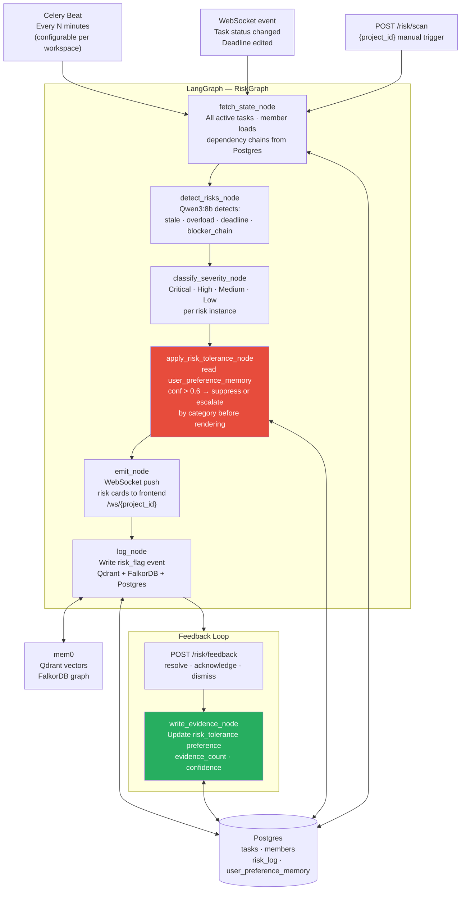

# Risk Agent — Technical Implementation Document

> Stack: LangGraph · LangChain · Qwen3:8b (Ollama) · Qdrant · FalkorDB (mem0) · Postgres · Celery Beat · FastAPI · Pydantic v2

---

## 1. Architecture Overview



---

## 2. Postgres Schema

### 2.1 `risk_log` table

```sql
CREATE TABLE risk_log (
    id              UUID PRIMARY KEY DEFAULT gen_random_uuid(),
    project_id      UUID NOT NULL,
    risk_type       VARCHAR(50) NOT NULL,   -- stale | overload | deadline | blocker_chain
    severity        VARCHAR(20) NOT NULL,   -- critical | high | medium | low | suppressed | escalated
    affected_task_id    UUID REFERENCES tasks(id),
    affected_member_id  UUID REFERENCES members(id),
    description     TEXT,
    suggested_action TEXT,
    agent_reasoning  TEXT,
    status          VARCHAR(20) DEFAULT 'open',  -- open | acknowledged | resolved | dismissed | suppressed
    suppressed_by_preference BOOLEAN DEFAULT FALSE,
    suppression_reason TEXT,
    created_at      TIMESTAMP DEFAULT NOW(),
    updated_at      TIMESTAMP DEFAULT NOW()
);
```

### 2.2 `risk_tolerance` in `user_preference_memory`

```sql
-- preference_type = 'risk_tolerance'
-- preference_value shape:
{
  "dismisses":  ["overload", "stale"],        -- categories manager reliably dismisses
  "escalates":  ["blocker_chain", "deadline"], -- categories manager always acts on
  "dismiss_counts":  {"overload": 8, "stale": 5},
  "escalate_counts": {"blocker_chain": 6, "deadline": 4},
  "total_seen":      {"overload": 9, "stale": 6, "blocker_chain": 6, "deadline": 4}
}
```

---

## 3. Pydantic Schemas

```python
# schemas/risk.py
from pydantic import BaseModel, Field
from typing import Literal, Optional
from uuid import UUID
from datetime import datetime

RiskType     = Literal["stale", "overload", "deadline", "blocker_chain"]
SeverityLevel = Literal["critical", "high", "medium", "low", "suppressed", "escalated"]

class TaskSnapshot(BaseModel):
    id:              UUID
    title:           str
    status:          str
    assignee_id:     Optional[UUID]
    assignee_name:   Optional[str]
    due_date:        Optional[datetime]
    last_updated:    datetime
    progress_pct:    int
    estimated_points: int
    affected_module: Optional[str]
    blocker_task_ids: list[UUID] = []

class MemberSnapshot(BaseModel):
    id:           UUID
    name:         str
    load_pct:     float
    active_tasks: int
    capacity:     int

class DetectedRisk(BaseModel):
    risk_type:       RiskType
    severity:        SeverityLevel
    affected_task:   Optional[TaskSnapshot]
    affected_member: Optional[MemberSnapshot]
    description:     str          # natural language explanation
    suggested_action: str         # e.g. "Reassign to Carol" or "Add 3-day buffer"
    agent_reasoning:  str         # LLM's chain-of-thought (shown in Autopsy)
    downstream_count: int = 0     # for blocker_chain: how many tasks blocked

class RiskRadar(BaseModel):
    risks:                list[DetectedRisk]
    suppressed_risks:     list[DetectedRisk]   # hidden by default, filter-accessible
    project_id:           str
    scanned_at:           datetime
    preference_applied:   bool
    manager_id:           str

class RiskState(BaseModel):
    """LangGraph state dict for the Risk Agent."""
    project_id:  str
    manager_id:  str

    # populated by nodes
    tasks:          list[TaskSnapshot]   = []
    members:        list[MemberSnapshot] = []
    raw_risks:      list[DetectedRisk]   = []
    radar:          Optional[RiskRadar]  = None
```

---

## 4. Risk Detection Logic

### 4.1 Detection Thresholds (configurable per workspace)

```python
# config/risk_thresholds.py
THRESHOLDS = {
    "stale_task_days":          3,    # no update in N days → stale
    "overload_pct":             85,   # load >= N% → overload risk
    "critical_overload_pct":    95,   # load >= N% → critical overload
    "deadline_warning_days":    2,    # due in N days with <70% progress → risk
    "deadline_critical_days":   1,    # due in N days with any blockers → critical
    "blocker_chain_min_count":  2,    # single task blocking >= N others → blocker risk
}
```

### 4.2 Stale Task Detection

```python
def detect_stale(tasks: list[TaskSnapshot]) -> list[DetectedRisk]:
    from datetime import datetime, timezone
    risks = []
    now = datetime.now(timezone.utc)

    for task in tasks:
        if task.status in ("completed", "cancelled"):
            continue

        days_idle = (now - task.last_updated).days
        if days_idle < THRESHOLDS["stale_task_days"]:
            continue

        severity = "critical" if days_idle > 7 else "high" if days_idle > 5 else "medium"
        risks.append(DetectedRisk(
            risk_type="stale",
            severity=severity,
            affected_task=task,
            affected_member=None,
            description=(
                f"'{task.title}' has had no updates for {days_idle} days "
                f"(status: {task.status}, progress: {task.progress_pct}%)."
            ),
            suggested_action=(
                f"Check in with {task.assignee_name or 'assignee'} "
                f"or reassign if blocked."
            ),
            agent_reasoning=(
                f"Task last_updated={task.last_updated.date()}, "
                f"days_idle={days_idle}, threshold={THRESHOLDS['stale_task_days']}d. "
                f"Progress is {task.progress_pct}% with status={task.status}."
            ),
        ))
    return risks
```

### 4.3 Overload Detection

```python
def detect_overload(members: list[MemberSnapshot]) -> list[DetectedRisk]:
    risks = []
    for member in members:
        if member.load_pct < THRESHOLDS["overload_pct"]:
            continue

        severity = (
            "critical" if member.load_pct >= THRESHOLDS["critical_overload_pct"]
            else "high"
        )
        risks.append(DetectedRisk(
            risk_type="overload",
            severity=severity,
            affected_task=None,
            affected_member=member,
            description=(
                f"{member.name} is at {member.load_pct:.0f}% capacity "
                f"with {member.active_tasks} active tasks."
            ),
            suggested_action=(
                f"Redistribute tasks from {member.name} or delay "
                f"low-priority assignments until load drops below 80%."
            ),
            agent_reasoning=(
                f"load_pct={member.load_pct:.1f}%, "
                f"threshold={THRESHOLDS['overload_pct']}%, "
                f"active_tasks={member.active_tasks}, capacity={member.capacity}."
            ),
        ))
    return risks
```

### 4.4 Deadline Risk Detection

```python
def detect_deadline_risks(tasks: list[TaskSnapshot]) -> list[DetectedRisk]:
    from datetime import datetime, timezone
    risks = []
    now = datetime.now(timezone.utc)

    for task in tasks:
        if not task.due_date or task.status == "completed":
            continue

        days_remaining = (task.due_date - now).days
        has_blockers   = len(task.blocker_task_ids) > 0
        low_progress   = task.progress_pct < 70

        # Critical: due tomorrow with any blockers
        if days_remaining <= THRESHOLDS["deadline_critical_days"] and has_blockers:
            severity = "critical"
        # High: due in 2 days with low progress
        elif days_remaining <= THRESHOLDS["deadline_warning_days"] and low_progress:
            severity = "high"
        # Medium: due in 3 days with blockers
        elif days_remaining <= 3 and has_blockers:
            severity = "medium"
        else:
            continue

        risks.append(DetectedRisk(
            risk_type="deadline",
            severity=severity,
            affected_task=task,
            affected_member=None,
            description=(
                f"'{task.title}' is due in {days_remaining} day(s) "
                f"with {task.progress_pct}% progress"
                + (f" and {len(task.blocker_task_ids)} unresolved blocker(s)." if has_blockers else ".")
            ),
            suggested_action=(
                "Resolve blockers immediately and review with assignee. "
                "Consider adding a 2-day buffer or descoping non-critical criteria."
            ),
            agent_reasoning=(
                f"due_date={task.due_date.date()}, days_remaining={days_remaining}, "
                f"progress={task.progress_pct}%, blockers={len(task.blocker_task_ids)}, "
                f"thresholds: critical={THRESHOLDS['deadline_critical_days']}d, "
                f"warning={THRESHOLDS['deadline_warning_days']}d."
            ),
        ))
    return risks
```

### 4.5 Blocker Chain Detection

```python
def detect_blocker_chains(tasks: list[TaskSnapshot]) -> list[DetectedRisk]:
    """
    Find tasks that are blocking >= N other tasks (a single point of failure).
    Uses an adjacency map built from task.blocker_task_ids.
    """
    # Build: blocked_by_map[task_id] = [ids that task blocks]
    blocking_map: dict[str, list[str]] = {}
    for task in tasks:
        for blocker_id in task.blocker_task_ids:
            bid = str(blocker_id)
            blocking_map.setdefault(bid, []).append(str(task.id))

    task_by_id = {str(t.id): t for t in tasks}
    risks = []

    for blocker_id, blocked_ids in blocking_map.items():
        count = len(blocked_ids)
        if count < THRESHOLDS["blocker_chain_min_count"]:
            continue

        blocker_task = task_by_id.get(blocker_id)
        if not blocker_task:
            continue

        severity = "critical" if count >= 4 else "high" if count >= 3 else "medium"
        blocked_titles = [
            task_by_id[bid].title for bid in blocked_ids if bid in task_by_id
        ]

        risks.append(DetectedRisk(
            risk_type="blocker_chain",
            severity=severity,
            affected_task=blocker_task,
            affected_member=None,
            description=(
                f"'{blocker_task.title}' is blocking {count} downstream tasks: "
                f"{', '.join(blocked_titles[:3])}"
                + (f" and {count - 3} more." if count > 3 else ".")
            ),
            suggested_action=(
                f"Escalate '{blocker_task.title}' to Critical priority. "
                f"Consider pairing a second engineer or descoping to unblock downstream work."
            ),
            agent_reasoning=(
                f"blocker_id={blocker_id}, downstream_count={count}, "
                f"threshold={THRESHOLDS['blocker_chain_min_count']}. "
                f"Blocked tasks: {blocked_ids}."
            ),
            downstream_count=count,
        ))

    return risks
```

---

## 5. LangGraph Nodes

### 5.1 `fetch_state_node`

```python
# nodes/risk/fetch_state.py
from db import get_pg_conn
from schemas.risk import TaskSnapshot, MemberSnapshot
from datetime import datetime, timezone

def fetch_state_node(state: dict) -> dict:
    conn = get_pg_conn()

    # Active tasks with their blocker relationships
    task_rows = conn.execute("""
        SELECT t.*,
               m.name as assignee_name,
               COALESCE(
                   array_agg(td.depends_on_id) FILTER (WHERE td.depends_on_id IS NOT NULL),
                   '{}'
               ) as blocker_task_ids
        FROM tasks t
        LEFT JOIN members m ON t.assignee_id = m.id
        LEFT JOIN task_dependencies td ON td.task_id = t.id
        WHERE t.project_id = %s AND t.status NOT IN ('completed','cancelled')
        GROUP BY t.id, m.name
    """, (state["project_id"],)).fetchall()

    tasks = [
        TaskSnapshot(
            id=row["id"],
            title=row["title"],
            status=row["status"],
            assignee_id=row["assignee_id"],
            assignee_name=row["assignee_name"],
            due_date=row["due_date"],
            last_updated=row["updated_at"],
            progress_pct=row.get("progress_pct", 0),
            estimated_points=row.get("estimated_points", 0),
            affected_module=row.get("affected_module"),
            blocker_task_ids=row["blocker_task_ids"] or [],
        )
        for row in task_rows
    ]

    # Member loads
    member_rows = conn.execute("""
        SELECT id, name,
               ROUND((active_points::float / NULLIF(capacity,0)) * 100) as load_pct,
               capacity,
               (SELECT COUNT(*) FROM tasks WHERE assignee_id=m.id
                AND status NOT IN ('completed','cancelled')) as active_tasks
        FROM members m
        WHERE project_id = %s AND availability != 'deactivated'
    """, (state["project_id"],)).fetchall()

    members = [
        MemberSnapshot(
            id=row["id"],
            name=row["name"],
            load_pct=float(row["load_pct"] or 0),
            active_tasks=int(row["active_tasks"]),
            capacity=row["capacity"],
        )
        for row in member_rows
    ]

    return {"tasks": tasks, "members": members}
```

### 5.2 `detect_risks_node`

```python
# nodes/risk/detect_risks.py
from risk_detectors import (
    detect_stale, detect_overload,
    detect_deadline_risks, detect_blocker_chains,
)

def detect_risks_node(state: dict) -> dict:
    tasks   = state["tasks"]
    members = state["members"]

    raw_risks = (
        detect_stale(tasks)
        + detect_overload(members)
        + detect_deadline_risks(tasks)
        + detect_blocker_chains(tasks)
    )

    # Sort: blocker_chain first, then by severity
    severity_order = {"critical": 0, "high": 1, "medium": 2, "low": 3}
    type_order     = {"blocker_chain": 0, "deadline": 1, "overload": 2, "stale": 3}

    raw_risks.sort(key=lambda r: (
        type_order.get(r.risk_type, 9),
        severity_order.get(r.severity, 9),
    ))

    return {"raw_risks": raw_risks}
```

### 5.3 `apply_risk_tolerance_node` — Pre-render Suppression / Escalation

```python
# nodes/risk/apply_risk_tolerance.py
from db import get_pg_conn
from schemas.risk import DetectedRisk
import json

CONFIDENCE_THRESHOLD = 0.6

def _get_risk_tolerance(manager_id: str) -> dict | None:
    conn = get_pg_conn()
    row = conn.execute(
        """SELECT preference_value, confidence FROM user_preference_memory
           WHERE user_id = %s AND preference_type = 'risk_tolerance'
           AND confidence > %s""",
        (manager_id, CONFIDENCE_THRESHOLD)
    ).fetchone()

    if not row:
        return None

    val = row["preference_value"]
    return json.loads(val) if isinstance(val, str) else val


def apply_risk_tolerance_node(state: dict) -> dict:
    """
    Read risk_tolerance preference. When confidence > 0.6:
    - Categories in 'dismisses' list → severity = "suppressed"
      (hidden from default radar, moved to suppressed_risks list)
    - Categories in 'escalates' list → severity = "escalated"
      (promoted above Critical in the UI sort order)

    Suppressed risks are NEVER deleted — they stay in suppressed_risks
    and are filter-accessible with hover reason showing why they were suppressed.
    """
    manager_id = state["manager_id"]
    raw_risks  = state["raw_risks"]

    pref = _get_risk_tolerance(manager_id)

    active_risks    = []
    suppressed_risks = []

    for risk in raw_risks:
        if pref is None:
            # No preference above threshold — show everything unmodified
            active_risks.append(risk)
            continue

        dismisses = pref.get("dismisses", [])
        escalates = pref.get("escalates", [])

        if risk.risk_type in dismisses:
            # Suppress: move to suppressed list with reason
            risk.severity = "suppressed"
            risk.suppression_reason = (
                f"Hidden: you reliably dismiss {risk.risk_type} risks "
                f"(learned from {pref['dismiss_counts'].get(risk.risk_type, '?')} dismissals). "
                f"Click 'Show suppressed' to review."
            )
            suppressed_risks.append(risk)

        elif risk.risk_type in escalates:
            # Escalate: mark for top-of-list treatment
            risk.severity = "escalated"
            active_risks.append(risk)

        else:
            active_risks.append(risk)

    from schemas.risk import RiskRadar
    from datetime import datetime, timezone

    radar = RiskRadar(
        risks=active_risks,
        suppressed_risks=suppressed_risks,
        project_id=state["project_id"],
        scanned_at=datetime.now(timezone.utc),
        preference_applied=pref is not None,
        manager_id=manager_id,
    )

    return {"radar": radar}
```

### 5.4 `emit_node`

```python
# nodes/risk/emit.py
from websocket_manager import broadcast

def emit_node(state: dict) -> dict:
    radar = state["radar"]

    # Push to frontend via WebSocket /ws/{project_id}
    payload = {
        "type":             "risk_radar_update",
        "scanned_at":       radar.scanned_at.isoformat(),
        "risk_count":       len(radar.risks),
        "suppressed_count": len(radar.suppressed_risks),
        "preference_applied": radar.preference_applied,
        "risks": [
            {
                "risk_type":      r.risk_type,
                "severity":       r.severity,
                "description":    r.description,
                "suggested_action": r.suggested_action,
                "affected_task":  r.affected_task.title if r.affected_task else None,
                "affected_member": r.affected_member.name if r.affected_member else None,
                "downstream_count": r.downstream_count,
            }
            for r in radar.risks
        ],
        "suppressed_risks": [
            {
                "risk_type":        r.risk_type,
                "description":      r.description,
                "suppression_reason": r.suppression_reason,
            }
            for r in radar.suppressed_risks
        ],
    }

    broadcast(state["project_id"], payload)
    return {}
```

### 5.5 `log_node`

```python
# nodes/risk/log_node.py
from memory_agent.config import get_mem0_client
from db import get_pg_conn
import uuid

def log_node(state: dict) -> dict:
    radar  = state["radar"]
    client = get_mem0_client()
    conn   = get_pg_conn()

    logged_ids = []
    all_risks  = radar.risks + radar.suppressed_risks

    for risk in all_risks:
        risk_id = str(uuid.uuid4())

        # ── Postgres audit row ─────────────────────────────────────────── #
        conn.execute("""
            INSERT INTO risk_log
            (id, project_id, risk_type, severity,
             affected_task_id, affected_member_id,
             description, suggested_action, agent_reasoning,
             suppressed_by_preference, suppression_reason)
            VALUES (%s,%s,%s,%s,%s,%s,%s,%s,%s,%s,%s)
        """, (
            risk_id, state["project_id"], risk.risk_type, risk.severity,
            str(risk.affected_task.id) if risk.affected_task else None,
            str(risk.affected_member.id) if risk.affected_member else None,
            risk.description, risk.suggested_action, risk.agent_reasoning,
            risk.severity == "suppressed",
            getattr(risk, "suppression_reason", None),
        ))

        # ── mem0 (Qdrant vector + FalkorDB graph) ──────────────────────── #
        embed_text = (
            f"Risk detected: {risk.risk_type} ({risk.severity}). "
            f"{risk.description} "
            f"Suggested: {risk.suggested_action}"
        )
        metadata = {
            "event_type":  "risk_flag",
            "project_id":  state["project_id"],
            "risk_type":   risk.risk_type,
            "severity":    risk.severity,
            "memory_tier": "active",
            "relevance_score": 1.0,
        }
        client.add(embed_text, user_id=state["manager_id"],
                   metadata=metadata, infer=False)

        logged_ids.append(risk_id)

    conn.commit()
    return {"logged_risk_ids": logged_ids}
```

### 5.6 `write_evidence_node` — Learning from Feedback

```python
# nodes/risk/write_evidence.py
from db import get_pg_conn
import json
from datetime import datetime

CONFIDENCE_THRESHOLD = 0.6

def _calculate_confidence(consistency_rate: float, evidence_count: int) -> float:
    return consistency_rate * (1 - 1 / (1 + evidence_count))


def write_evidence_node(state: dict) -> dict:
    """
    Called by POST /risk/feedback.
    state keys: manager_id, risk_log_id, risk_type, action (resolve|acknowledge|dismiss)
    """
    conn        = get_pg_conn()
    manager_id  = state["manager_id"]
    risk_type   = state["risk_type"]
    action      = state["action"]    # "resolve" | "acknowledge" | "dismiss"

    # Update the risk status in risk_log
    new_status = {"resolve": "resolved", "acknowledge": "acknowledged",
                  "dismiss": "dismissed"}.get(action, action)
    conn.execute(
        "UPDATE risk_log SET status=%s, updated_at=NOW() WHERE id=%s",
        (new_status, state["risk_log_id"])
    )

    # ── Update risk_tolerance preference ─────────────────────────────────── #
    existing = conn.execute(
        """SELECT * FROM user_preference_memory
           WHERE user_id=%s AND preference_type='risk_tolerance'""",
        (manager_id,)
    ).fetchone()

    now = datetime.utcnow()

    if existing is None:
        pref_value = {
            "dismisses":       [risk_type] if action == "dismiss" else [],
            "escalates":       [risk_type] if action in ("resolve","acknowledge") else [],
            "dismiss_counts":  {risk_type: 1} if action == "dismiss" else {},
            "escalate_counts": {risk_type: 1} if action != "dismiss" else {},
            "total_seen":      {risk_type: 1},
        }
        confidence = _calculate_confidence(1.0, 1)
        conn.execute(
            """INSERT INTO user_preference_memory
               (user_id, preference_type, preference_value, confidence,
                evidence_count, last_observed, created_at)
               VALUES (%s,'risk_tolerance',%s,%s,1,%s,%s)""",
            (manager_id, json.dumps(pref_value), confidence, now, now)
        )

    else:
        val = json.loads(existing["preference_value"]) if isinstance(
            existing["preference_value"], str) else existing["preference_value"]

        evidence_count = existing["evidence_count"] + 1
        total_seen     = val.get("total_seen", {})
        total_seen[risk_type] = total_seen.get(risk_type, 0) + 1

        if action == "dismiss":
            dc = val.get("dismiss_counts", {})
            dc[risk_type] = dc.get(risk_type, 0) + 1
            val["dismiss_counts"] = dc
        else:
            ec = val.get("escalate_counts", {})
            ec[risk_type] = ec.get(risk_type, 0) + 1
            val["escalate_counts"] = ec

        val["total_seen"] = total_seen

        # Recalculate which categories to dismiss / escalate
        # Rule: dismiss if dismissed > 70% of the time for that type
        #       escalate if acted on > 70% of the time
        dismisses = []
        escalates = []
        for rtype, seen in total_seen.items():
            if seen < 3:
                continue   # not enough data
            dismiss_rate  = val.get("dismiss_counts",  {}).get(rtype, 0) / seen
            escalate_rate = val.get("escalate_counts", {}).get(rtype, 0) / seen
            if dismiss_rate  > 0.70:
                dismisses.append(rtype)
            if escalate_rate > 0.70:
                escalates.append(rtype)

        val["dismisses"] = dismisses
        val["escalates"] = escalates

        # Confidence is the average consistency across all seen types
        consistency_rates = []
        for rtype, seen in total_seen.items():
            if seen < 2:
                continue
            dismiss_r  = val.get("dismiss_counts",  {}).get(rtype, 0) / seen
            escalate_r = val.get("escalate_counts", {}).get(rtype, 0) / seen
            consistency_rates.append(max(dismiss_r, escalate_r))

        avg_consistency = (sum(consistency_rates) / len(consistency_rates)
                           if consistency_rates else 0.5)
        confidence = _calculate_confidence(avg_consistency, evidence_count)

        conn.execute(
            """UPDATE user_preference_memory
               SET preference_value=%s, confidence=%s, evidence_count=%s, last_observed=%s
               WHERE id=%s""",
            (json.dumps(val), confidence, evidence_count, now, existing["id"])
        )

    conn.commit()
    return {
        "evidence_written": True,
        "action":           action,
        "risk_type":        risk_type,
        "new_confidence":   confidence,
    }
```

---

## 6. LangGraph Graph Definition

```python
# graphs/risk.py
from langgraph.graph import StateGraph, START, END
from nodes.risk.fetch_state       import fetch_state_node
from nodes.risk.detect_risks      import detect_risks_node
from nodes.risk.apply_risk_tolerance import apply_risk_tolerance_node
from nodes.risk.emit              import emit_node
from nodes.risk.log_node          import log_node

def build_risk_graph():
    graph = StateGraph(dict)

    graph.add_node("fetch_state",        fetch_state_node)
    graph.add_node("detect_risks",       detect_risks_node)
    graph.add_node("apply_tolerance",    apply_risk_tolerance_node)
    graph.add_node("emit",               emit_node)
    graph.add_node("log",                log_node)

    graph.add_edge(START,             "fetch_state")
    graph.add_edge("fetch_state",     "detect_risks")
    graph.add_edge("detect_risks",    "apply_tolerance")
    graph.add_edge("apply_tolerance", "emit")
    graph.add_edge("emit",            "log")
    graph.add_edge("log",             END)

    return graph.compile()

risk_graph = build_risk_graph()
```

---

## 7. Celery Beat Schedule

```python
# celery_app.py
from celery import Celery
from celery.schedules import crontab

app = Celery("neuralpm", broker="redis://localhost:6379/1")

app.conf.beat_schedule = {
    "risk-scan-all-projects": {
        "task":     "tasks.run_risk_scan",
        "schedule": 300,   # every 5 minutes (demo mode)
        # production: crontab(minute="*/15")
    },
}

# tasks.py
@app.task
def run_risk_scan():
    from db import get_pg_conn
    from graphs.risk import risk_graph

    conn = get_pg_conn()
    # Get all active projects and their managers
    projects = conn.execute(
        "SELECT DISTINCT project_id, manager_id FROM project_settings"
    ).fetchall()

    for project in projects:
        risk_graph.invoke({
            "project_id": str(project["project_id"]),
            "manager_id": str(project["manager_id"]),
        })
```

---

## 8. FastAPI Endpoints

```python
# api/risk.py
from fastapi import APIRouter
from pydantic import BaseModel
from typing import Literal
from graphs.risk import risk_graph
from nodes.risk.write_evidence import write_evidence_node

router = APIRouter(prefix="/risk", tags=["Risk Agent"])

class ScanRequest(BaseModel):
    project_id: str
    manager_id: str

@router.post("/scan")
def manual_scan(req: ScanRequest):
    result = risk_graph.invoke(req.model_dump())
    radar  = result.get("radar")
    return {
        "risk_count":       len(radar.risks),
        "suppressed_count": len(radar.suppressed_risks),
        "preference_applied": radar.preference_applied,
        "risks": [r.model_dump() for r in radar.risks],
        "suppressed_risks": [r.model_dump() for r in radar.suppressed_risks],
    }

class FeedbackRequest(BaseModel):
    risk_log_id: str
    manager_id:  str
    risk_type:   str
    action:      Literal["resolve", "acknowledge", "dismiss"]

@router.post("/feedback")
def feedback(req: FeedbackRequest):
    result = write_evidence_node(req.model_dump())
    return {
        "evidence_written": result["evidence_written"],
        "action":           result["action"],
        "new_confidence":   result["new_confidence"],
    }
```

---

## 9. Complete Flow Walkthrough

### Scenario: Celery Beat fires → detects blocker chain + Sarah overload

**State after fetch_state:**
```
tasks:   [PaymentAPI(status=ongoing, due=tomorrow, blockers=[StripeLib]),
          CheckoutFlow(blockers=[PaymentAPI]),
          Refunds(blockers=[PaymentAPI]),
          AuthLogin(status=stale, last_updated=6 days ago)]
members: [Sarah(load=92%), Bob(load=45%), Carol(load=30%)]
```

**detect_risks:**
```
stale:         AuthLogin (6 days idle) → severity=high
overload:      Sarah (92%) → severity=critical
deadline:      PaymentAPI (due tomorrow, has blockers) → severity=critical
blocker_chain: PaymentAPI blocks [CheckoutFlow, Refunds] (count=2) → severity=high
```

**apply_risk_tolerance (manager Alice, confidence=0.73):**
```
pref: dismisses=["overload"], escalates=["blocker_chain"]
→ Sarah overload → severity="suppressed", reason="Alice dismisses overload risks (8 dismissals)"
→ PaymentAPI blocker_chain → severity="escalated"
```

**Risk Radar sent via WebSocket:**
```
active_risks (3):
  [escalated] blocker_chain: PaymentAPI blocks CheckoutFlow, Refunds
  [critical]  deadline:      PaymentAPI due tomorrow with unresolved blockers
  [high]      stale:         AuthLogin idle 6 days

suppressed_risks (1):
  [suppressed] overload: Sarah at 92% — "Alice dismisses overload risks"
```

**Manager clicks "Dismiss" on AuthLogin stale risk:**
```
POST /risk/feedback {risk_type: "stale", action: "dismiss", manager_id: "alice"}
→ stale dismiss_count: 6/8 total = 75% dismiss rate > 70% threshold
→ "stale" added to dismisses list
→ confidence recalculated → 0.77
→ Next scan: stale risks auto-suppressed
```
