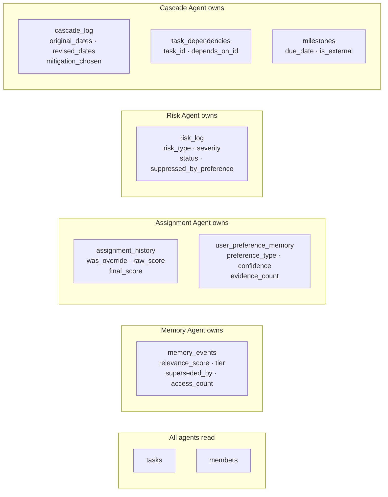
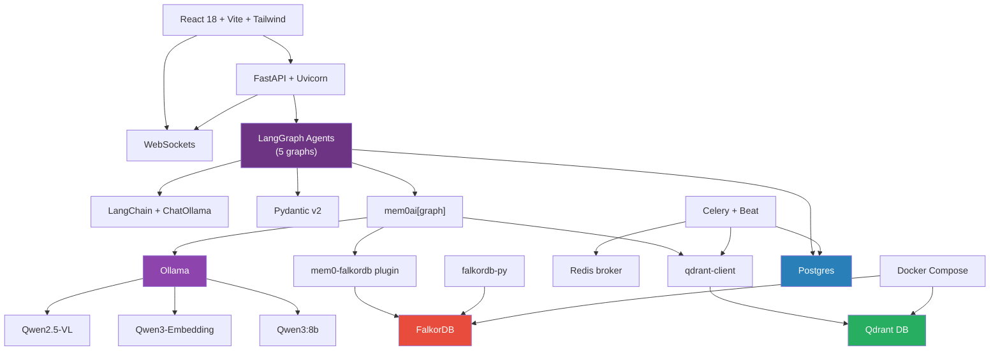

# NeuralPM — Detailed Tech Stack

> Every technology in the project: what it does, why it was chosen, how it is configured, which agents use it, and what to watch out for.

---

## Quick Reference

```
Layer               Technology              Version         Port
─────────────────────────────────────────────────────────────────
Vector Store        Qdrant                  v1.12.4         6333
Graph Store         FalkorDB                latest          6379
Relational DB       PostgreSQL              14+             5432
Message Broker      Redis (via FalkorDB)    —               6379/1
LLM Runtime         Ollama                  0.7.0+          11434
LLM Model           Qwen3:8b                —               —
Embedding Model     Qwen3-Embedding:4b      —               —
Multimodal Model    Qwen2.5-VL:7b           —               —
Memory Abstraction  mem0ai[graph]           ≥1.0.0          —
Graph Plugin        mem0-falkordb           ≥0.1.0          —
Agent Orchestration LangGraph               0.2.60+         —
LLM Framework       LangChain (Ollama)      langchain-ollama 0.2.2
Schema Validation   Pydantic v2             2.10.4          —
Settings            pydantic-settings       2.7.1           —
API Framework       FastAPI                 0.115.6         8000
ASGI Server         Uvicorn                 0.34.0          8000
Task Queue          Celery                  5.x             —
Frontend Framework  React                   18              5173
Build Tool          Vite                    5+              5173
CSS Framework       Tailwind CSS            3.x             —
Containerisation    Docker + Compose        —               —
```

---

## 1. Qdrant

| Field | Detail |
|---|---|
| **Version** | `qdrant/qdrant:v1.12.4` (pinned Docker image) |
| **Category** | Vector database |
| **Port** | 6333 (REST + Web UI), 6334 (gRPC) |
| **Python client** | `qdrant-client==1.12.1` |

### What it does in NeuralPM

Qdrant is the **semantic memory store**. Every project event (requirement, assignment decision, risk flag, timeline shift) is embedded into a 1024-dimensional vector and stored here. When any agent needs historical context — "who worked on payment tasks before?" or "what requirements changed last sprint?" — it runs a cosine similarity search against this collection.

### Collection design

```
Collection: neuralpm_memories (single collection, all agents, all projects)

Per-point payload (indexed fields):
  project_id       VARCHAR  ← hard isolation filter on every query
  memory_tier      VARCHAR  ← active | compressed | archived
  event_type       VARCHAR  ← assignment | requirement_update | risk_flag | timeline_shift
  user_id          VARCHAR  ← scopes to manager/user
  relevance_score  FLOAT    ← updated by Celery decay job
  agent_source     VARCHAR  ← which agent wrote this memory
  affected_module  VARCHAR  ← payment | auth | dashboard | ...
  priority         VARCHAR  ← critical | high | medium | low
```

### Payload indexes (must exist before loading data)

```python
from qdrant_client import QdrantClient
from qdrant_client.models import PayloadSchemaType

client = QdrantClient(host="localhost", port=6333)
for field in ["project_id", "memory_tier", "event_type", "user_id"]:
    client.create_payload_index(
        collection_name="neuralpm_memories",
        field_name=field,
        field_schema=PayloadSchemaType.KEYWORD,
    )
# relevance_score needs FLOAT index for range queries
client.create_payload_index(
    collection_name="neuralpm_memories",
    field_name="relevance_score",
    field_schema=PayloadSchemaType.FLOAT,
)
```

### Key operations

```python
# Used by: Memory Agent store_node (via mem0)
# Used by: Celery decay job (direct qdrant_client, bypasses mem0)

# Decay update — called by Celery, NOT via mem0
client.set_payload(
    collection_name="neuralpm_memories",
    payload={"relevance_score": 0.72, "memory_tier": "compressed"},
    points=[str(event_id)],
)

# Supersession — called synchronously on override
client.set_payload(
    collection_name="neuralpm_memories",
    payload={"relevance_score": 0.05, "superseded_by": str(new_id)},
    points=[str(old_id)],
)
```

### Filter syntax (important: NO `$` prefix)

```python
# mem0 uses bare operator names — MongoDB-style $ prefix causes ValidationError
filters = {
    "user_id":     "alice",
    "project_id":  "alpha",
    "memory_tier": {"in": ["active", "compressed"]},   # ✅ correct
    # NOT: {"$in": ["active", "compressed"]}            # ❌ wrong
    "relevance_score": {"gte": 0.2},                   # ✅ correct
}
```

### Why Qdrant over alternatives

| Alternative | Why not chosen |
|---|---|
| pgvector | Post-filter (not pre-filter) — accuracy degrades under heavy filtering |
| Pinecone | Managed only, no self-hosted for demo; `in`/`nin` operators constrained |
| Chroma | Equality and basic comparisons only, limited nesting |
| FAISS | No payload filtering, no persistence without custom code |

### Gotchas

- Client/server version skew triggers a loud `UserWarning`. Pin both: `qdrant/qdrant:v1.12.4` image + `qdrant-client==1.12.1`.
- Default path `/tmp/qdrant` is cleared on restart — always set `on_disk: True` or use a Docker volume.
- `recreate_collection` is deprecated — check `client.collection_exists()` before creating.
- The deprecated `.search()` method was removed in newer clients — use `.query_points()` for direct calls.

**Used by:** Memory Agent (store, retrieve, allocate_context), Celery decay job, all agent log_nodes via mem0

---

## 2. FalkorDB

| Field | Detail |
|---|---|
| **Version** | `falkordb/falkordb:latest` |
| **Category** | Graph database (Redis wire protocol) |
| **Port** | 6379 |
| **Python client** | `falkordb>=1.0.0` |
| **mem0 integration** | `mem0-falkordb>=0.1.0` (runtime patching plugin) |

### What it does in NeuralPM

FalkorDB stores the **entity-relationship graph** of the project. When mem0 ingests text, FalkorDB's extraction LLM identifies entities (engineers, tasks, modules, risks) and their relationships (ASSIGNED_TO, BLOCKS, CAUSED_BY) and persists them as a typed graph. At search time, these graph triples are returned alongside vector hits as the `relations` array.

### Per-user graph isolation

```
mem0_{user_id}  →  one dedicated graph per user

mem0_alice              mem0_project_alpha_pm
├── Alice-[:ASSIGNED_TO]->PaymentAPI      ├── Sarah-[:ASSIGNED_TO]->PaymentAPI
├── Alice-[:FOLLOWS_DIET]->Vegan          ├── PaymentAPI-[:BLOCKS]->CheckoutFlow
└── ...                                   └── RiskAgent-[:FLAGGED]->Sarah
```

**Why this matters:** A query for `project_alpha_pm` physically cannot touch `project_beta_pm`'s graph. No `WHERE user_id=` filter to forget — the graph engine operates on a different data structure.

### NeuralPM graph extraction prompt

```python
GRAPH_EXTRACTION_PROMPT = """
Entities: Engineers, Tasks, Requirements, Risks, Sprints, Modules, Agents
Relationships:
  (Engineer)-[:ASSIGNED_TO]->(Task)
  (Task)-[:BLOCKS]->(Task)
  (Requirement)-[:PART_OF]->(Module)
  (Risk)-[:AFFECTS]->(Task)
  (Risk)-[:CAUSED_BY]->(Task or Requirement)
  (Task)-[:DELAYED_BY]->(Task)
  (Agent)-[:FLAGGED]->(Risk)
  (Agent)-[:SUGGESTED]->(Engineer)
  (Engineer)-[:OVERLOADED_AT]->(Sprint)
Always capture the causal direction.
"""
```

### How the plugin works

```python
# mem0-falkordb uses runtime patching — NO mem0 fork needed
# Must be called BEFORE any mem0 import
from mem0_falkordb import register
register()   # patches mem0 internals to translate Cypher for FalkorDB

# What it translates:
# Neo4j call                          →  FalkorDB translation
# db.index.vector.queryNodes(...)     →  db.idx.vector.queryNodes(...)
# elementId(n)                        →  id(n)
# SET n.embedding = $embedding        →  SET n.embedding = vecf32($embedding)
# CALL { ... UNION ... }              →  directional scans
```

### Direct inspection

```bash
# List all user graphs
docker exec -it neuralpm-falkordb falkordb-cli GRAPH.LIST

# Query a specific user's graph
docker exec -it neuralpm-falkordb falkordb-cli GRAPH.QUERY mem0_project_alpha_pm \
  "MATCH (a)-[r]->(b) RETURN a.name, type(r), b.name LIMIT 20"

# GDPR delete — one command removes everything for a user
docker exec -it neuralpm-falkordb falkordb-cli GRAPH.DELETE mem0_alice
```

### Why FalkorDB over Neo4j

| Metric | FalkorDB | Neo4j |
|---|---|---|
| p99 latency | <140ms | 46,900ms |
| Memory efficiency | 6x better | baseline |
| Per-user isolation | Built-in (automatic graph per user_id) | Manual `WHERE user_id=` filter |
| Wire protocol | Redis (port 6379) | Bolt (port 7687) |
| mem0 integration | Runtime plugin, no fork | Built-in provider |
| GDPR deletion | `DELETE GRAPH mem0_alice` | Complex filtered DELETE |
| Multi-tenancy | All plans | Premium only |

### Gotchas

- `register()` must be called **before** `from mem0 import Memory`. Importing mem0 before registering silently breaks FalkorDB translation.
- FalkorDB graphs are created lazily on first write — `GRAPH.LIST` returns empty until first `m.add()` runs.
- Requires Ollama ≥ 0.7.0 for Qwen2.5-VL (unrelated but same version gate).
- Graph extraction runs even when `infer=False` — the `infer` parameter only controls vector-store fact extraction, not graph population.

**Used by:** Memory Agent (store_node writes, retrieve_node reads relations), all agent log_nodes via mem0

---

## 3. PostgreSQL

| Field | Detail |
|---|---|
| **Version** | 14+ |
| **Category** | Relational database |
| **Port** | 5432 |
| **Python client** | `psycopg2` or `asyncpg` |

### What it does in NeuralPM

Postgres is the **source of truth for structured project data and decay metadata**. While Qdrant holds the vectors and FalkorDB holds the graph, Postgres holds every scalar field that drives forgetting, preference learning, and cascade traversal.

### Tables by ownership



### Critical note: no `embedding` column in `memory_events`

```sql
-- ❌ WRONG — do not add this
ALTER TABLE memory_events ADD COLUMN embedding VECTOR(1024);

-- ✅ RIGHT — vectors live exclusively in Qdrant
-- memory_events.id == Qdrant point ID (UUID)
-- The Qdrant point stores the vector; Postgres stores the decay scalar fields
```

### Recursive CTE for Cascade Agent

```sql
-- Finds all tasks downstream of a given trigger task
WITH RECURSIVE downstream AS (
    SELECT td.task_id, 1 AS depth
    FROM task_dependencies td
    WHERE td.depends_on_id = $trigger_task_id

    UNION ALL

    SELECT td.task_id, ds.depth + 1
    FROM task_dependencies td
    JOIN downstream ds ON td.depends_on_id = ds.task_id
    WHERE ds.depth < 20   -- safety limit
)
SELECT DISTINCT ON (t.id) t.*, ds.depth
FROM downstream ds
JOIN tasks t ON t.id = ds.task_id
WHERE t.project_id = $project_id
  AND t.status NOT IN ('completed', 'cancelled')
ORDER BY t.id, ds.depth;
```

This replaces Neo4j for Phase 1 cascade traversal. Upgrade to Neo4j when the dependency graph exceeds ~50,000 edges.

### `user_preference_memory` — cross-agent learning table

```sql
-- All four agents write to and read from this single table
-- preference_type values:
--   assignment_override   → written by Assignment Agent
--   risk_tolerance        → written by Risk Agent
--   timeline_philosophy   → written by Cascade Agent
--   communication_style   → written by Memory Agent (chatbot)

-- Confidence formula (used by all agents):
-- confidence = consistency_rate × (1 − 1 / (1 + evidence_count))
-- Threshold to activate re-ranking: 0.6
```

**Used by:** All agents (read/write), Celery decay job (read/write memory_events)

---

## 4. Redis

| Field | Detail |
|---|---|
| **Version** | Shared with FalkorDB (same port 6379, different DB number) |
| **Category** | Message broker |
| **Port** | 6379/1 (DB=1, FalkorDB uses DB=0) |

### What it does in NeuralPM

Redis serves as the **Celery message broker** only. It does not store application data. FalkorDB runs on the same port (6379) using DB=0; Celery uses DB=1.

```python
# celery_app.py
CELERY_BROKER_URL = "redis://localhost:6379/1"   # DB 1 — avoids FalkorDB's DB 0
```

If port conflict is a concern, run a separate Redis container on port 6380.

**Used by:** Celery worker + Beat (broker only)

---

## 5. Ollama

| Field | Detail |
|---|---|
| **Version** | ≥ 0.7.0 (required for Qwen2.5-VL) |
| **Category** | Local model runtime |
| **Port** | 11434 |

### What it does in NeuralPM

Ollama is the **local inference server** that runs all three Qwen models. All LLM calls (classify, extract, score, synthesize, compress, embed) go through Ollama's REST API. No cloud API keys required — the full stack runs offline.

### Model pull commands

```bash
ollama pull qwen3:8b               # ~5.2 GB — all reasoning/extraction tasks
ollama pull qwen3-embedding:0.6b   # ~0.5 GB — embeddings (1024 dims)
# OR for higher quality embeddings:
ollama pull qwen3-embedding:4b     # ~2.5 GB — embeddings (2560 dims, update EMBED_DIMS)
ollama pull qwen2.5vl:7b           # ~6.0 GB — chatbot file/image analysis
```

### Verify embedding dimensions

```bash
# ALWAYS verify before setting EMBED_DIMS in .env
curl http://localhost:11434/api/embed \
  -d '{"model": "qwen3-embedding:0.6b", "input": "test"}' | \
  python3 -c "import json,sys; d=json.load(sys.stdin); print(len(d['embeddings'][0]))"
# → 1024
```

**Used by:** All LLM nodes (via LangChain ChatOllama), mem0 embedder config, Qwen2.5-VL path in synthesize_node

---

## 6. Qwen3:8b

| Field | Detail |
|---|---|
| **Provider** | Alibaba Cloud / QwenLM |
| **Size** | ~5.2 GB (Q4_K_M quantization) |
| **Context window** | 40K tokens |
| **Thinking mode** | Enabled by default — must be disabled |

### What it does in NeuralPM

Qwen3:8b is the **primary reasoning model** used by every LangGraph node that needs language understanding:

| Node | Task | Temperature |
|---|---|---|
| `classify_node` | Classify message: requirement / chat / preference | 0.0 |
| `extract_node` | Extract structured RequirementEvent from text | 0.0 |
| `score_node` | Generate one-sentence assignment rationale | 0.0 |
| `synthesize_node` | Answer chatbot queries with citations | 0.2 |
| `compress_job` | Summarise old events into one sentence | 0.0 |
| mem0 graph extraction | Extract entities + relationships for FalkorDB | 0.0 |

### Critical: disable thinking mode

```python
from langchain_ollama import ChatOllama

# ❌ Wrong — thinking mode active, ~60% JSON miss rate in extraction loops
llm = ChatOllama(model="qwen3:8b", temperature=0)

# ✅ Correct — thinking disabled, deterministic JSON output
llm = ChatOllama(model="qwen3:8b", temperature=0, reasoning=False, format="json")
```

Qwen3 thinks by default. In agentic/extraction loops, the model "plans" the JSON output in a `<think>` block and then fails to emit it. `reasoning=False` disables the thinking block entirely.

### JSON output safety net

```python
import re, json

def safe_parse(content: str) -> dict:
    # Strip <think>...</think> block if present (failsafe)
    content = re.sub(r"<think>.*?</think>", "", content, flags=re.DOTALL).strip()
    # Strip markdown fences
    content = content.strip().removeprefix("```json").removeprefix("```").removesuffix("```").strip()
    return json.loads(content)
```

### Add `/no_think` to prompts

```python
# Additional guard in every structured output prompt
CLASSIFY_PROMPT = """/no_think
Classify this message...
Return ONLY valid JSON: {...}
"""
```

**Used by:** `config.get_llm()`, all extraction/classification nodes, mem0 graph extraction, Celery compression job

---

## 7. Qwen3-Embedding:4b

| Field | Detail |
|---|---|
| **Provider** | Alibaba Cloud / QwenLM |
| **Size** | ~2.5 GB |
| **Output dimensions** | 2560 (4b) / 1024 (0.6b) / 4096 (8b) |
| **Context window** | 32K tokens |
| **MTEB multilingual rank** | #1 (as of June 2025) |

### What it does in NeuralPM

Every text stored in the memory layer is embedded by this model before going into Qdrant. The embedding captures semantic meaning — "Stripe payment" and "credit card checkout" are close in vector space even though they share no words.

### Configuration in mem0

```python
"embedder": {
    "provider": "ollama",
    "config": {
        "model": "qwen3-embedding:0.6b",    # or :4b or :8b
        "ollama_base_url": "http://localhost:11434",
        "embedding_dims": 1024,             # MUST match model's actual output
    }
}
```

### EMBED_DIMS must match exactly

```
Model                  Actual dims   Set EMBED_DIMS to
qwen3-embedding:0.6b   1024          1024
qwen3-embedding:4b     2560          2560
qwen3-embedding:8b     4096          4096
```

Mismatch causes `ValueError: shapes (0,1536) and (1024,) not aligned` at upsert time.

**Used by:** mem0 `embedder` config (called internally on every `m.add()`), direct embedding calls in test scripts

---

## 8. Qwen2.5-VL:7b

| Field | Detail |
|---|---|
| **Provider** | Alibaba Cloud / QwenLM |
| **Size** | ~6.0 GB |
| **Context window** | 125K tokens |
| **Input modalities** | Text + Image |
| **Ollama tag** | `qwen2.5vl:7b` |
| **Minimum Ollama version** | 0.7.0 |

### What it does in NeuralPM

Qwen2.5-VL is the **multimodal model** used exclusively in the Memory Chatbot when the user attaches a file or image. For text-only queries, Qwen3:8b is used instead (faster, smaller).

### Invocation pattern (direct Ollama API, not LangChain)

```python
import httpx

def call_vl(prompt: str, attachment_base64: str, ollama_url: str) -> str:
    payload = {
        "model": "qwen2.5vl:7b",
        "messages": [{
            "role": "user",
            "content": [
                {"type": "text", "text": prompt},
                {"type": "image_url", "image_url": {"url": attachment_base64}},
            ],
        }],
        "stream": False,
        "options": {"temperature": 0.2},
    }
    resp = httpx.post(f"{ollama_url}/api/chat", json=payload, timeout=60)
    return resp.json()["message"]["content"]
```

### Use cases in the chatbot

- Upload a PDF requirements doc → "Extract all acceptance criteria from this document"
- Upload a screenshot of a Gantt chart → "Which tasks overlap with the payment module timeline?"
- Upload a whiteboard photo → "Parse these handwritten task names into a structured list"

**Used by:** `synthesize_node` (conditional path when `attachment` is present in state)

---

## 9. mem0ai[graph]

| Field | Detail |
|---|---|
| **Version** | `≥1.0.0` |
| **Install** | `pip install mem0ai[graph]` |
| **Category** | Memory abstraction layer |

### What it does in NeuralPM

mem0 provides a **unified add/search API** that writes to both Qdrant (vectors) and FalkorDB (graph) in a single call. Without mem0, we would need to:
1. Call Ollama `/api/embed` directly
2. Call `qdrant_client.upsert()` manually
3. Call a separate entity extraction LLM
4. Parse the output and write Cypher to FalkorDB

With mem0, a single `m.add(text, user_id, metadata)` does all of this.

### Core API used in NeuralPM

```python
from mem0 import Memory

m = Memory.from_config(config)

# Write — goes to Qdrant (vector) + FalkorDB (graph)
result = m.add(
    "Payment API assigned to Sarah. Stripe expertise required.",
    user_id="project_alpha_pm",         # maps to FalkorDB graph: mem0_project_alpha_pm
    metadata={"project_id": "alpha", "event_type": "assignment", ...},
    infer=False,                        # store our text verbatim, skip mem0's own extraction
)
# result = {"results": [{"id": "...", "memory": "..."}], "relations": [...]}

# Read — queries Qdrant + returns FalkorDB relations
response = m.search(
    "who worked on payment module?",
    filters={
        "user_id":     "project_alpha_pm",
        "project_id":  "alpha",
        "memory_tier": {"in": ["active", "compressed"]},
    },
    limit=8,
)
# response = {"results": [...], "relations": [...]}
```

### `infer=False` behaviour

| Parameter | Vector store path | Graph store path |
|---|---|---|
| `infer=True` (default) | mem0 LLM extracts facts, stores summaries | Entity extraction runs |
| `infer=False` | Raw text stored verbatim | Entity extraction **still runs** |

NeuralPM uses `infer=False` because we do our own extraction in the classify/extract nodes. The graph extraction is a separate LLM call that runs regardless.

### Version history gotcha

- `mem0ai==0.1.114` (old) — no graph support, `search()` accepted `user_id` as top-level kwarg
- `mem0ai>=1.0.0` (current) — graph support added, `user_id` must go inside `filters={}`
- `mem0ai==2.0.4` (PyPI latest) — `search(query, user_id=...)` raises `ValueError`, use `filters={"user_id": ...}`

**Used by:** `config.get_mem0_client()`, store_node, retrieve_node, all agent log_nodes

---

## 10. mem0-falkordb

| Field | Detail |
|---|---|
| **Version** | `≥0.1.0` |
| **Install** | `pip install mem0-falkordb` |
| **Category** | Runtime patching plugin |
| **Source** | https://github.com/FalkorDB/mem0-falkordb |

### What it does in NeuralPM

mem0-falkordb is a **zero-fork plugin** that registers FalkorDB as a mem0 `graph_store` provider. It intercepts mem0's internal Cypher calls and translates them into FalkorDB-optimised equivalents at runtime.

### Registration — must be first

```python
# config.py — THE VERY FIRST LINES (before any mem0 import)
from mem0_falkordb import register
register()   # patches mem0 internals

# ONLY NOW can mem0 be imported
from mem0 import Memory
```

If `register()` runs after `from mem0 import Memory`, the translation layer is not applied and FalkorDB calls fail silently.

### Config block

```python
"graph_store": {
    "provider": "falkordb",          # registered by register()
    "config": {
        "host": "localhost",
        "port": 6379,
        "database": "mem0",
    },
    "custom_prompt": GRAPH_EXTRACTION_PROMPT,
}
```

**Used by:** `config.py` exclusively — all other code goes through `get_mem0_client()`

---

## 11. LangGraph

| Field | Detail |
|---|---|
| **Version** | `0.2.60` (stable 0.x series) |
| **Category** | Agent orchestration framework |
| **Stability** | LangGraph 1.0 shipped Oct 2025, no breaking changes from 0.x |

### What it does in NeuralPM

LangGraph is the **graph execution engine** for all five agent graphs. Each agent is a `StateGraph` — a directed graph of nodes (Python functions) connected by edges (including conditional edges for routing).

### Graphs in NeuralPM

| Graph | File | Nodes | Conditional edges |
|---|---|---|---|
| Ingestion | `graphs/ingestion.py` | 3 | `classify → extract OR skip` |
| Chat | `graphs/chat.py` | 4 | None |
| Assignment | `graphs/assignment.py` | 8 | `apply_preference → output OR auto_assign` |
| Risk | `graphs/risk.py` | 5 | None |
| Cascade | `graphs/cascade.py` | 7 | `apply_philosophy → emit OR simulate_end` |

### Pattern used in all graphs

```python
from langgraph.graph import StateGraph, START, END

def build_graph():
    graph = StateGraph(dict)

    graph.add_node("node_name", node_function)
    graph.add_edge(START, "first_node")          # LangGraph 1.0 idiom
    graph.add_conditional_edges(
        "apply_preference",
        lambda state: "auto_assign" if state.get("mode") == "auto" else "output",
        {"output": "output", "auto_assign": "auto_assign"},
    )
    graph.add_edge("output", END)
    return graph.compile()
```

### State passing between nodes

```python
# Each node receives full state dict, returns PARTIAL dict of updates
def score_node(state: dict) -> dict:
    # state has: task, members, memory_context, graph_relations (set by previous nodes)
    candidates = compute_scores(state["task"], state["members"])
    return {"candidates": candidates}   # merged into state, does NOT overwrite other keys
```

### `set_entry_point` deprecation

```python
# ❌ Deprecated (0.1.x pattern)
graph.set_entry_point("classify")

# ✅ Current idiom (both 0.x and 1.0 compatible)
graph.add_edge(START, "classify")
```

### Dependency pinning

```
langgraph==0.2.60
# Do NOT mix langgraph and langgraph-prebuilt versions — minor drift breaks ToolNode
```

**Used by:** All 5 agent graphs — `graphs/ingestion.py`, `graphs/chat.py`, `graphs/assignment.py`, `graphs/risk.py`, `graphs/cascade.py`

---

## 12. LangChain (langchain-ollama)

| Field | Detail |
|---|---|
| **Version** | `langchain-ollama==0.2.2`, `langchain-core==0.3.40` |
| **Category** | LLM framework |
| **Import** | `from langchain_ollama import ChatOllama` |

### What it does in NeuralPM

LangChain provides the **`ChatOllama` integration** for calling Qwen3:8b in every LangGraph node. It handles message formatting, response parsing, and the `format="json"` constraint.

### Usage pattern

```python
from langchain_ollama import ChatOllama

# For structured output nodes (classify, extract, score rationale)
llm = ChatOllama(
    model="qwen3:8b",
    base_url="http://localhost:11434",
    temperature=0.0,
    format="json",      # forces syntactically valid JSON output
    reasoning=False,    # disables Qwen3 thinking mode
)

# For natural language nodes (synthesize, compress)
llm = ChatOllama(
    model="qwen3:8b",
    base_url="http://localhost:11434",
    temperature=0.2,
    reasoning=False,
    # NO format="json" — we want prose
)

response = llm.invoke(prompt)
content  = response.content   # string
```

### Why `langchain-ollama` not `langchain_community`

```python
# ❌ Old import — breaks with_structured_output
from langchain_community.chat_models import ChatOllama

# ✅ Correct import — full feature support
from langchain_ollama import ChatOllama
```

**Used by:** `config.get_llm()`, `classify_node`, `extract_node`, `score_node`, `synthesize_node`, `compress_job`

---

## 13. Pydantic v2

| Field | Detail |
|---|---|
| **Version** | `pydantic==2.10.4` |
| **Category** | Schema validation |
| **Settings** | `pydantic-settings==2.7.1` |

### What it does in NeuralPM

Pydantic v2 validates all LLM outputs and API request/response shapes. When the LLM produces malformed JSON, Pydantic catches it before it reaches Qdrant or Postgres.

### Key models

```
schemas/requirement.py    ClassifyResult, RequirementEvent
schemas/assignment.py     TaskContext, MemberContext, FactorScores, Candidate, AssignmentOutput
schemas/risk.py           TaskSnapshot, MemberSnapshot, DetectedRisk, RiskRadar
schemas/cascade.py        TaskNode, MilestoneConflict, MitigationScenario, CascadeResult
```

### v2 API (not v1 — breaking changes)

```python
# ✅ Pydantic v2
from pydantic import BaseModel
model.model_dump()          # NOT .dict()
model.model_dump_json()     # NOT .json()
model.model_validate(data)  # NOT .parse_obj()
model_rebuild()             # NOT update_forward_refs()

# Settings
from pydantic_settings import BaseSettings, SettingsConfigDict
class Settings(BaseSettings):
    model_config = SettingsConfigDict(env_file=".env", extra="ignore")
    qdrant_host: str = "localhost"
```

### Validation in extraction nodes

```python
try:
    event = RequirementEvent(**json.loads(raw_json))
    return {"extracted_event": event}
except ValidationError as e:
    return {"extraction_error": str(e)}   # bubble up without crashing the graph
```

**Used by:** All schemas, FastAPI request/response models, all extraction nodes

---

## 14. FastAPI

| Field | Detail |
|---|---|
| **Version** | `fastapi==0.115.6` |
| **Category** | API framework |
| **ASGI Server** | `uvicorn[standard]==0.34.0` |
| **Port** | 8000 |

### What it does in NeuralPM

FastAPI is the **HTTP + WebSocket server** that exposes all agent capabilities to the frontend. Every agent has its own router; all routers are included in the main `api.py` app.

### App structure

```python
# api.py
from fastapi import FastAPI
from fastapi.middleware.cors import CORSMiddleware
from api.memory     import router as memory_router
from api.assignment import router as assignment_router
from api.risk       import router as risk_router
from api.cascade    import router as cascade_router
from api.websocket  import router as ws_router

app = FastAPI(title="NeuralPM API", version="1.0.0")

app.add_middleware(CORSMiddleware,
    allow_origins=["http://localhost:5173"],   # Vite dev server
    allow_credentials=True,
    allow_methods=["*"], allow_headers=["*"],
)

app.include_router(memory_router)
app.include_router(assignment_router)
app.include_router(risk_router)
app.include_router(cascade_router)
app.include_router(ws_router)
```

### WebSocket manager

```python
# websocket_manager.py
from fastapi import WebSocket
from collections import defaultdict

class ConnectionManager:
    def __init__(self):
        self.connections: dict[str, list[WebSocket]] = defaultdict(list)

    async def connect(self, project_id: str, ws: WebSocket):
        await ws.accept()
        self.connections[project_id].append(ws)

    async def broadcast(self, project_id: str, message: dict):
        for ws in self.connections.get(project_id, []):
            await ws.send_json(message)

manager = ConnectionManager()

def broadcast(project_id: str, message: dict):
    import asyncio
    asyncio.create_task(manager.broadcast(project_id, message))
```

### Run command

```bash
uvicorn api:app --reload --port 8000
# Interactive docs: http://localhost:8000/docs
```

**Used by:** All API endpoints, WebSocket `/ws/{project_id}`

---

## 15. Celery + Celery Beat

| Field | Detail |
|---|---|
| **Version** | `celery>=5.0` |
| **Category** | Distributed task queue |
| **Broker** | Redis (localhost:6379/1) |

### What it does in NeuralPM

Celery runs two categories of background work that must not block API responses:

| Job | Schedule | What it does |
|---|---|---|
| `run_risk_scan` | Every 5 min (demo) / 15 min (prod) | Runs Risk Agent graph for all active projects |
| `run_decay_cycle` | Every 5 min (demo) / nightly (prod) | Recalculates relevance_score + tier for all memory_events |
| `run_compression_job` | Every 10 min (demo) | LLM-compresses active→compressed tier events |

### Demo mode acceleration

```python
# In demo mode, 5-minute cycles simulate "nightly" production behaviour
# An "advance sprint" control in the UI can fast-forward the age field in
# memory_events to make forgetting observable in a single session
app.conf.beat_schedule = {
    "risk-scan":   {"task": "tasks.run_risk_scan",   "schedule": 300},
    "decay":       {"task": "tasks.run_decay_cycle", "schedule": 300},
    "compression": {"task": "tasks.run_compression", "schedule": 600},
}
```

### Run commands

```bash
# Start worker (processes tasks)
celery -A celery_app worker --loglevel=info

# Start beat (schedules periodic tasks)
celery -A celery_app beat --loglevel=info
```

**Used by:** Risk Agent (periodic scan), Memory Agent (decay + compression)

---

## 16. React 18

| Field | Detail |
|---|---|
| **Version** | 18 |
| **Category** | Frontend framework |
| **Build tool** | Vite 5+ |
| **Dev port** | 5173 |

### What it does in NeuralPM

React 18 renders all five UI panels. State is managed with `useState` and `useReducer` — no external state library needed for the current scope.

### Key components

```
src/components/
├── TaskCommandCenter/
│   ├── TaskTable.jsx            — sortable/filterable task list
│   ├── AssignmentPanel.jsx      — shortlist side panel with per-factor scores
│   └── FindBestMatchButton.jsx  — triggers POST /assignment/suggest
├── MembersHub/
│   ├── MembersTable.jsx
│   └── MemberProfile.jsx        — skill matrix, velocity chart, assignment history
├── InsightsWarRoom/
│   ├── RiskRadar.jsx            — live risk cards, suppressed toggle, hover reason
│   ├── CascadeTimeline.jsx      — before/after comparisons, What-If drag interface
│   └── LearningPanel.jsx        — override rate graph, confidence growth, preference registry
├── RequirementsInput/
│   └── IngestForm.jsx           — POST /memory/ingest
└── MemoryChatbot/
    ├── ChatPanel.jsx            — POST /memory/chat, multi-turn
    ├── MemoryAutopsy.jsx        — expandable LOADED/FILTERED/BUDGET panel
    └── FileUpload.jsx           — base64 attachment → Qwen2.5-VL
```

### WebSocket connection

```javascript
// hooks/useProjectSocket.js
import { useEffect, useRef } from "react";

export function useProjectSocket(projectId, onMessage) {
    const ws = useRef(null);

    useEffect(() => {
        ws.current = new WebSocket(`ws://localhost:8000/ws/${projectId}`);
        ws.current.onmessage = (e) => onMessage(JSON.parse(e.data));
        return () => ws.current?.close();
    }, [projectId]);
}

// Message types handled:
// risk_radar_update  → update Risk Radar panel
// cascade_impact     → show cascade notification + open Cascade View
// auto_assignment    → show assignment notification toast
```

### Vite proxy (avoids CORS in dev)

```javascript
// vite.config.js
export default defineConfig({
    plugins: [react()],
    server: {
        proxy: {
            "/api": {
                target: "http://localhost:8000",
                changeOrigin: true,
                rewrite: (p) => p.replace(/^\/api/, ""),
            },
        },
    },
});
```

**Used by:** All frontend components

---

## 17. Tailwind CSS

| Field | Detail |
|---|---|
| **Version** | 3.x |
| **Category** | CSS utility framework |

### What it does in NeuralPM

All component styling. Severity colours, status badges, load bars, score meters, and preference-applied banners are all Tailwind utility classes. No custom CSS files.

### Key utility patterns

```jsx
// Severity colour mapping
const severityColors = {
    critical:  "bg-red-100 text-red-800 border-red-300",
    high:      "bg-orange-100 text-orange-800 border-orange-300",
    medium:    "bg-yellow-100 text-yellow-800 border-yellow-300",
    low:       "bg-green-100 text-green-800 border-green-300",
    suppressed: "bg-gray-100 text-gray-400 border-gray-200",
    escalated:  "bg-purple-100 text-purple-800 border-purple-300",
};

// Preference-applied banner on assignment card
{candidate.preference_applied && (
    <div className="bg-amber-50 border border-amber-200 rounded px-2 py-1 text-xs text-amber-700">
        {candidate.preference_reason}
    </div>
)}
```

**Used by:** All frontend components

---

## 18. Docker + Docker Compose

| Field | Detail |
|---|---|
| **Category** | Containerisation |
| **Services** | Qdrant, FalkorDB |

### What it does in NeuralPM

Docker Compose spins up the two database services that don't have native macOS/Windows binaries.

```yaml
services:
  qdrant:
    image: qdrant/qdrant:v1.12.4     # pinned — not :latest
    container_name: neuralpm-qdrant
    ports: ["6333:6333", "6334:6334"]
    volumes: [qdrant_storage:/qdrant/storage]

  falkordb:
    image: falkordb/falkordb:latest
    container_name: neuralpm-falkordb
    ports: ["6379:6379"]
    volumes: [falkordb_storage:/data]

volumes:
  qdrant_storage:     # persists vectors between container restarts
  falkordb_storage:   # persists graphs between container restarts
```

### Why Qdrant image is pinned but FalkorDB is not

Qdrant client/server version skew raises a `UserWarning` if the minor version difference is > 1. FalkorDB uses the Redis wire protocol which is stable across versions — no incompatibility risk.

**Used by:** Local development, CI, demo environment

---

## 19. falkordb-py

| Field | Detail |
|---|---|
| **Version** | `≥1.0.0` |
| **Category** | Direct FalkorDB Python client |
| **Use** | Graph inspection + test scripts only |

### What it does in NeuralPM

Used **only** in `test_graph.py` and `inspect_graphs.py` to bypass the mem0 abstraction and query FalkorDB directly. Not used in production code paths — all production graph reads go through `m.search()`.

```python
import falkordb

db     = falkordb.FalkorDB(host="localhost", port=6379)
graphs = db.list_graphs()   # ["mem0_alice", "mem0_project_alpha_pm", ...]

g = db.select_graph("mem0_project_alpha_pm")

# All relationships in the graph
result = g.query("MATCH (a)-[r]->(b) RETURN a.name, type(r), b.name LIMIT 20")
for row in result.result_set:
    print(f"({row[0]})-[:{row[1]}]->({row[2]})")

# NeuralPM-specific: Sarah's assignments
result = g.query("MATCH (s {name: 'Sarah'})-[r:ASSIGNED_TO]->(t) RETURN t.name")
```

**Used by:** `test_graph.py`, debugging/inspection only

---

## 20. qdrant-client

| Field | Detail |
|---|---|
| **Version** | `qdrant-client==1.12.1` |
| **Category** | Direct Qdrant Python client |
| **Use** | Celery decay job, payload index creation, test scripts |

### What it does in NeuralPM

Used in two places where we need to update Qdrant **without** going through mem0:

```python
from qdrant_client import QdrantClient
from qdrant_client.models import PayloadUpdateOperation

client = QdrantClient(host="localhost", port=6333)

# Celery decay job — update payload fields after score recalculation
client.set_payload(
    collection_name="neuralpm_memories",
    payload={"relevance_score": 0.72, "memory_tier": "compressed"},
    points=[str(event_id)],
)

# Supersession — instant on override
client.set_payload(
    collection_name="neuralpm_memories",
    payload={"relevance_score": 0.05, "superseded_by": str(new_id)},
    points=[str(old_event_id)],
)
```

**Used by:** `celery_tasks/decay.py`, `config.py` (collection + index creation), `test_pipe.py`

---

## Full Dependency Graph



---

## Requirements.txt (Final)

```
# Memory layer
mem0ai[graph]>=1.0.0          # graph_store support (added 1.0.0)
mem0-falkordb>=0.1.0           # FalkorDB plugin (runtime patching)
falkordb>=1.0.0                # direct FalkorDB client (tests + decay)

# Vector store
qdrant-client==1.12.1          # must stay within 1 minor of server v1.12.4

# Agent orchestration
langgraph==0.2.60

# LLM integration
langchain-ollama==0.2.2        # NOT langchain_community
langchain-core==0.3.40

# Schema validation
pydantic==2.10.4
pydantic-settings==2.7.1

# API
fastapi==0.115.6
uvicorn[standard]==0.34.0
websockets>=12.0               # WebSocket support for FastAPI

# Async jobs
celery>=5.0
redis>=5.0                     # Celery broker client

# DB
psycopg2-binary>=2.9           # Postgres driver

# Misc
python-dotenv==1.0.1
httpx>=0.27.0                  # Qwen2.5-VL direct Ollama calls
```
